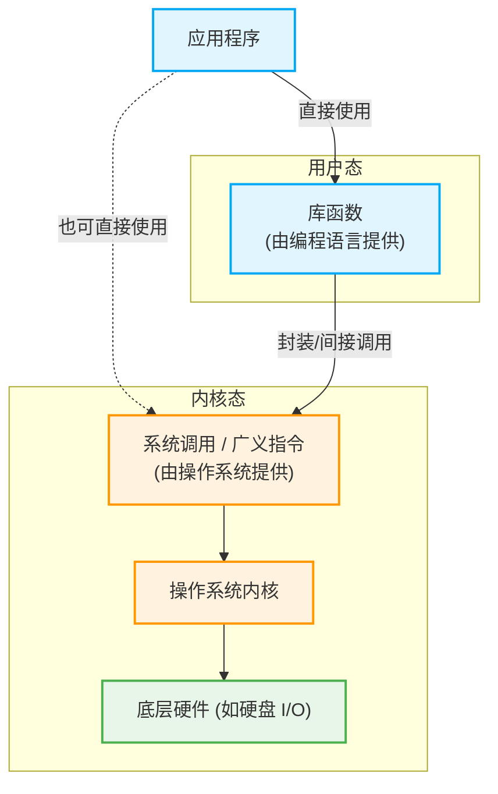

# 操作系统核心概念辨析

## 一、 软件、程序与文件的关系

- **应用程序与软件**：一个 `.exe` 可执行程序通常被称为**应用程序**。只有当它和其他资源文件（如图片、音效等）组合在一起时，才构成了一个完整的**软件**。
- **资源与文件管理**：除了管理硬件和软件，操作系统还负责**文件管理**。文件不等于软件，但文件属于计算机的重要资源。
- **管理视角的差异**：
  - **操作系统的视角**：OS 在管理文件时，更关心**一个大文件如何被拆分成小分片，以及这些小分片如何存储到外存（硬盘）中**。OS 并不关心文件内部的具体数据（是源代码、视频还是图片）。
  - **用户/程序员的视角**：源程序（源代码文件）由程序员管理。文件具体要存放在哪个目录下、哪个文件夹下，是由程序员或用户来负责决定的。

---

## 二、 并发性的微观时间约束

并发不仅需要保证“宏观上同时”，还对微观时间有严格要求：

- 各个事件发生的间隔**不能太长、不能没有规律**。
- 必须保证各个事件在**较短的时间间隔内都可以陆续发生**，这样才能在宏观上形成“同时进行”的视觉效果。

---

## 三、 系统调用与库函数的深度剖析

操作系统分为**用户态**和**内核态**。系统调用是一种**特殊的过程调用**，它能够让应用程序**安全地、间接地**调用内核功能。用户态正是通过系统调用来使用内核服务的。

### 1. 调用层级与关系图

### 2. 库函数的两类工作模式

库函数是由**编程语言**提供的，为了方便开发者调用，编程语言会将系统调用再一次封装成库函数。库函数分为以下两类：

| 库函数分类       | 特点与机制                                                                                                           | 典型代表             | 跨平台特性                                                                                             |
| :--------------- | :------------------------------------------------------------------------------------------------------------------- | :------------------- | :----------------------------------------------------------------------------------------------------- |
| **纯用户态计算** | 不涉及系统调用。例如取绝对值、纯数学运算。                                                                           | `math.h`             | 与具体平台/操作系统**无关**。                                                                          |
| **封装系统调用** | 涉及底层硬件操作（如读写硬盘、创建新文件）。I/O 控制是内核的核心功能，因此必须申请内核服务，底层必定封装了系统调用。 | `stdio.h` (输入输出) | 底层封装的系统调用与**具体平台相关**（不同 OS 内核实现差别很大），但库函数对外提供的**接口保持不变**。 |

> **核心总结**：
>
> - **提供者**：操作系统提供系统调用，编程语言提供库函数。
> - **层级**：系统调用属于操作系统的一部分，而库函数不是。系统调用处于更底层。
> - **调用路径**：应用程序通常直接使用库函数，通过库函数**间接**使用系统调用；纯硬件操作必然被封装在系统调用里。

---

## 四、 程序接口、中断与原语

### 1. 程序接口

- **定义**：程序接口是由**一组系统调用**组成的（程序接口 = 系统调用，系统调用也叫**广义指令**）。
- **使用方式**：只允许用户通过编写程序来间接使用。

### 2. 中断 (Interrupt)

- **特性**：与硬件密切相关。直接影响硬件的操作一般不会直接提供给应用程序或用户使用。
- **作用机制**：利用中断技术通知 CPU 停下当前正在进行的工作，转而处理紧急的当前操作（例如：单击鼠标的操作，需要通过中断告诉 CPU 立即处理）。

### 3. 原语 (Primitive)

- **层级地位**：处于操作系统的**最底层**，是最接近硬件的部分。
- **核心特性**：具备**原子性**。原语的执行只能**一气呵成**，即这一系列操作在中间**绝对不能被间断**。
