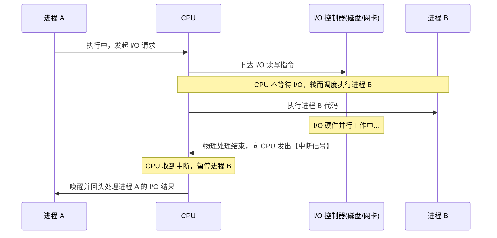

# 操作系统原理：核心特征、运行机制与管理策略

## 一、 多道程序设计与操作系统的基本特征

提高单机资源利用率最关键的是**多道程序设计技术**，因为它使操作系统具备了并发的特性，能大幅度提升单机资源（包括内存、CPU、I/O 设备）的利用率。

多道程序系统具备四个基本特征：**并发、共享、虚拟、异步**。其中，并发和共享是必须的，而“虚拟”并非强制（例如针对 8086 CPU 的实地址模式，未采用分页，也没有虚拟存储保护，多道程序一直待在实地址模式下同样可以运行）。

### 1. 并发性与共享性的关联

- **共享性与并发性密切相关**：一旦多个程序需要并发运行，必然需要共享特性。例如，CPU、内存就是多道程序必须共享的核心资源。
- **并发的微观要求**：并发需要保证“宏观上同时”，而在微观上各个事件发生的间隔不能太长、不能没有规律，必须保证在较短的时间间隔内都可以陆续发生。

### 2. 运行特性的差异（多道 vs 单道）

| 运行特性          | 单道程序系统                             | 多道程序系统                                                                                                                                             |
| :---------------- | :--------------------------------------- | :------------------------------------------------------------------------------------------------------------------------------------------------------- |
| **顺序性**        | 各个程序按照顺序依次“一口气”执行完毕。   | 运行顺序不可预知，上处理机运行的顺序会因各类原因改变。                                                                                                   |
| **间断性 (异步)** | 一旦提交便执行到底，中间不中断、不间断。 | 程序“走走停停”。各个程序交替上 CPU 运行，执行过程断断续续。                                                                                              |
| **制约性**        | 无共享资源的制约。                       | 程序的执行会因共享资源而**相互制约**。例如 A 和 B 并发运行且共享互斥变量 X，A 访问 X 时，B 必须阻塞等待 A 用完才能访问（一人使用，另一人必须暂停等待）。 |

---

## 二、 操作系统分类与核心理念

### 1. 分时操作系统

- **核心机制**：把一整段时间划分为一个个小的**时间片**，分配给多个用户轮流使用，使得多个用户可以同时使用一台主机。
- **主要场景**：主要用于**交互型**的作业类型，其最主要的特征是每个任务要依次轮流使用时间片。
- **用户与进程的关系**：每个用户登录时，操作系统会创建对应的用户进程。操作系统对用户服务，本质上是对该用户对应的用户进程服务（一个用户可能对应多个进程）。
- **时间片对响应时间的影响**：
  - **响应时间**：从用户提交请求到系统首次产生响应所用的时间。分时系统中每个任务轮流使用时间片，因此响应时间通常较短。
  - **负面影响**：加大时间片会延长系统的响应时间。
  - _示例_：系统有 3 个用户进程。若时间片为 `1ms`，任何进程在 `3ms` 内都会至少被响应 1 次；若时间片改为 `2ms`，响应时间则会变成 `6ms`。时间片一定时，用户越多，响应时间越长。

### 2. 实时操作系统

- **核心要求**：及时处理突发事件。
- **资源利用率**：实时系统应**避免资源利用率过高**。如果 CPU 非常忙碌，遇到某些突发事件时 CPU 可能会来不及处理。

### 3. 其他系统类型

- **PC 操作系统**：强调的是操作系统的**应用场景**（部署在个人电脑上），而不是特定的功能特性。
- **分布式操作系统**：随着云计算诞生。其与传统单机操作系统的区别在于：分布式系统管理的是**一堆计算机硬件的集群**，而传统 OS 仅管理单机。
- **微型计算机**：通常指代个人计算机 (PC)。
- **多任务操作系统**：支持多个进程并发运行。**不需要多核 CPU**，单核 CPU 和 I/O 设备在某一段时刻也可以并行运行。

---

## 三、 中断技术与 CPU-I/O 并行机制

### 1. 真正的物理并行 (Parallelism)

- **实体独立**：CPU 和 I/O 控制器（如磁盘控制器、网卡芯片）是两个**完全独立的物理硬件实体**。
- **物理并行**：当磁盘在物理旋转读盘、网络芯片在进行电信号收发时，CPU 芯片的核心内部正同时在做加减法或执行指令。它们在同一物理时刻都在运转，属于严格意义上的**物理并行**。

### 2. 中断技术的关键作用

没有中断，就无法实现并发和并行。中断技术使得多道批处理系统和 I/O 设备可以与 CPU 并行工作：

👇 **中断驱动 CPU 与 I/O 并行交互图**

- _说明_：如果 CPU 当前执行的进程发出了 I/O 请求，它会在等待回应时转而执行另一个进程。当原进程的 I/O 处理结束后，I/O 设备向 CPU 发出**中断信号**，CPU 回头处理原进程。否则，CPU 转向其他进程后将无法返回处理。

---

## 四、 内存管理与页式策略

**分页 (Paging)** 是操作系统对内存进行管理的一种技术。

- **核心思想**：把程序的逻辑地址空间和物理内存全部切成大小固定的一小块一小块。程序运行时**不再需要占用连续的物理内存**。

### 1. 静态页式管理 vs 动态页式管理

| 管理模式         | 加载机制                                                     | 启动响应时间                       | 运行期耗时                                           |
| :--------------- | :----------------------------------------------------------- | :--------------------------------- | :--------------------------------------------------- |
| **静态页式管理** | 程序启动时，将所有数据**一次性全部调入**内存，再开始运行。   | 长（调入全部数据需极大的时间开销） | 短（所有代码数据已在内存，交互迅速）                 |
| **动态页式管理** | 启动时，只调入当前需要的**一小部分数据**即可运行并响应用户。 | **短**（极速响应启动）             | 长（换新功能时需把新数据调入内存，动作伴随时间开销） |

### 2. 代码可重入 (Reentrant Code)

- **定义**：指多个进程或线程共享的一段代码，其执行结果不会相互影响。
- **影响**：它对于系统的响应时间并**没有什么直接的影响**。

---

## 五、 进程调度、时间与性能指标

### 1. 关键时间概念

- **周转时间 / 周转周期**：一个进程从提交到执行完成的这一段时间。
- **时间片**：操作系统给每个进程分配的可以执行的**一小段时间**。进程执行完一个时间片后，会被强行踢下处理机，换下一个进程运行。

### 2. 调度算法：非抢占式 + 优先级

- **规则机制**：系统为各个进程设置优先级。
- **非抢占式特性**：即使此时出现更高优先级的进程，也**不能抢占**当前正在使用 CPU 资源的进程，必须等当前进程完全运行结束后才可上处理机运行。（强占式则相反）。
- **对响应时间的影响**：
  - **高优先级进程**：只要上处理机运行，非抢占式调度算法会让它一直霸占处理机，与该进程的交互可以立即被操作系统响应。
  - **低优先级进程**：需要一直往下等，导致操作系统的响应时间降低（变慢）。

### 3. 性能与系统开销指标

- **系统吞吐量**：指 CPU 完成作业所占的比例。
- **CPU 利用率**：CPU 忙的时间所占的比例。（**注：进程数和 CPU 利用率无关**）。
- **系统开销**：除了处理作业之外，系统在进程、内存等管理上消耗的时间。多道程序系统引入了多道程序，必然多花一些资源或时间在进程的调度管理上，因此**系统开销变大**。
- **多道批处理阶段的资源利用率**：系统中同时有多个进程并发运行，不同进程使用不同的 I/O 设备，使各种 I/O 设备尽可能多地**同时投入工作**；同时内存里驻留多个进程的数据，**内存利用率得到提升**。

### 4. 多处理器系统

- **概念**：多处理器系统包含多个独立的处理单元（可以是单颗多核 CPU，也可以是多颗独立 CPU）。
- **优势**：有了多个处理单元，系统就能在同一时刻运行不同进程的任务，实现真正的物理并行；而在单核 CPU 下，系统只能通过时间片交替切换来实现并发。
