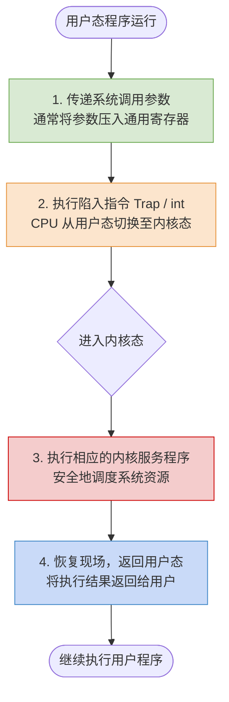

# 操作系统：中断、寄存器与系统调用核心考点整理

> **导语**
> 本文梳理了操作系统中关于**中断处理、寄存器状态保护（PC与PSW）、系统调用过程**以及**时钟中断**等核心考点。内容保留了原有的生动举例与通俗解释，并对排版、层级进行了系统化优化，加入了图表辅助理解，方便大家查阅、复习和打印。

---

## 📌 零、 核心基础概念速览

在深入探讨具体考点前，先明确几个操作系统底层的核心概念：

- **特权指令**：
  - **I/O 指令**：如 x86 架构的 `in`/`out` 汇编指令。
  - **开/关中断指令**：影响程序是否能一直霸占 CPU。
  - **修改 PSW（程序状态字）指令**。
- **PSW (程序状态字寄存器)**：记录了系统重要状态参数，例如当前 CPU 是处于用户态还是内核态、是否开/关中断等。
- **通道 (Channel)**：可以理解为 CPU 的“小马仔”，它可以独立执行 I/O 指令及部分普通指令，从而代替 CPU 管理 I/O 设备的工作。
- **系统调用**：用户程序主动“陷入 (Trap)”内核的过程。用户程序不会（也无权）主动执行“关中断”等特权指令。
- **中断响应过程**：由**硬件**实现。包括：关中断 -> 保存断点 (PC/PSW) -> 引出中断服务程序 -> 将 CPU 状态改为内核态。

---

## 📌 考点一：子程序调用与中断处理时的“寄存器保存”

无论是执行普通的**子程序调用 (函数调用)**，还是执行**中断处理程序**，CPU 最终都要返回到原来的主程序继续执行。这期间涉及多种寄存器的状态保存与恢复。

### 1. 程序计数器 (PC, Program Counter)

- **作用**：一种特殊寄存器，存放着**下一条即将执行的指令地址**。
- **机制**：当发生子程序调用或中断时，程序流跳转到新的地址（如从地址 `n` 跳到 `m`），必须将原先的 PC 值（主程序的下一条指令地址）**压栈保护**。执行结束后，再从栈中弹出并恢复 PC 值，以便程序能准确回到被打断的地方继续执行。
- **结论**：**无论子程序调用还是中断，PC 的内容都必须保存。**

### 2. 通用数据寄存器 / 地址寄存器

- **作用**：读写速度极快，用于暂存运算数据或地址，匹配 CPU 工作速度。
- **保存原则**：**视情况而定**。
  - _需要保存_：如果子程序或中断服务程序中**用到并会覆盖**这些通用寄存器，那么在执行前必须先保存原数据，执行后恢复现场，以免破坏主程序的运算结果。
  - _无需保存_：如果子程序或中断程序根本没用到这些通用寄存器，则无需保存。

### 3. 程序状态字寄存器 (PSW)

- **作用**：标记当前处理器状态（如内核态/用户态、中断屏蔽标志等）。
- **中断处理 ➔ 必须保存**：
  - 中断通常会导致 CPU 从用户态切入内核态（或在嵌套中断中保持内核态）。
  - 必须记录中断发生前 PSW 的原始状态，以便中断结束后，CPU 知道是该切回用户态，还是继续保持在更低优先级的内核中断态中。
- **普通子程序调用 ➔ 无需保存**：
  - 狭义的子程序调用（不涉及系统调用）完全在**同一特权级（通常是用户态）**内进行，PSW 的标志位不会改变。
  - _注_：用户态下也根本无权修改 PSW 的核心状态（否则极不安全），因此普通调用无需保存 PSW。

#### 📊 对比总结表

| 寄存器类型              | 作用               | 中断处理程序 | 普通子程序调用 | 负责保存的组件       |
| :---------------------- | :----------------- | :----------: | :------------: | :------------------- |
| **PC** (程序计数器)     | 记录下一条指令地址 | **必须保存** |  **必须保存**  | **硬件**自动完成     |
| **PSW** (程序状态字)    | 记录处理器核心状态 | **必须保存** |  **无需保存**  | **硬件**自动完成     |
| **通用数据/地址寄存器** | 暂存运算数据与地址 | **可能保存** |  **可能保存**  | **软件** (OS/编译器) |
| **TLB (快表) / Cache**  | 主存数据的副本     | **无需保存** |  **无需保存**  | (可随时重新加载)     |

---

## 📌 考点二：用户态向内核态的切换逻辑

**核心原则：CPU 从用户态变为内核态，唯一的途径就是通过“中断/异常”。**
反之，只要发生了中断，处理过程一定是在内核态中进行的。

我们可以通过分析以下汇编指令操作，判断是否会引发中断，从而导致 CPU 状态切换：

1.  **除法操作 (如 `div r1`)**：
    - 如果 `r1 = 0`，会导致“整数除零”的非法操作。这会触发**内部异常（软件中断/故障）**，从而使 CPU 切换到内核态。
2.  **软中断指令 (如 `int` 指令)**：
    - `int` 通常作为访管指令（陷入指令 Trap）。这是用户**自愿触发**的中断，用于发起系统调用，必然导致 CPU 切换至内核态。
3.  **访存指令 (将内存数据读入寄存器)**：
    - 如果目标内存页面尚未调入物理主存，会引发**缺页异常 (Page Fault)**。这属于硬件故障导致的内部中断，CPU 会切入内核态进行页面置换修复。
4.  **按位取反指令 (如 `not r0`)**：
    - 单纯对寄存器内部的二进制序列进行 `0变1, 1变0` 的逻辑操作。这属于极其普通的算术逻辑运算，**绝不会引发异常和中断**，因此状态不会切换。

---

## 📌 考点三：系统调用的完整执行顺序

当用户程序需要请求操作系统服务时，就会发生系统调用。初学者往往容易弄混“传参”与“陷入”的顺序。

### 为什么必须先传参，再陷入？

如果先执行陷入指令 (Trap)，CPU 立即进入内核态，用户程序将**丧失控制权**，此时便无法再将所需的参数传递给操作系统。因此，参数传递必须在陷入内核之前完成。

> _补充细节_：普通子程序调用通过“用户栈”传参；而系统调用由于会切换到“内核栈”，通常采用**通用寄存器传参**的方式。

### 系统调用执行流程图

---

## 📌 考点四：时钟中断服务程序的作用

**时钟部件 (Timer)** 是一种硬件设备，每隔固定时间（如 50ms）就会给 CPU 发送一个时钟中断信号。CPU 接收到信号后，会转向执行**时钟中断服务程序**（内核程序）。

时钟中断服务程序通常需要完成以下核心更新任务：

1.  **更新系统时钟变量**：记录系统的绝对时间（例如每次中断到来，时间变量 `t += 50ms`）。
2.  **更新当前进程的剩余时间片**：
    - 将当前运行进程的剩余时间片减去相应时间（如减 50ms）。
    - 如果发现时间片已用完（剩余为 0），则立刻触发**进程调度与切换模块**，让另一个进程上 CPU 运行。
3.  **统计并更新进程占用 CPU 的累计时间**：
    - 累计每个进程总共使用了多久的 CPU 时间。
    - **作用举例**：结合磁盘 IO 使用时间，操作系统可以借此判断该进程是“CPU 繁忙型”还是“I/O 繁忙型”，从而动态优化进程调度算法的优先级。

---

> **总结**：深刻理解硬件与软件的边界（特别是 PC/PSW 是硬件管，通用寄存器是软件管），以及中断作为用户态和内核态之间唯一桥梁的作用，是解答各类 OS 底层原理题目的关键。
