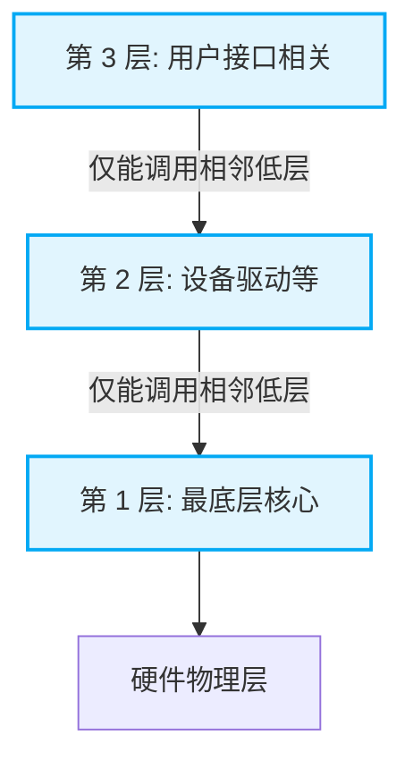

# 操作系统的体系结构与核心运行机制全解

## 一、 操作系统的新增体系结构

除了传统的大内核（宏内核）与微内核，现代操作系统大纲引入了**分层结构**、**模块化结构**以及**外核**。选择题常以这几种结构的**设计思想及优缺点**作为命题角度。

### 1. 分层结构 (Layered Structure)

内核被划分为多层（类似洋葱）。最底层是硬件，最上层是用户接口。
**核心规则**：**每一层只能单向调用相邻的低层提供的接口**，严格禁止跨层调用。

| 优点                                                                                                             | 缺点                                                                                                         |
| :--------------------------------------------------------------------------------------------------------------- | :----------------------------------------------------------------------------------------------------------- |
| **便于调试和验证**：自底向上逐层调试。底层（如硬件）没问题，再调第1层，验证OK后再调第2层，软件测试过程清晰明了。 | **难以合理定义各层边界**：系统功能常相互依赖（如进程管理与内存管理互相调用），严格的高层调低层规定极不灵活。 |
| **易于扩充和维护**：层间调用接口（函数名、参数、返回值）固定清晰。在两层间插入新层只需保证接口不变即可。         | **效率低**：不可跨层调用。高层系统调用需一层层往下传递（如 A传B, B传C, C传D），执行时间长。                  |

### 2. 模块化结构 (Modular Structure)

将内核按逻辑功能划分为多个协作模块（如进程管理、内存管理等）。
**核心组成**：**主模块**（进程/内存等核心必需模块） + **可加载内核模块**（如设备驱动，可动态加载，锦上添花）。

| 优点                                                                                            | 缺点                                                                                       |
| :---------------------------------------------------------------------------------------------- | :----------------------------------------------------------------------------------------- |
| **逻辑清晰，易于维护**：确定好模块间接口后，可支持**多模块同时并行开发**。                      | **接口定义难**：开发中途常发现需要新增互相调用的功能，初始接口定义未必合理。               |
| **适应性强 (动态加载)**：支持动态加载新模块（如新设备驱动、新文件系统），无需重新编译整个内核。 | **难以调试和验证**：模块间互相依赖、互相调用，出错时难以定位是自身问题还是被调模块的问题。 |
| **调用效率高**：任何模块间都可**直接调用函数**，无需像微内核那样通过消息传递通信。              | -                                                                                          |

### 3. 外核 (Exokernel)

一种极罕见的结构，由**内核**和**外核**两部分组成。

- **内核**：仅负责进程调度、进程通信等与硬件资源分配无关的工作。
- **外核**：负责为用户进程分配**未经抽象的（实实在在的）硬件资源**，并保障使用安全。

> **“未经抽象的硬件资源”解析**：
> 普通 OS 给进程分配的是“虚拟连续”的磁盘或内存，实际物理位置可能极其零散，访问时需 OS 查页表映射（耗时）。
> **外核直接分配物理连续的一整块资源**（如物理磁盘 0~1024 块全给你）。进程确切知道数据存放在哪。

| 优点                                                                                                                   | 缺点                                                                                             |
| :--------------------------------------------------------------------------------------------------------------------- | :----------------------------------------------------------------------------------------------- |
| **资源使用更灵活**：如果进程知道自己需要频繁随机访问文件，直接申请连续的物理磁盘块，可大幅减少磁头来回移动，提升性能。 | **降低系统一致性**：有的进程申请虚拟地址（需系统映射），有的申请物理地址，管理策略极为复杂混乱。 |
| **减少映射层，效率极高**：分配纯物理地址，进程访问时免去了 OS 查页表、地址转换的映射时间。                             | -                                                                                                |

---

## 二、 核心运行机制真题考点精析

### 1. CPU 状态与特权指令

- **核心态 (管态)**：可执行特权指令 + 非特权指令。
- **用户态 (目态)**：仅能执行非特权指令。
- **特权指令判定技巧**：凡是容易危害计算机安全、涉及底层资源分配、不常见的指令，通常是特权指令。例如：开关中断、I/O 操作、清内存、修改 PSW。
- **非特权指令举例**：`trap`（陷入/访管）、跳转指令、压栈指令、数据传送（`mov`）、设置断点（程序调试用）。

> 💡 **内核为什么不使用访管指令 (`trap`)？**
> **门卫大爷隐喻**：你想进学校，必须对门卫大爷说“麻烦开个门”（发出 `trap` 指令系统调用），大爷审核你权限后用钥匙开门（进入内核态执行特权）。
> 门卫大爷（操作系统内核）自己想进门时，直接用钥匙开门即可，完全没必要对自己喊一句“麻烦开个门”。因此，**内核态运行的内核程序，通常不需要使用访管指令**。

### 2. 中断与异常的辨析

- **外中断 (狭义中断)**：信号来自 CPU **外部**，与当前执行的指令**无关**。
  - _典型场景_：时钟中断（定时器产生，用于多道程序并发切换）、I/O 中断（如 DMA 传送结束、打印机缺纸）。
- **内中断 (异常)**：信号来自 CPU **内部**，由当前执行的指令**引发**。
  - _故障 (可修复)_：如缺页中断（访存时页面不在内存）。
  - _自陷 (Trap)_：如访管中断（执行陷入指令，主动请求系统调用）。
  - _终止 (致命错误)_：如整数除以 0、用户态强行访问系统区（存储保护错）、地址越界。

### 3. 系统调用 vs 库函数 (过程调用)

- **系统调用**：发生在用户态，处理在核心态。调用者是用户程序，被调用者必定是内核程序。
  - _必须由 OS 完成的操作_：涉及共享资源的访问，如创建新进程（`fork`）、读写文件（`read/write` 逻辑块）。
  - _非系统调用操作_：生成随机数、求绝对值、求最大值（纯用户态库函数运算）、页面置换（OS 内部异常触发，非用户主动请求）、进程调度（OS 内部状态监测触发）。
- **库函数**：运行在用户态，方便替换和调试。部分库函数（如 `printf`）底层封装了系统调用。
- **普通过程调用 (函数调用)**：调用者和被调用者状态不确定，均可在用户态或核心态。
- **系统调用参数传递顺序**：
  1. 将参数放入通用寄存器（传递参数）。
  2. 执行陷入指令（`trap/int 80`）。
  3. CPU 状态切入核心态。
  4. 执行系统调用服务程序。
  5. 结束返回结果给用户。

### 4. 现场保护机制 (中断处理中的寄存器保存)

发生中断或系统调用时，必须保存现场，以便后续恢复执行。

- **硬件负责保存**：**PC (程序计数器)** 与 **PSW (程序状态字)**。无论何种中断，硬件强制压栈保存，因其直接决定了程序返回位置及 CPU 运行状态（防止多重嵌套中断返回时状态错乱）。
- **操作系统(软件)负责保存**：**通用寄存器**（如遇到中断处理程序需要覆盖该寄存器才保存）、**中断屏蔽字**。
- _(注：快表 TLB、Cache 等存放的是数据副本，丢失可重载，无需保存。)_

### 5. 时钟中断服务程序的作用

时钟（定时器）中断是驱动多道程序并发的核心。当触发时钟中断时，内核会：

1. 更新内核中的系统时钟变量（时间累加）。
2. 更新当前进程在时间片内的剩余时间（若扣减为0，则触发进程切换）。
3. 统计当前进程占用 CPU 的总时间（用于分析 CPU/IO 繁忙型进程，优化调度算法）。

### 6. 中断向量表

- **作用**：根据硬件传入的“中断类型号”（ID），快速查找对应的“中断处理程序入口地址”。
- **最佳数据结构**：**数组**。已知中断号 `i`，通过数组索引 `A[i]` 以 $O(1)$ 时间复杂度直接拿到处理程序地址。
