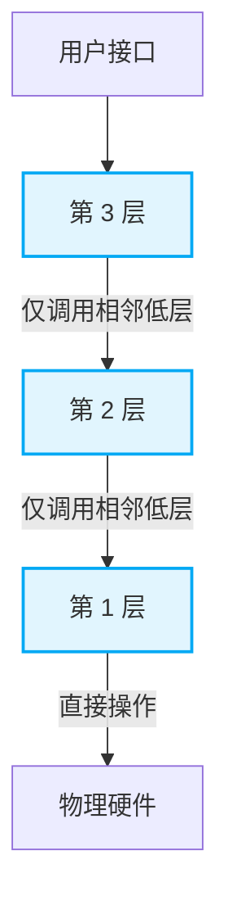
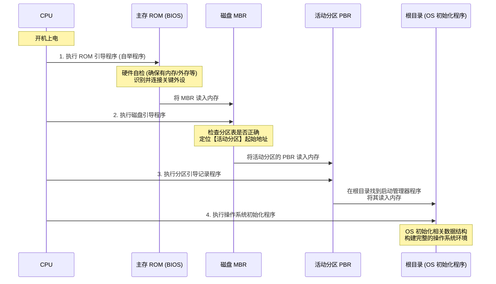

# 操作系统的体系结构与核心运行机制全解

## 一、 操作系统的新增体系结构

除了传统的大内核（宏内核）与微内核，现代操作系统大纲引入了**分层结构**、**模块化结构**以及**外核**。选择题常以这几种结构的**设计思想及优缺点**作为命题角度。

### 1. 分层结构 (Layered Approach)

将操作系统内核划分为多层（类似洋葱），最底层是硬件，最上层是用户接口。
**核心规则：各层之间只能单向依赖、单向调用（高层只能调用相邻的低层接口），严格禁止跨层调用。**

| 优点                                                                                               | 缺点                                                                                     |
| :------------------------------------------------------------------------------------------------- | :--------------------------------------------------------------------------------------- |
| **便于调试和验证**：自底向上逐层调试验证，底层无误后再调上层，测试过程清晰。                       | **边界定义困难**：系统功能常相互依赖（如进程与内存管理），严格的高层调低层规定极不灵活。 |
| **易于扩充和维护**：层间调用接口固定。在两层间插入或替换一层，只需保证对外接口不变，不影响其他层。 | **执行效率低**：不可跨层调用，高层系统调用需一层层向下传递，耗时较长。                   |

### 2. 模块化结构 (Modular Approach)

将内核按逻辑功能划分为多个协作模块（主模块 + 可动态加载的内核模块 LKM）。
**核心规则：模块之间相互依赖，任何模块都可以直接调用其他模块的函数。**

| 优点                                                                         | 缺点                                                                 |
| :--------------------------------------------------------------------------- | :------------------------------------------------------------------- |
| **逻辑清晰，支持并行开发**：确定接口后，多模块可同时开发，易于维护。         | **接口定义难**：开发中常需新增互相调用的功能，初始接口定义未必实用。 |
| **适应性强**：支持**动态加载**新模块（如新设备驱动），无需重新编译整个内核。 | **难以调试和验证**：模块间互相调用频繁，出错时极难定位错误源头。     |
| **效率高**：模块间**直接函数调用**，无需消息传递通信。                       | -                                                                    |

### 3. 大内核与微内核对比

| 对比维度          | 大内核 (宏内核 / Macrokernel)                        | 微内核 (Microkernel)                                                           |
| :---------------- | :--------------------------------------------------- | :----------------------------------------------------------------------------- |
| **内核构成**      | 所有核心功能（进程、内存、设备等）全部包含在内核态。 | 仅保留与硬件关联最紧密的模块（中断、时钟、原语、进程间通信），其他移至用户态。 |
| **通信机制**      | 模块间**直接函数调用**。                             | 模块间通过微内核进行**消息传递 (C/S 模式)**。                                  |
| **性能效率**      | **极高**（状态切换少）。                             | **较低**（需频繁在用户态与内核态之间切换）。                                   |
| **可靠性与维护**  | 代码庞大混乱，一处崩溃全盘崩溃。                     | **极高**。结构小巧清晰；非内核服务崩溃不影响全系统。                           |
| **可扩展性/移植** | 较差，需修改重编译内核代码。                         | **极好**，添加服务无需修改微内核代码，便于移植。                               |

> **微内核的设计精髓：“策略与机制分离”**
> 微内核只提供底层的“机制”（如进程调度的底层切换动作），而将上层的“策略”（如决定哪个进程优先调度的算法）留给运行在用户态的服务器模块去实现。

### 4. 外核 (Exokernel)

由**内核**（负责进程调度/通信等与硬件分配无关的工作）和**外核**组成。

- **外核的核心职责**：为用户进程分配**未经抽象的硬件资源**（例如：直接分配连续的物理磁盘块或物理内存空间），并保证资源使用安全。
- **优点**：资源使用极为灵活（如进程随机访问文件可直接控制物理磁盘位置，减少磁头移动）；减少了虚拟地址到物理地址的映射层，**提升系统效率**。
- **缺点**：降低了系统的一致性，系统管理策略变得极为复杂。

---

## 二、 处理器状态与指令权限机制

### 1. 核心态与用户态的权限划分

- **核心态 (管态)**：可执行特权指令 + 非特权指令。
- **用户态 (目态)**：**只能**执行非特权指令。

**特权指令的判定依据**：容易危害系统安全、涉及核心资源调配、不常见的指令均为特权指令。

- _特权指令_：I/O 指令、关/开中断、修改 PSW（程序状态字）、置时钟指令、清内存。
- _非特权指令_：数据传送指令（`mov`）、算术运算、压栈指令、设置断点指令（用于普通程序调试）、**访管/陷入指令 (`trap`)**。

> **内核为什么不需要使用访管指令 (`trap`)？**
> **门卫大爷隐喻**：普通用户进门，需对门卫喊“麻烦开个门”（执行陷入指令触发内中断，请求系统调用），门卫（内核）审核权限后亲自开门（特权操作）。但门卫大爷自己想进门时，直接用手里的钥匙开门即可，无需对自己喊“麻烦开个门”。因此，**处于核心态的内核程序，直接执行所需特权指令即可，不会使用访管/陷入指令。**

### 2. 中断与异常机制辨析

- **外中断 (狭义中断)**：源于 CPU 外部，与当前执行指令**无关**。
  - _示例_：时钟中断（驱动时间片轮转）、I/O 中断（如 DMA 传送结束、打印机缺纸）。
- **内中断 (异常)**：源于 CPU 内部，由当前执行指令**引发**。
  - _故障 (可修复)_：访存时缺页（缺页中断）。
  - _自陷 (Trap)_：执行访管指令，主动请求系统调用。
  - _终止 (不可修复)_：整数除以零、用户态越权访问系统区（存储保护错）。

### 3. 现场保护机制的数据归属

当发生中断时，必须保存“现场”，以便中断结束后恢复源程序：

- **由硬件自动保存**：**PC (程序计数器)** 和 **PSW (程序状态字)**。这些决定了程序返回位置和 CPU 基础状态，必须绝对安全保存。
- **由软件 (操作系统) 保存**：**通用寄存器**、**中断屏蔽字**。只有当中断服务程序确定需要覆盖某些寄存器时，才由 OS 代码负责将其压栈保存。

---

## 三、 库函数与系统调用的对比

| 维度                 | 库函数 (Library Function)                                                                              | 系统调用 (System Call)                                     |
| :------------------- | :----------------------------------------------------------------------------------------------------- | :--------------------------------------------------------- |
| **运行状态**         | 运行在**用户态**。                                                                                     | 发起于用户态，**处理过程必须在内核态**。                   |
| **与操作系统的关系** | 由编程语言提供（如 C 语言的 `stdio.h`）。                                                              | 操作系统提供的程序接口（又称广义指令）。                   |
| **底层依赖**         | 纯计算型（如求绝对值 `math.h`）无需系统调用；涉及资源请求的（如文件读写 `printf`）底层封装了系统调用。 | 直接向内核请求资源（如 `fork` 创建进程、设备分配）。       |
| **开销与替换**       | 效率高，不涉及状态切换，**容易被替换和调试**。                                                         | 涉及内中断、状态切换、现场保护，开销大，**极难替换调试**。 |

**系统调用底层参数传递顺序**：

1. 将参数送入**通用寄存器**。
2. 执行**陷入指令**（触发内中断）。
3. CPU 由用户态转为内核态。
4. 执行对应的内核服务程序。
5. 返回结果，恢复用户态。

---

## 四、 操作系统的引导过程 (Booting)

系统引导是将操作系统从磁盘加载到内存并运行的过程。

### 1. 引导相关的数据结构

- **ROM 芯片**：集成在主板，断电不丢失，存放 **BIOS** 及 **ROM 引导程序 (自举程序)**。
- **主引导记录 (MBR)**：位于磁盘 0 扇区，包含**磁盘引导程序**和**分区表**。
- **分区引导记录 (PBR)**：位于活动分区（安装 OS 的分区，如 C 盘）的起始处。
- **启动管理器**：存放在根目录下（如 Windows 的 `\Boot`），真正的 OS 初始化程序。

### 2. 标准引导四步骤

---

## 五、 虚拟机技术 (Virtual Machine)

虚拟机管理程序（VMM / Hypervisor）将一台物理机虚拟为多台虚拟机。特权级关系始终为：**VMM > 客户 OS > 应用程序**。

### 第一类 VMM vs 第二类 VMM

| 特性                 | 第一类 VMM (裸机型)                                                 | 第二类 VMM (宿主型, 如 VMWare)                                   |
| :------------------- | :------------------------------------------------------------------ | :--------------------------------------------------------------- |
| **运行位置与权限**   | 直接运行在**物理硬件**上，独占**最高特权级 (Ring 0)**。             | 运行在**宿主操作系统**之上，分为内核态驱动和用户态程序。         |
| **物理资源控制**     | 直接控制并分配未抽象的物理资源。                                    | 不能直接控制硬件，需向宿主 OS 申请抽象资源（大文件/虚拟内存）。  |
| **性能效率**         | **高**（少一层映射开销）。                                          | **低**（宿主 OS 作为硬件调用的中间人）。                         |
| **可支持虚拟机数量** | **多**（独占全部硬件性能）。                                        | **少**（资源需优先保障宿主 OS 及宿主进程运行）。                 |
| **可迁移性**         | 差，与底层硬件耦合深。                                              | **极强**，虚拟机作为一个文件/文件夹存储于外存，拷走即用。        |
| **指令截获机制**     | 客户 OS 运行在次高特权级，仅其执行敏感特权指令时才被 VMM 截获模拟。 | 客户 OS 运行在用户态，其所有系统调用均被 VMM 截获并转交宿主 OS。 |
