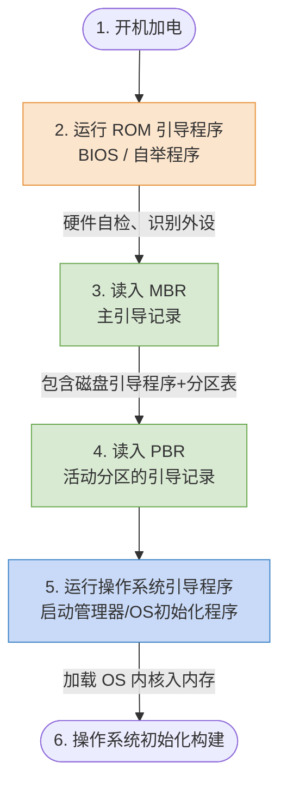

# 操作系统核心考点：系统结构、引导过程与虚拟机

> **导语**
> 本节笔记提炼了操作系统课程中的三大难点：**操作系统的体系结构（微内核与外核）**、**计算机的启动引导过程**以及**虚拟机技术**。
> 内容剥离了冗长的口语，将核心知识点以对比表格、流程图等形式进行了结构化重组，非常适合备考复习和日常查阅。

---

## 一、 操作系统的结构：大内核 vs 微内核

### 1. 微内核 (Microkernel) 的核心设计思想

微内核的设计理念是**“让内核尽可能小”**，只保留最底层、最核心、与硬件强相关的功能，将其他高级服务移到用户态执行。

- **必定留在微内核的功能**：
  1.  **进程与线程管理**（底层机制，如进程切换需直接操作CPU）
  2.  **低级存储器管理**（如页表硬件控制）
  3.  **中断和陷入处理**
  4.  **低级 I/O 操作**（与底层硬件强相关的端口读写）
- **移出微内核的功能（放在用户态）**：
  - 文件系统服务、高级进程调度策略、设备驱动的逻辑层等。

### 2. 微内核的两大典型特征

- **策略与机制分离**：
  - **机制**（内核态）：微内核提供基础的“工具箱”（如进程切换的具体动作）。
  - **策略**（用户态）：上层的管理模块决定“怎么用工具箱”（如决定哪个进程优先上CPU）。
- **基于 C/S (Client/Server) 模式**：
  - 用户态的各个功能模块（如文件服务器）相当于服务端（Server）。
  - 应用程序相当于客户端（Client）。两者通过微内核进行消息传递（请求与响应）。

### 3. 微内核的优缺点总结

| 维度                  | 大内核 (宏内核 Monolithic)                 | 微内核 (Microkernel)                                     |
| :-------------------- | :----------------------------------------- | :------------------------------------------------------- |
| **性能效率**          | 🌟 **极高** (所有功能在内核，无需频繁切换) | ⚠️ **较低** (系统调用需频繁在用户态和内核态间切换)       |
| **可靠性/稳定性**     | 较低 (一个模块崩溃可能导致整个系统宕机)    | 🌟 **极高** (内核小巧，容错率高；某个服务崩溃不影响内核) |
| **可扩展性/可移植性** | 较差 (代码耦合度高)                        | 🌟 **极高** (采用面向对象技术，增删服务无需修改内核代码) |
| **适用场景**          | 传统 PC 操作系统 (如 Linux)                | 分布式系统、实时系统                                     |

---

## 二、 操作系统的外核 (Exokernel)

外核是一种更为极端的架构设计。

- **核心功能**：专门负责为虚拟机或用户进程**分配未经抽象的硬件资源**（例如：明确告诉用户进程你使用的是物理磁盘的第 $0 \sim 1023$ 块）。
- **优势**：直接分配物理资源，减少了虚拟硬件资源映射的开销，极大提升了系统效率；同时确保资源使用的安全隔离。
- **⚠️ 易错点**：外核**不负责**进程调度，它只管底层硬件资源的分配与隔离。

---

## 三、 计算机与操作系统的引导过程 (Booting)

计算机开机启动是一个“俄罗斯套娃”般层层加载的过程。

### 各阶段核心任务拆解

1.  **ROM 引导程序 (BIOS)**：
    - 存储在主板的 ROM 芯片中（断电不丢失，防病毒篡改）。
    - 负责**关键部件自检**（检查内存、硬盘等）和**识别外设**（如显示器、键盘）。
2.  **主引导记录 (MBR, Master Boot Record)**：
    - 位于磁盘的第一个扇区。
    - 包含**磁盘引导程序**和**磁盘分区表**。负责检查分区表，并找出**活动分区**（装有 OS 的分区，如 C 盘）。
3.  **分区引导记录 (PBR)**：
    - 加载活动分区的启动程序。
4.  **操作系统引导程序**：
    - 也叫启动管理器（如 Windows 的 `bootmgr` 或 Linux 的 `GRUB`）。若为双系统，会与用户交互选择启动哪个系统。
5.  **操作系统初始化**：
    - 在内存中建立中断向量表、内核页表、PCB 就绪队列等核心数据结构，最终启动首个用户进程。

---

## 四、 虚拟机技术 (Virtual Machine)

虚拟机的本质是在物理硬件之上增加软件层，实现硬件资源的标准化和复用。

### 1. 两类虚拟机管理程序 (VMM) 对比

| 对比维度     | 第一类 (裸金属型 / Bare-metal) | 第二类 (宿主型 / Hosted)              |
| :----------- | :----------------------------- | :------------------------------------ |
| **运行位置** | 直接运行在**底层物理硬件**之上 | 运行在**宿主操作系统 (Host OS)** 之上 |
| **特权级别** | **最高特权级** (核心态)        | 大部分运行在**用户态**                |
| **运行效率** | 🌟 **高** (直接控制硬件)       | ⚠️ **低** (需经过宿主 OS 转发请求)    |
| **典型代表** | VMware ESXi, Xen               | VMware Workstation, VirtualBox        |

### 2. 虚拟机核心考点

- **敏感指令拦截**：虚拟机中的客户操作系统运行在用户态。当它尝试执行特权/敏感指令时，真实硬件会拒绝，并触发异常被 VMM 截获，由 VMM 代理执行，确保系统安全。
- **文件形式存在**：在第二类虚拟机中，一台虚拟机的所有数据通常被封装在宿主 OS 的一个普通文件夹（外存数据）中。
- **指令集模拟**：虚拟化技术支持模拟不同的指令集架构（ISA），例如在 Windows (x86) 上运行基于 ARM 架构的系统。

---

## 附：常见存储介质常识速记

- **RAM (随机存取存储器)**：内存条，读写快，断电**数据丢失**。
- **ROM (只读存储器)**：主板 BIOS 芯片，一次写入不可更改，断电**数据不丢失**。
- **EPROM**：可擦除可编程 ROM，可通过物理/电学方式擦除重写。
