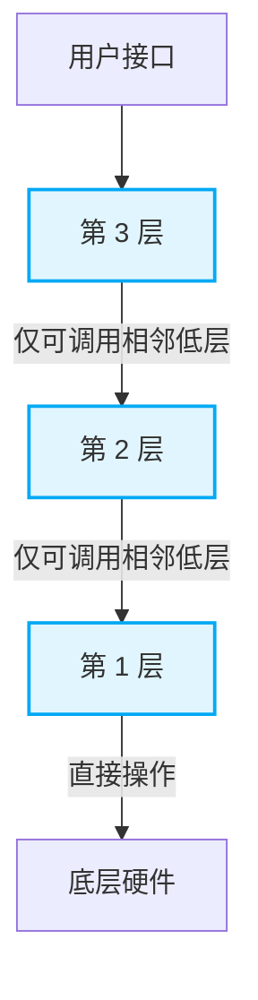
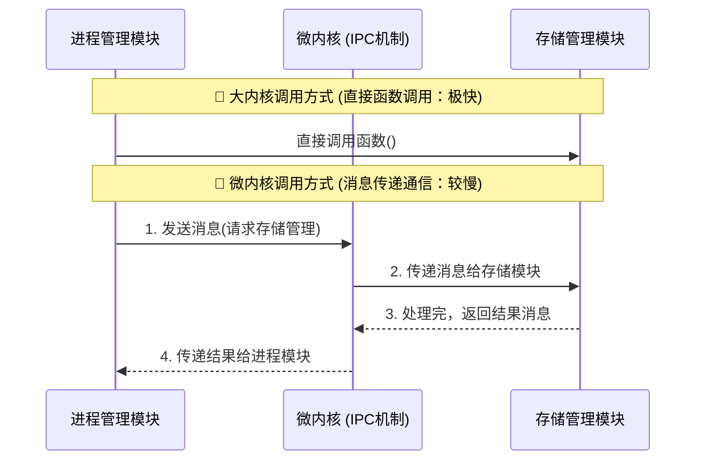

# 1.4 操作系统的体系结构 (详解版)

操作系统的内核设计有多种不同的架构。近年来大纲新增了**分层结构、模块化结构以及外核**。选择题大概率会考查各种结构的**特性、设计思想及其优缺点**。

---

## 一、 分层结构 (Layered Approach)

分层结构将操作系统内核划分为多层，就像洋葱一样。

- **设计规则**：每一层只能**单向地调用相邻的低层**所提供的接口。不能跨层调用。
  - 例如：第 3 层只能调用第 2 层，第 2 层只能调用第 1 层，只有最底层的第 1 层可以直接操作硬件。

👇 **分层结构调用逻辑图**

### 优缺点分析

| 优点                                                                                                                                  | 缺点                                                                                                                                 |
| :------------------------------------------------------------------------------------------------------------------------------------ | :----------------------------------------------------------------------------------------------------------------------------------- |
| **便于调试和验证**：可以“自底向上”逐层调试。底层（如硬件或第1层）验证无误后，其上层就可以基于已验证的底层进行调试，测试过程清晰明了。 | **难以合理定义各层边界**：操作系统很多功能是相互依赖的（如进程管理依赖内存管理，内存管理有时又依赖进程管理），严格单向分层极不灵活。 |
| **易于扩充和维护**：只要层间接口的定义（函数名、参数、返回值）保持不变，在两层之间插入一个新层非常简单。                              | **效率低**：由于不能跨层调用，高层的系统调用请求只能一层一层地往下传递，导致执行时间变长。                                           |

---

## 二、 模块化结构 (Modular Approach)

模块化将操作系统内核划分为多个相互协作的模块（如进程管理、内存管理等）。

- **结构划分**：
  - **主模块**：内核中必不可少的核心模块（如进程、内存管理）。
  - **可加载内核模块 (Loadable Kernel Modules, LKM)**：可以动态加载到内核中的辅助模块（如设备驱动程序、新文件系统），它们不影响系统的基本运行，主要用于拓展功能。

### 优缺点分析

| 优点                                                                                                     | 缺点                                                                                                                                         |
| :------------------------------------------------------------------------------------------------------- | :------------------------------------------------------------------------------------------------------------------------------------------- |
| **模块间逻辑清晰，易于维护**：按逻辑功能划分，并且只要确定了模块间的接口，多个模块可以**同时并行开发**。 | **接口定义难**：开发过程中可能会发现模块间需要相互调用各种新功能，最初的接口定义未必实用。                                                   |
| **适应性强**：支持**动态加载**新的内核模块（如插上新设备自动加载驱动），无需重新编译整个内核。           | **难以调试和验证**：模块之间可以相互调用（你调我，我调你），依赖关系复杂。一旦出错，很难定位是自身模块、被调用模块，还是循环调用引发的问题。 |
| **调用效率高**：任何模块之间都可以直接相互调用函数，无需像微内核那样采用“消息传递”进行通信。             | -                                                                                                                                            |

---

## 三、 大内核 vs 微内核 (宏内核 vs Microkernel)

这是大家最熟悉的基础架构对比。

- **大内核 (宏内核)**：将**所有**的系统功能（如进程、存储、设备、中断等）都放在内核态中运行。本质上大内核也采用了模块化设计，内部各功能可**直接相互调用**。
- **微内核**：只将**最基本、与硬件联系最紧密**的功能（中断、时钟、原语）放在内核中。其他功能（进程管理等）移至内核外（用户态）。

👇 **大内核与微内核通信效率对比**

### 优缺点分析

| 架构       | 优点                                                               | 缺点                                                                                        |
| :--------- | :----------------------------------------------------------------- | :------------------------------------------------------------------------------------------ |
| **大内核** | 各模块直接调用，**性能极高**。                                     | 代码庞大、结构混乱，难以维护。任一模块出错可能导致整个系统崩溃。                            |
| **微内核** | 内核精简，**可靠性高，方便维护**。非内核模块崩溃不会导致全盘崩溃。 | 模块间通信需通过微内核的消息传递机制，**频繁切换 CPU 状态（用户态与内核态），导致性能低**。 |

---

## 四、 外核 (Exokernel)

外核是一种非常罕见且特殊的操作系统结构。

- **结构组成**：包含**内核**和**外核**两部分。
- **职责划分**：
  - **内核**：只负责进程调度、进程通信等与硬件分配无关的工作。
  - **外核**：负责为用户进程**分配未经抽象的（物理真实的）硬件资源**，并保证这些资源的安全使用。

### “未经抽象的硬件资源”是什么意思？

- **普通 OS (虚拟/抽象分配)**：OS 给进程分配内存或磁盘时，进程看到的是连续的**虚拟地址/虚拟文件空间**。实际上这些数据被 OS 零散地映射到物理内存或磁盘的各个角落。访问时需要 OS 帮忙进行地址映射查找（降低了效率）。
- **外核 OS (真实物理分配)**：外核直接给进程分配一整块**连续的物理磁盘块或物理内存**。进程知道这些数据具体在物理硬件的哪里。

### 优缺点分析

| 优点                                                                                                                           | 缺点                                                                                                                     |
| :----------------------------------------------------------------------------------------------------------------------------- | :----------------------------------------------------------------------------------------------------------------------- |
| **用户进程使用资源更灵活**：如果进程需要频繁随机访问数据，可以直接向外核申请连续的物理磁盘块，减少磁头来回跳动，极大提升性能。 | **降低了系统的一致性**：系统变得极其复杂。因为有的进程申请的是虚拟映射空间，有的申请的是直接的物理空间，管理策略不统一。 |
| **减少映射层，提升效率**：因为分配的是直接的物理地址，进程访问时操作系统不需要再去查页表做虚拟地址映射，节省了时间。           | -                                                                                                                        |
