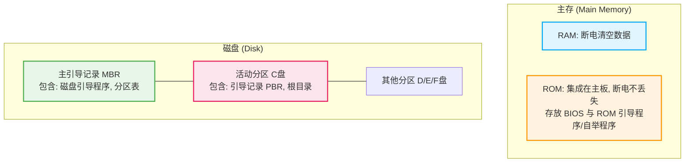
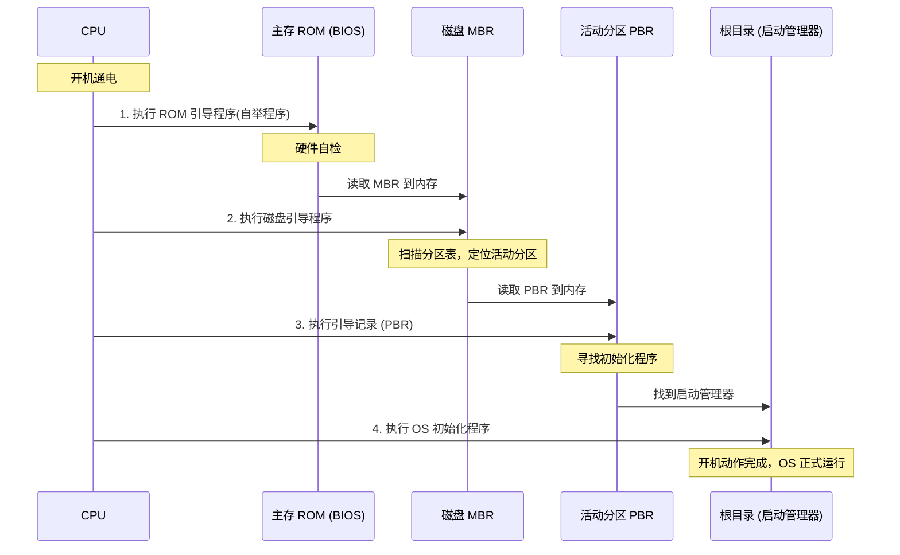

# 1.5 操作系统的引导

操作系统的引导即计算机开机时，让操作系统在电脑上运行起来的全过程。理解该过程需要先了解磁盘与主存中的特定数据结构。

## 一、 磁盘与主存的数据结构

在操作系统引导之前，必须明确存放引导数据的硬件结构：

### 1. 主存结构 (Main Memory)

- **RAM**：我们平时所说的“电脑内存”，断电后内部数据会被清空。
- **ROM**：集成在电脑主板上的存储芯片，断电后数据**不会丢失**。内部存放有 **BIOS**（基本输入输出系统），其中最关键的是 **ROM 引导程序（又称自举程序）**。

### 2. 磁盘结构 (Disk)

- **主引导记录 (MBR, Master Boot Record)**：位于磁盘的开头位置，包含两个重要部分：
  - **磁盘引导程序**：用于后续寻找活动分区。
  - **分区表**：说明每个分区占用的空间大小及地址范围。
- **活动分区 (Active Partition)**：安装了操作系统并用于启动的分区（通常是 C 盘）。C 盘的开头和根目录包含：
  - **引导记录 (PBR, Partition Boot Record)**：位于活动分区开头的特殊程序。
  - **根目录**：存放操作系统初始化的启动管理器程序。

👇 **硬件数据结构分布图**

---

## 二、 操作系统引导的四个步骤

CPU 通电后，会严格按照以下四个步骤一步步完成开机引导：

1.  **执行 ROM 引导程序（自举程序）**
    - CPU 通电后，前往主存的固定位置（ROM）取指令，执行 ROM 引导程序。
    - 进行**硬件自检**（检查内存条、磁盘等是否正常）。硬件无误后，指示 CPU 将磁盘的**主引导记录 (MBR)** 读入内存。
2.  **执行磁盘引导程序 (MBR)**
    - CPU 执行读入内存的磁盘引导程序。
    - 扫描 MBR 中的**分区表**，找到安装操作系统的**活动分区（C 盘）**及其起始地址。
    - 将活动分区的**引导记录 (PBR)** 读入内存。
3.  **执行引导记录 (PBR)**
    - CPU 执行 PBR 程序。
    - 该程序负责在 C 盘的**根目录**中，找到完整的**启动管理器**（操作系统初始化程序）。
4.  **执行操作系统初始化程序**
    - CPU 执行启动管理器程序，完成一系列开机动作（如屏幕上显示的转圈圈加载画面）。
    - 初始化工作完成后，操作系统正式启动完毕。

👇 **操作系统引导流程时序图**

---

## 三、 实践拓展

如果你使用的是 Windows 操作系统，可以打开 C 盘，寻找 `C:\Windows\Boot` 文件夹。这里面存放的就是第四步中提到的**操作系统初始化程序**相关的文件。了解理论后结合实际目录观察，能让记忆更加牢固。
