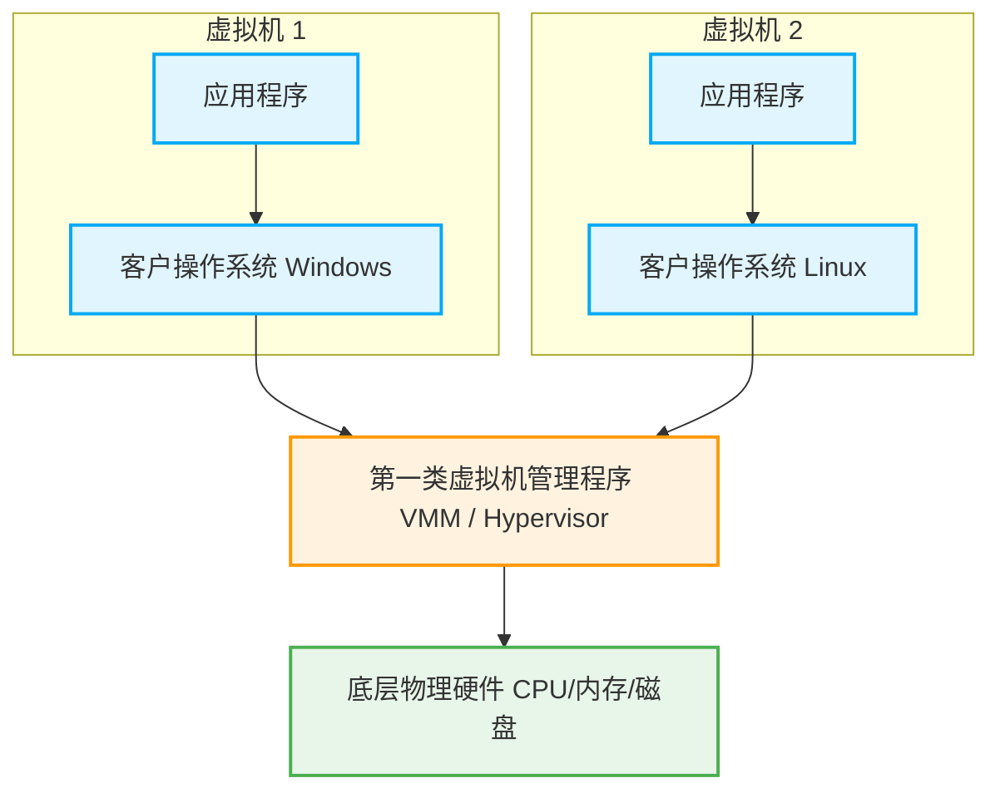
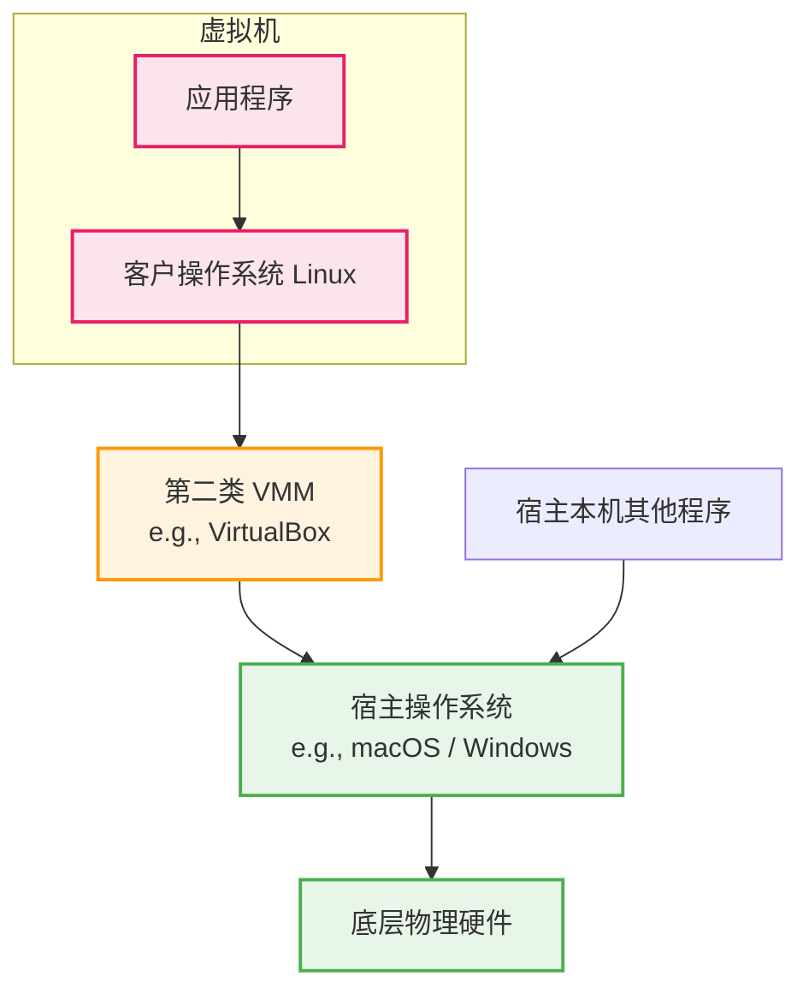

# 1.6 虚拟机 (Virtual Machine)

本节介绍虚拟机的概念及其两类管理程序的区别。近年来大纲新增内容，考查重点通常在于**第一类与第二类虚拟机管理程序的特性对比**。

---

## 一、 虚拟机的概念与由来

### 1. 传统物理机的局限性

- **资源浪费与隔离性差**：传统计算机在一台物理机器上只能运行一个操作系统。如果在同一系统上同时运行多个存在竞争或安全隐患的商业进程（如两个不同游戏的服务器），可能会互相影响。
- **痛点**：若为了隔离而把它们分别部署在两台物理机上，又会造成硬件资源（如高性能 CPU、内存）的极大浪费。

### 2. 虚拟机的诞生

- **概念**：虚拟机（VM）利用虚拟化技术，将一台物理机器虚拟化为多台逻辑上的虚拟机器。每台虚拟机上都可以独立运行各自的操作系统和应用程序，互相隔离。
- **核心实现者**：**虚拟机管理程序**，英文叫 Virtual Machine Monitor (**VMM**) 或 **Hypervisor**（虚拟机监控程序）。这些术语含义等同。

---

## 二、 虚拟机管理程序的两类划分 (核心考点)

虚拟机管理程序根据其运行位置和资源控制方式，分为第一类和第二类。

### 1. 第一类虚拟机管理程序 (裸机型 / Type 1)

- **运行位置**：**直接运行在裸机硬件之上**。
- **资源分配**：直接接管并分配物理硬件资源（CPU 时间片、内存空间、磁盘空间）。类似于一个超级操作系统。
- **特权级划分 (Ring 机制)**：
  - 现代 CPU 将特权级进行了更精细的划分（如 Ring 0 ~ Ring 3）。
  - **VMM (管理程序)**：运行在最高特权级（Ring 0 / 核心态）。
  - **客户操作系统 (Guest OS)**：运行在次高特权级（如 Ring 1 / 虚拟内核空间）。它误以为自己运行在核心态，当它尝试执行 Ring 0 的敏感特权指令时，会被 VMM **截获**并模拟执行。
  - **用户进程**：运行在最低特权级（Ring 3 / 用户态）。

👇 **第一类 VMM 架构图**

### 2. 第二类虚拟机管理程序 (宿主型 / Type 2)

- **运行位置**：运行在**宿主操作系统 (Host OS)** 之上。例如在 macOS (宿主) 上安装 VirtualBox 或 VMWare。
- **资源分配**：它无法直接控制硬件，必须作为普通程序**向宿主操作系统申请资源**。
  - _外存分配_：宿主 OS 给它分配一个大文件（虚拟磁盘），它再把这个文件分给虚拟机。
  - _内存分配_：宿主 OS 给它分配虚拟内存，它再把虚拟内存分给虚拟机（套娃分配）。
- **运行模式**：
  - 一部分运行在用户态。
  - 一部分以**虚拟机驱动程序**的方式加载到宿主操作系统的内核态中。当客户 OS 发出系统调用（如读写磁盘）时，会被 VMM 截获，并由 VMM 代替它向宿主 OS 发出真实的系统调用。宿主 OS 始终充当“中介”工具人。

👇 **第二类 VMM 架构图**

---

## 三、 第一类 vs 第二类 VMM 特性对比 (必考点)

这是本节最有可能命题的角度，请务必理解记忆：

| 对比维度              | 第一类虚拟机管理程序 (Type 1)                                                                | 第二类虚拟机管理程序 (Type 2)                                                                                |
| :-------------------- | :------------------------------------------------------------------------------------------- | :----------------------------------------------------------------------------------------------------------- |
| **物理资源控制权**    | **直接控制**并分配物理资源（未经抽象）。                                                     | **无法直接控制**。依赖宿主 OS 为其分配经过抽象的虚拟资源（大文件/虚拟内存）。                                |
| **性能表现**          | **性能好**。因为减少了一层虚拟化地址映射的中介开销。                                         | **性能差**。每次系统调用和硬件访问都必须通过宿主 OS 作为中介（多层映射“套娃”）。                             |
| **支持的虚拟机数量**  | **更多**。因为 VMM 独占所有硬件资源，没有宿主 OS 的额外消耗。                                | **较少**。硬件资源需优先满足宿主 OS 及其本机进程的需求。                                                     |
| **可迁移性 (灵活性)** | 较差。将虚拟机迁移到另一台物理机的流程较繁琐。                                               | **极好**。虚拟机被打包成了镜像文件（如 `.iso` 或大文件），拷走文件在另一台机器上加载即可运行。商业应用广泛。 |
| **运行模式**          | **最高特权级 (Ring 0)**。客户 OS 运行在次高特权级，仅在执行特权敏感指令时才被 VMM 截获模拟。 | **用户态 + 内核态 (驱动)**。客户 OS 的所有底层系统调用都会被 VMM 截获，并由 VMM 代替它向宿主 OS 申请服务。   |
