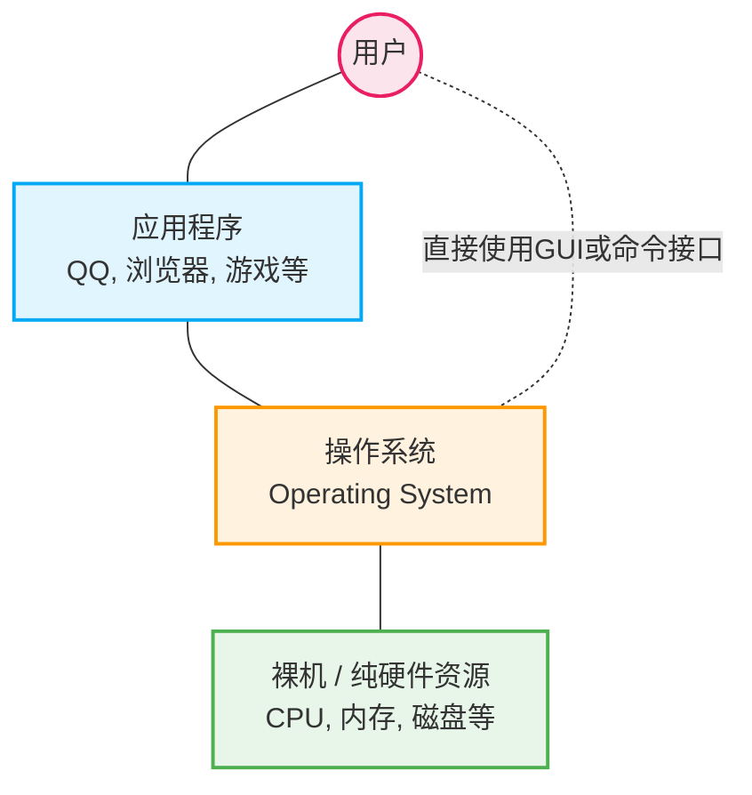
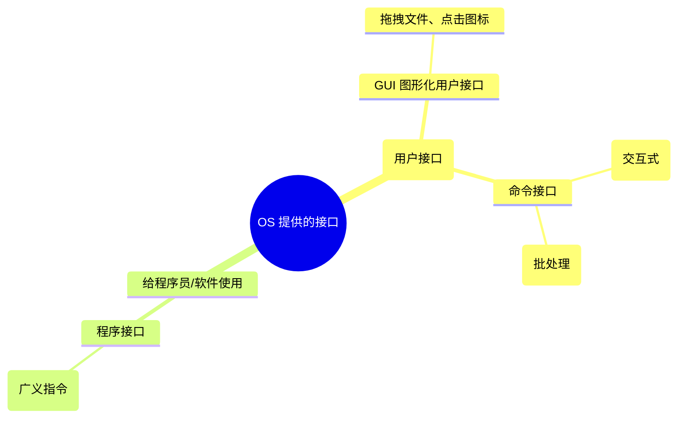

# 1.1 操作系统的概念、功能和目标

## 一、 引言：我们身边的操作系统

在我们深入理论之前，可以先结合日常的感性经验：

- **主流系统**：苹果的 macOS / iOS，质朴实用的 Windows / Android。
- **专业/早期系统**：技术人员必备的 Linux，以及早期的塞班（Symbian）系统。
  通过将平时使用这些系统的经验与接下来的理论知识相结合，可以做到学以致用。

---

## 二、 计算机系统的层次结构与操作系统定义

### 1. 计算机系统的层次结构

一台电脑从出厂到被我们使用，经历了“**裸机 (纯硬件) → 安装操作系统 → 安装应用程序 → 用户使用**”的过程。

👇 **计算机系统层次结构图**

_注：用户不仅可以通过应用程序使用计算机，也可以直接与操作系统交互；应用程序的底层实现也直接与操作系统相连。_

### 2. 操作系统的概念与定义

> **操作系统的标准定义**：
> 操作系统是指控制和管理整个计算机系统的**硬件和软件资源**，并合理地组织调度计算机的工作和资源的分配；以**提供给用户和其他软件方便的接口和环境**；它是计算机系统中最基本的**系统软件**。

---

## 三、 操作系统的三大核心功能与目标

### 1. 作为“系统资源的管理者”

操作系统既管理软件资源，也管理硬件资源。以“在电脑上打开 QQ 和朋友视频聊天”为例，操作系统在背后默默完成了以下四大管理功能：

| 用户操作步骤           | 背后发生的物理过程                                           | 对应的操作系统功能             | 后续对应章节 |
| :--------------------- | :----------------------------------------------------------- | :----------------------------- | :----------- |
| **① 找到 QQ 安装目录** | 在 `D:\` 盘的一系列层级目录中寻找 `QQ.exe` 启动程序。        | **文件管理**                   | 第四章       |
| **② 双击打开 QQ.exe**  | 程序执行前，必须将程序数据从磁盘调入内存，并安排好存放位置。 | **存储器管理** (主存/内存管理) | 第三章       |
| **③ QQ 程序正常运行**  | 决定何时将处理机（CPU）资源分配给 QQ 进程使用。              | **处理机管理**                 | 第二章       |
| **④ 和朋友开启视频**   | 将本机的摄像头设备分配给 QQ 进程使用。                       | **设备管理**                   | 第五章       |

### 2. 向上层提供方便易用的服务（接口）

最底层的硬件只能听懂丑陋复杂的二进制机器语言（0和1）。操作系统利用了**封装思想**（类似汽车把复杂的发动机封装成简单的方向盘和油门），屏蔽了底层硬件细节，向上层暴露了更美丽、友好的交互接口。

👇 **操作系统提供的接口分类图**

#### A. 给普通用户使用的接口

1.  **GUI (图形化用户接口)**：最形象直观，如在 Windows 中把文件拖入回收站。
2.  **命令接口**：
    - **联机命令接口（交互式命令接口）**：**“说一句，做一句”**。例如打开 Windows 的 cmd 小黑框，输入 `time`，系统返回时间并等待你输入新时间，处于不断交互的过程。
    - **脱机命令接口（批处理命令接口）**：**“说一堆，做一堆”**。例如运行 Windows 下的 `.bat` 批处理文件。用户把一堆命令写在清单里，系统一次性按顺序自动执行完。

#### B. 给程序员/软件使用的接口

- **程序接口（系统调用）**：普通用户无法直接使用，程序员在写代码时通过**系统调用**来间接使用。
  - _示例_：C语言的 `printf` 是一个标准库函数，但其底层实现正是请求了操作系统提供的“显示相关的系统调用”，操作系统再去操作显示器打印出 "Hello World"。
  - _别名注意_：在有些教材中，系统调用又被称为**“广义指令”**。

_(注：部分老教材认为狭义的“用户接口”只包含命令接口和程序接口，不含 GUI，做题时需稍加注意语境。)_

### 3. 作为最接近硬件的层次：实现对硬件机器的拓展

- **裸机**：没有任何软件支持的纯硬件计算机。
- **扩充机器 (虚拟机)**：覆盖了操作系统的裸机。
- **拓展原理**：就像给发动机和轮子加上传动系统，汽车就能跑起来一样；操作系统把 CPU、内存等零散的硬件合理组织、协调配合，使简单的硬件能实现更多复杂功能，让机器功能更强、使用更方便。

---

**高频考点速记提示**

- 操作系统是最基本的**系统软件**（非硬件）。
- 判断命令接口类型认准交互特征：联机命令接口 = 交互式（说一句做一句）；脱机命令接口 = 批处理（说一堆做一堆）。
- 应用程序请求操作系统服务的唯一方式是**系统调用**（程序接口）。
