# 1.1.2 操作系统的四个特征

操作系统的四个基本特征分别是：**并发、共享、虚拟、异步**。其中，**并发和共享是操作系统最基本的两个特征，并且二者互为存在条件。**本节内容通常在选择题中考查概念理解。

---

## 一、 并发 (Concurrency)

### 1. 并发与并行的区别 (核心考点)

要理解操作系统的并发性，首先必须严格区分“并发”与“并行”的概念。

- **并发 (Concurrency)**：指两个或多个事件在同一**时间间隔**内发生。
  - **特点**：在**宏观上**是同时发生的，但在**微观上**是**交替发生**的。
  - _生活类比：单手撸两只猫（招财和进宝）。一段时间内看起来两只猫都在被撸，但任何一个瞬间，手只摸着其中一只猫，属于左右交替抚摸。_
- **并行 (Parallelism)**：指两个或多个事件在同一**时刻**（瞬间）同时发生。
  - _生活类比：双手撸猫。左手摸招财，右手摸进宝，两个动作在同一时刻真正同时进行。_

👇 **并发与并行的微观执行对比**

```mermaid
gantt
    title 并发 vs 并行 (时间轴视角)
    dateFormat  s
    axisFormat %S

    section 单核 CPU (并发)
    程序 A : a1, 0, 1
    程序 B : b1, 1, 2
    程序 A : a2, 2, 3
    程序 B : b2, 3, 4

    section 多核 CPU (并行)
    核心 1 - 程序 A : c1, 0, 4
    核心 2 - 程序 B : d1, 0, 4
```

### 2. 操作系统的并发性

操作系统的并发性是指计算机系统中**“同时”运行着多道程序**。

- 即使是现代的多核 CPU（例如 4 核支持 4 道程序绝对并行），当用户打开的程序数量（如 5 个或更多）超过核心数时，必然需要通过操作系统的**调度**，让程序在微观上交替上 CPU 运行。
- 因此，即使在多核时代，并发性依然是不可或缺的。

---

## 二、 共享 (Sharing)

共享是指系统中的**资源共享**。即有限的硬件或软件资源，如何供多个**并发执行的进程**共同使用。

根据资源的属性，共享方式主要分为两种：

| 共享方式     | 概念界定                                                                             | 典型代表资源     | 举例说明                                                                                    |
| :----------- | :----------------------------------------------------------------------------------- | :--------------- | :------------------------------------------------------------------------------------------ |
| **互斥共享** | 在一段时间内，**只允许一个进程**访问该资源。                                         | 摄像头、打印机等 | 打开系统相机时，微信视频就无法同时调用摄像头。                                              |
| **同时共享** | 在一段时间内，允许**多个进程“同时”**访问该资源（宏观上同时，微观上可能是交替访问）。 | 硬盘、扬声器等   | 可以一边用音乐软件听歌，一边看B站视频，两者同时共享扬声器；QQ和微信可同时发送硬盘里的文件。 |

### 💡 为什么并发与共享互为存在条件？

1.  **没有并发，就不需要共享**：如果没有并发，系统同一时间只跑一个程序，所有资源独占即可，共享性失去存在意义。
2.  **没有共享，就无法实现并发**：如果不提供同时共享硬盘的能力，QQ 和微信就无法在同一时间段内分别读取发送文件，并发运行的设想也就成了空谈。

---

## 三、 虚拟 (Virtualization)

虚拟是指把一个**物理上的实体**变成若干个**逻辑上的对应物**。物理实体是实际存在的，而逻辑上的对应物是用户感知到的。

虚拟技术主要基于两种思想实现：

### 1. 空分复用技术 (虚拟存储器技术)

- **概念**：将有限的物理空间切分，分块给不同的进程独立复用。
- **示例**：物理内存只有 4GB。但用户却可以一边玩 GTA5（最低配置 4GB），一边挂 QQ、迅雷和听歌。用户在**逻辑上感知到**的内存容量似乎远大于 4GB。这是通过将内存切分、动态换入换出实现的。

### 2. 时分复用技术 (虚拟处理器技术)

- **概念**：将时间切分为微小的时间片，让多个进程交替使用同一个物理设备。
- **示例**：只有一个单核 CPU（物理实体只有一个），但用户打开了 6 个软件都在运行。这是因为 CPU 被切分成了极短的时间片，交替为各个软件服务。在用户看来，**逻辑上**似乎有 6 个 CPU 在同时为这 6 个软件服务。

---

## 四、 异步 (Asynchronism)

- **定义**：在多道程序环境下，由于系统资源有限，并发执行的多个进程并不是“一贯到底”的，而是**走走停停**，以**不可预知的速度**向前推进。
- **情景理解**：
  - _场景_：用微信发送 iCloud 云盘里一张还未下载到本地的图片。
  - _问题产生_：iCloud 下载进程和微信发送进程是**并发运行**的。由于 CPU 和网络资源有限，iCloud 的下载是走走停停的（速度不可预知）。如果微信不等 iCloud 下载完，中途就尝试发送，就会导致发送残缺文件。
  - _解决思路_：操作系统必须提供一套**“进程同步机制”**（详见第二章），来协调这些以异步（不可预知速度）推进的进程，防止出现时序上的逻辑错误。

---

> **复习小结**：重点理解并发（交替）与并行（同时）的区别，以及互斥共享与同时共享的区别。虚拟和异步概念在当前阶段建立初步认知即可，在后续“内存管理”和“进程管理”章节会深入剖析。
