# 操作系统的发展历程与分类

操作系统的发展历程按时间顺序可划分为五个主要阶段。学习的重点在于理解**各阶段为了解决什么核心问题而诞生，以及它们各自的优缺点**。

## 一、 发展阶段总览对比

| 发展阶段           | 核心技术 / 标志             | 解决的核心问题                     | 存在的主要缺点                               |
| :----------------- | :-------------------------- | :--------------------------------- | :------------------------------------------- |
| **手工操作阶段**   | 纸带机打孔                  | 无（前操作系统时代）               | 独占全机、人机速度矛盾导致 CPU 利用率极低    |
| **单道批处理系统** | 脱机 I/O 技术、**监督程序** | 缓解人机速度矛盾                   | 串行执行，内存中仅一道程序，CPU 仍有大量空闲 |
| **多道批处理系统** | **操作系统正式诞生**        | 提升系统资源（尤其是 CPU）的利用率 | 不提供人机交互功能 不能调试                  |
| **分时操作系统**   | **时间片**轮转              | 实现人机交互、及时响应             | 绝对公平，无法优先处理紧急任务               |
| **实时操作系统**   | 优先级调度                  | 满足紧急任务的及时性与可靠性要求   | -                                            |

---

## 二、 各阶段详细解析

### 1. 手工操作阶段 (前 OS 时代)

- **工作方式**：程序员在纸带上打孔（有孔代表 `1`，无孔代表 `0`）编写程序。将纸带装入纸带机输入计算机，运行结束后再通过纸带机输出结果，由程序员手工取走。
- **致命缺点**：
  - **用户独占全机**：一个程序员的程序未运行结束前，其他程序员绝对无法使用计算机。
  - **人机速度矛盾**：手工装卸纸带和纸带机的读取速度极慢，而计算机 CPU 的计算速度极快。导致 CPU 在绝大部分时间里处于空闲等待状态，资源严重浪费。

### 2. 单道批处理系统

为了缓解手工操作带来的严重资源浪费，引入了**脱机输入输出技术**。

- **工作方式**：程序员将装有程序的纸带集中，由专用的“外围控制机”将其高速录入到**磁带**中。计算机直接从读写速度更快的磁带中读取作业。
- **监督程序**：系统中运行着一个名为“监督程序”的软件（操作系统的雏形），它负责控制计算机自动地从磁带中逐个读入作业、计算并输出。
- **局限性**：内存中同一时刻**只能有一道程序**运行。各程序之间是**串行执行**的，当程序进行 I/O 操作时，CPU 依然处于空闲等待状态。

👇 **单道批处理系统的执行状态（串行执行，CPU存在空闲）**

```mermaid
gantt
    title 单道批处理系统运行示意
    dateFormat  s
    axisFormat %S

    section I/O 设备
    输入作业 1 :a1, 0, 2
    输出作业 1 :a2, 4, 6
    输入作业 2 :a3, 6, 8

    section CPU
    空闲等待 :crit, 0, 2
    计算作业 1 :b1, 2, 4
    空闲等待 :crit, 4, 8
```

### 3. 多道批处理系统 (操作系统的正式诞生)

- **工作方式**：每次往内存中读入**多道程序**，让这些程序**并发运行**。
- **核心优势**：允许多道程序共享计算机资源（CPU、I/O 设备等）。例如，当作业 1 在使用输出设备时，CPU 可以立即切换去计算作业 2，同时输入设备可以读取作业 3。
- **主要缺点**：**不提供人机交互功能**。用户提交作业后只能盲等结果，无法在程序运行过程中进行调试或动态输入参数。

👇 **多道批处理系统的执行状态（并发执行，资源重叠利用）**

```mermaid
gantt
    title 多道批处理系统运行示意 (资源宏观并行利用)
    dateFormat  s
    axisFormat %S

    section I/O (输入)
    输入作业 1 :a1, 0, 2
    输入作业 2 (与计算1重叠) :a2, 2, 4
    输入作业 3 (与输出1、计算2重叠) :a3, 4, 6

    section I/O (输出)
    输出作业 1 (与读入3、计算2重叠) :c1, 4, 6

    section CPU
    空闲 :crit, 0, 2
    计算作业 1 :b1, 2, 4
    计算作业 2 :b2, 4, 6
```

### 4. 分时操作系统

为了解决多道批处理系统无法交互的痛点而诞生。

- **核心机制**：计算机以**时间片**为单位（如每 50 毫秒），轮流为各个用户/作业服务。
- **主要优点**：提供了人机交互能力，用户的请求可以得到及时的响应，多个终端用户感觉自己独占了整台计算机。
- **主要缺点**：对各个用户**完全公平**，按顺序轮流服务，**不能优先处理紧急任务**。

### 5. 实时操作系统

为了弥补分时系统无法优先处理紧急任务的缺陷而提出。

- **核心特点**：**及时性**与**可靠性**。系统必须在严格的时限内响应并正确处理紧急信号。
- **分类**：
  - **硬实时操作系统**：必须**绝对严格**地在规定时间内完成处理，否则将导致灾难性后果（如：导弹控制系统、自动驾驶系统）。
  - **软实时操作系统**：能接受偶尔违反时间规定，不会引起严重后果（如：12306 火车订票系统实时显示余票）。

---

## 三、 其他操作系统形态 (简要了解)

- **网络操作系统**：用于管理网络中的共享资源，实现网络通信与安全。
- **分布式操作系统**：系统中的多台计算机协同完成同一个任务，对用户而言如同使用一台计算机。
- **个人计算机操作系统**：如当前普遍使用的 Windows、macOS 等。
