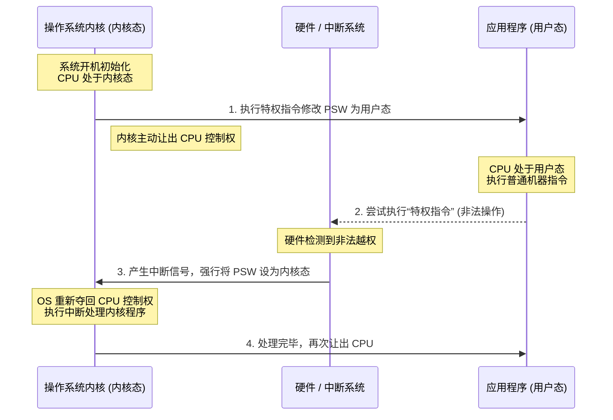

# 1.3 操作系统的运行机制

本节重点探讨操作系统在计算机硬件上底层是如何运行的。对于部分跨考或未学习过计算机组成原理的同学，需要先建立起一些关于“指令”与“程序”的预备知识。

---

## 一、 预备知识：程序是如何在底层运行的？

- **编译与机器指令**：我们用高级语言（如 C 语言）编写的代码，必须经过编译器翻译成计算机能听懂的二进制代码，也就是**机器指令**。
  - _示例_：高级语言 `x++` 经过编译后，底层可能会对应多条由 `0` 和 `1` 组成的机器指令。
- **指令的执行**：程序运行的过程，本质上就是 **CPU 将这些二进制机器指令一条一条执行**的过程。
- **⚠️ 概念辨析 (易混淆)**：
  - **机器指令**：让 CPU 识别并执行的最基本命令（如：加法、赋值），由二进制组成。
  - **交互式命令**：在小黑框终端里输入的 `ls`, `cd` 等。这属于操作系统的交互式命令接口，与本节讨论的底层二进制指令完全不同。

---

## 二、 两种程序与两类指令

在计算机系统中，程序和指令都存在着严格的等级划分。

### 1. 两种程序

- **应用程序**：普通程序员编写的、跑在操作系统之上的程序（如 QQ、微信）。
- **内核程序**：微软/苹果等系统开发者编写的底层程序。由众多内核程序组成的集合构成了**操作系统的内核 (Kernel)**。
  - **内核**是操作系统最核心、最接近硬件的部分。它是系统资源的管理者（例如 Docker 容器技术，只要有 Linux 内核即可实现底层核心功能）。

### 2. 两类指令

因为内核程序是整个系统的“大管家”，它有时必须执行一些极具破坏性或最高权限的操作（如内存清零）。

- **特权指令**：如内存清零指令。这类指令如果被滥用会影响其他程序的正常运行，因此**只能由内核程序使用**。
- **非特权指令**：如普通的加减乘除指令。所有程序（包括应用程序和内核程序）都可以使用。

---

## 三、 两种处理机状态 (CPU 状态)

既然有两类指令和两类程序，CPU 在执行指令时，如何判断当前正在运行的程序到底有没有资格执行特权指令呢？这就需要引入 CPU 的两种状态：

| CPU 状态   | 别称 | 含义说明                                | 允许执行的指令        |
| :--------- | :--- | :-------------------------------------- | :-------------------- |
| **内核态** | 管态 | 说明此时 CPU 正在运行的是**内核程序**。 | 特权指令 + 非特权指令 |
| **用户态** | 目态 | 说明此时 CPU 正在运行的是**应用程序**。 | **仅限**非特权指令    |

- **状态的物理标记**：CPU 内部有一个**程序状态字寄存器 (PSW)**。PSW 中有一个特定的二进制位（例如 `1` 代表内核态，`0` 代表用户态）来实时标记 CPU 当前所处的状态。

---

## 四、 CPU 状态的切换机制 (核心考点)

CPU 的状态（即控制权）在操作系统与应用程序之间是如何交接的？

👇 **CPU 状态切换流程图**

### 1. 内核态 ➔ 用户态 (OS 主动让权)

- **场景**：开机初始化完成后，OS 准备让用户启动的应用程序上 CPU 运行。
- **实现方式**：内核程序执行一条**特权指令**，将 PSW 的标志位修改为“用户态”。这就意味着操作系统内核**主动让出了 CPU 的使用权**。

### 2. 用户态 ➔ 内核态 (中断强行夺权)

- **场景**：应用程序运行期间，发生了需要操作系统介入的事件（如：某恶意程序在用户态下企图执行特权指令）。
- **实现方式**：
  1. CPU 读取到特权指令，但检查 PSW 发现自己处于用户态，判定为非法。
  2. 这种非法事件会引发一个**中断信号**。
  3. CPU 硬件一旦检测到中断信号，会**立即由硬件自动完成“强行变态”**（变为内核态）。
  4. CPU 暂停执行当前应用程序，**转去执行处理中断的内核程序**。
- **核心意义**：触发中断信号，意味着操作系统**强行重新夺回了 CPU 的使用权**。除了非法指令，任何需要操作系统介入管理工作的事件（如 I/O 操作完成）都会触发中断。

---

> **复习小结**：
> 本节虽然可能涉及较底层的概念，但考查方式通常为单项选择题。请务必牢记对应关系：**内核态 对应 内核程序 对应 可以执行特权指令**。并且深刻理解 CPU 状态切换的触发条件：向下（向用户）放权靠特权指令，向上（向内核）收权靠硬件中断。
