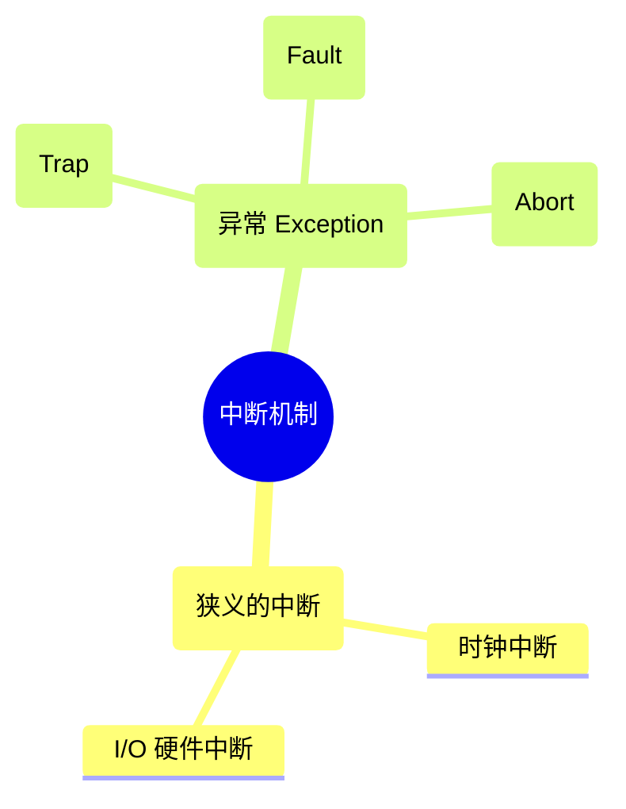
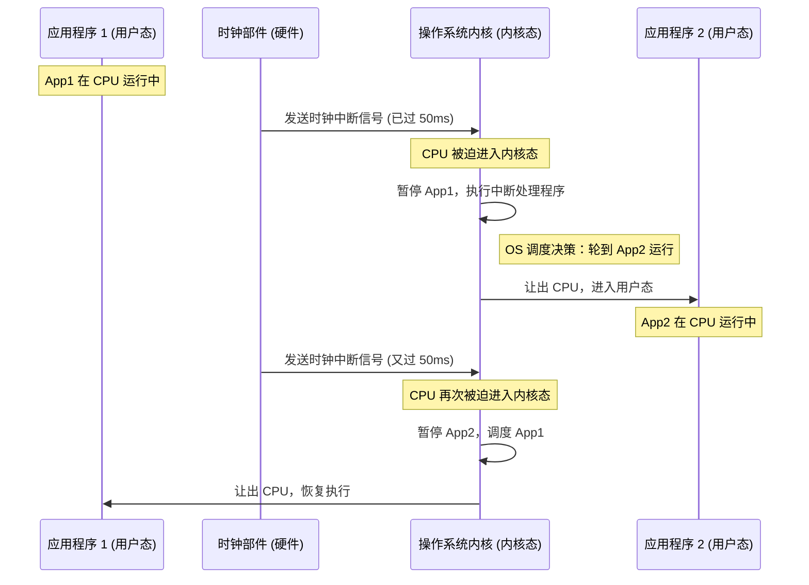

# 1.3.3 中断和异常

本节重点介绍中断的作用、分类以及中断机制的基本实现原理。中断是操作系统掌握系统控制权、实现多道程序并发的核心机制。

---

## 一、 中断的作用 (核心地位)

在计算机系统中，内核程序是管理者，应用程序是被管理者。当内核程序将 CPU 使用权交给应用程序后，应用程序会一直在 CPU 上运行（用户态）。

- **夺回控制权的唯一途径**：**中断**是让管理者（操作系统内核）重新夺回 CPU 使用权的**唯一途径**。
- **状态切换**：中断会强制使 CPU 的状态由**用户态切换为内核态**。
- **并发的基石**：如果没有中断机制，一个应用程序上 CPU 后就会一直霸占，就**不可能实现多道程序的并发运行**。甚至可以说，**没有中断技术就没有操作系统**。

_(注：内核态 ➔ 用户态 是内核主动执行特权指令让出的；而 用户态 ➔ 内核态 则必须依赖中断强行夺权。)_

---

## 二、 中断的分类 (内外中断 / 狭义中断与异常)

为了形象理解，我们按中断信号的来源分为**内中断**和**外中断**。在考试和官方术语中，内中断通常称为**异常 (Exception)**，外中断通常直接称为**中断 (Interrupt)**（狭义）。

### 1. 内中断 (异常 Exception)

- **特征**：中断信号来源于 **CPU 内部**，与**当前正在执行的指令有关**。
- **分类**：
  1.  **陷入 (Trap)**：
      - **触发方式**：由应用程序**故意**执行一条**陷入指令**引发。
      - **作用**：应用程序主动请求操作系统内核提供服务（如系统调用）。
      - _注：陷入指令是特殊指令，但它运行在用户态，所以它**不是特权指令**。_
  2.  **故障 (Fault)**：
      - **触发方式**：由错误条件引起，且可能被内核程序**修复**。
      - **结果**：内核修复后，会把 CPU 使用权还给该应用程序继续执行（例如第三章将学的**缺页故障**）。
  3.  **终止 (Abort)**：
      - **触发方式**：由内核无法修复的**致命错误**引起（例如整数除以 0、非法使用特权指令）。
      - **结果**：内核程序通常会**直接杀掉 (终止)** 该应用程序，不再归还 CPU 使用权。

### 2. 外中断 (狭义的中断)

- **特征**：中断信号来源于 **CPU 外部**，与**当前正在执行的指令无关**。CPU 会在每条指令执行结束的末尾，例行检查是否有外中断信号。
- **典型例子**：
  1.  **时钟中断**：由硬件“时钟部件”每隔固定时间（如 50ms）发出。内核通过处理时钟中断，强行剥夺当前程序的 CPU 使用权并分配给下一个程序，从而实现**多道程序并发运行**（时间片轮转）。
  2.  **I/O 中断**：如打印机打印完成后，向 CPU 发送中断信号，通知任务已完成。

👇 **并发运行与时钟中断机制的时序交互图**

---

## 三、 中断机制的基本实现原理

由于中断的原因五花八门（除零、系统调用、时钟、I/O 等），CPU 必须用不同的**中断处理程序**（属于内核程序）去分别处理。其基本实现步骤如下：

1.  **检查中断信号**：
    - **内中断 (异常)**：CPU 在执行指令**过程中**就会实时检查。
    - **外中断**：CPU 在**每条指令执行完毕之后**的末尾，例行检查。
2.  **查询中断向量表**：
    - CPU 检测到中断信号后，会根据信号的类型去查询**中断向量表**。
    - 通过中断向量表，找到该类型中断所对应的**中断处理程序**的内存入口地址。
3.  **转入内核态处理**：
    - CPU 转为内核态，执行对应的中断处理程序。处理完毕后，再根据具体情况决定是否将 CPU 归还给应用程序。
