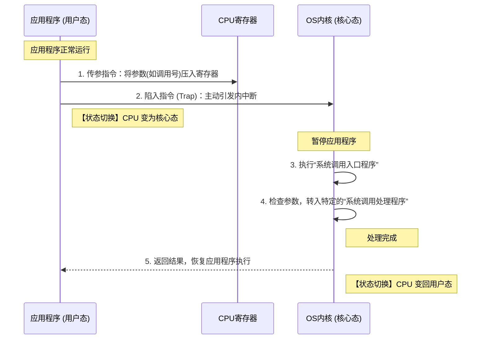

# 1.3.4 系统的运行机制：系统调用 (System Call)

## 一、 什么是系统调用？

在操作系统提供的接口中，给普通用户使用的是命令接口和 GUI，而给**程序员/应用程序**使用的则是**程序接口**。
**程序接口由一组系统调用组成。**

系统调用是应用程序程序员**请求操作系统内核服务**的一种途径。它和我们平时编程时使用的普通函数调用很类似，但系统调用更加底层。应用程序可以通过系统调用的方式，安全地请求操作系统的内核服务。

---

## 二、 系统调用与库函数的区别与联系

现在的程序员在开发时，通常直接使用高级语言（如 C、Java 等）提供的**库函数**，而不是直接用汇编语言去写系统调用。但是，高级语言的底层依然是通过封装系统调用来实现核心功能的。

### 1. 两者的关系层次

```mermaid
graph TD
    User[应用程序员 / 应用程序] -->|调用| Lib[高级语言库函数]
    User -.->|直接请求 (较少用)| SysCall
    Lib -->|部分函数底层封装| SysCall[系统调用 (OS提供的程序接口)]
    SysCall --> Kernel[操作系统内核 (Kernel)]
    Kernel --> Hardware[底层硬件 (裸机)]

    classDef user fill:#e1f5fe,stroke:#03a9f4,stroke-width:2px;
    classDef os fill:#fff3e0,stroke:#ff9800,stroke-width:2px;
    classDef hw fill:#e8f5e9,stroke:#4caf50,stroke-width:2px;

    class User,Lib user;
    class SysCall,Kernel os;
    class Hardware hw;
```

### 2. 是所有库函数都会使用系统调用吗？

**答案是否定的。** 库函数分为两类：

| 库函数类型     | 举例                      | 是否需要系统调用？ | 说明                                                 |
| :------------- | :------------------------ | :----------------- | :--------------------------------------------------- |
| **纯计算型**   | `math.h` 中的取绝对值运算 | **不需要**         | 这些操作不需要特权指令，在用户态即可独立完成。       |
| **资源请求型** | 创建新文件、打印输出      | **必须要**         | 必须请求操作系统内核的服务（操作底层硬件）才能完成。 |

---

## 三、 为什么必须需要系统调用？

我们可以通过一个生活场景来理解：

> **场景**：你在打印店用 WPS 点击打印论文，与此同时，另一个同学用 Word 也点击了打印他的论文。

- **如果没有系统调用**：WPS 和 Word 两个并发运行的进程随意、交替地直接向打印机发送指令。结果会导致打印机“先打一行你的论文，再打一行他的论文”，输出内容完全混杂。
- **引入系统调用的作用**：打印机属于**共享资源**，必须**互斥共享**使用。由操作系统的内核（系统的管理者）统一管理这些共享资源。
  - 上层应用程序只能通过**系统调用**向 OS 发出请求。
  - OS 负责协调和分配资源，保证并发运行的进程不会发生冲突。

### 哪些功能需要由系统调用实现？

**核心规律**：凡是和**共享资源**有关的操作，都必须通过系统调用来实现。

- **设备管理**：如请求使用打印机、摄像头。
- **文件控制**：如读写文件、创建删除文件。
- **进程控制**：如进程的创建、阻塞、唤醒。
- **内存管理**：如内存的分配与回收。

通过系统调用统一管理，可以保证系统的稳定性和安全性，防止应用程序的非法操作。

---

## 四、 系统调用的背后执行过程 (核心考点)

当一个应用程序想要发起系统调用时，底层到底发生了什么？

### 1. 执行流程图 (时序图)



### 2. 执行步骤详解

1.  **传参**：应用程序在用户态运行，首先通过指令将系统调用所需的参数（如系统调用号，指明需要哪种服务，比如 Linux 的 `fork`）放入 CPU 寄存器中。
2.  **陷入 (Trap)**：应用程序执行一条特殊的指令——**陷入指令**（也叫 `trap` 指令、访管指令）。这会引发一个**内中断**。
3.  **变态与入口**：CPU 检测到由于“陷入指令”引发的内中断后，立刻暂停当前应用程序，将 CPU 状态切换为**核心态 (内核态)**，并转去执行操作系统的**系统调用入口程序**。
4.  **分发与处理**：入口程序检查寄存器中的参数，知道应用程序需要什么服务，继而调用特定的**系统调用处理程序**进行处理。
5.  **返回**：系统调用处理完毕后，CPU 状态切回**用户态**，将控制权还给应用程序，继续往下执行。

---

## 五、 重点考试易错点总结

在考试中，关于系统调用有几个极易混淆的小细节需要特别注意：

1.  **陷入指令的性质**：
    - 陷入指令（Trap）是在**用户态**下由应用程序执行的。
    - 因此，**陷入指令不是特权指令**（非特权指令）。它只是通过主动引发内中断，让 CPU 进入核心态。
2.  **动作发生的场所**：
    - **“发出”系统调用请求**的操作是在**用户态**进行的。
    - **“处理”系统调用请求**的操作是在**核心态 (内核态)**完成的。
3.  **别名记忆**：
    - **陷入指令** = **trap 指令** = **访管指令**（访问管态/内核态的指令）。
    - 系统调用有时也被称为 **广义指令**。
