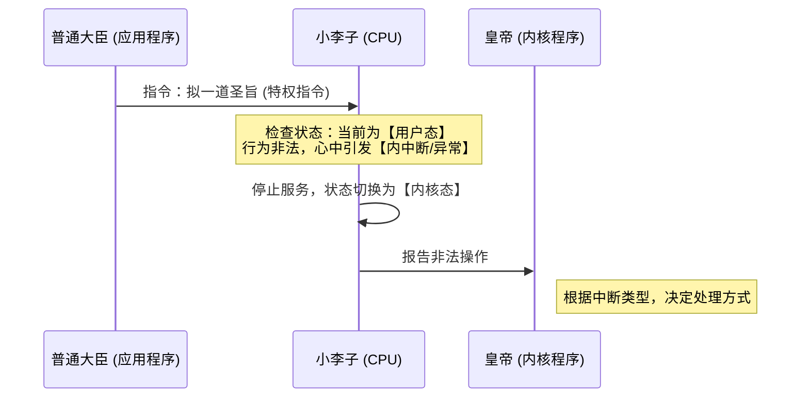
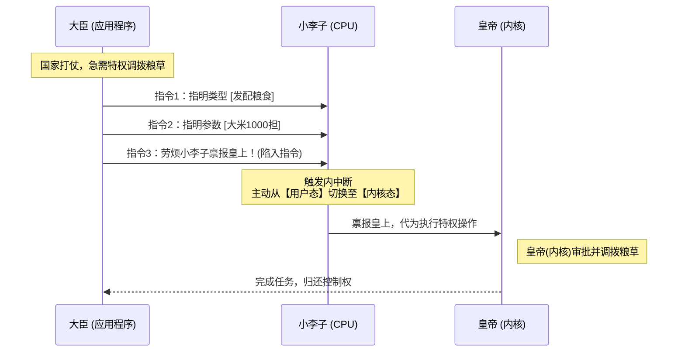

# 古代中国版：操作系统运行机制趣味指南

在遥远的古代中国，操作系统的机制就已经被“设计发明”了。在这个神秘的东方国度，我们可以通过一个生动的隐喻来完美理解 **CPU、操作系统内核、应用程序** 之间的关系，以及**中断、异常、系统调用**的工作原理。

---

## 一、 角色与系统资源映射

| 古代角色 / 事物 | 对应的操作系统概念          | 核心职责说明                                     |
| :-------------- | :-------------------------- | :----------------------------------------------- |
| **小李子**      | **CPU (中央处理器)**        | 忙碌的执行者，每天的工作就是执行各种各样的指令。 |
| **皇帝**        | **操作系统的内核 (Kernel)** | 整个国家系统最高权限的管理者。                   |
| **普通大臣**    | **普通应用程序 (App)**      | 只能进行常规操作，对小李子指指点点（发送指令）。 |

---

## 二、 小李子的两种工作状态 (CPU 状态)

小李子（CPU）平时的工作严格区分为两种状态，决定了他当前能执行什么级别的指令。

### 1. 用户态 (为大臣服务)

- **服务对象**：普通的大臣（应用程序）。
- **权限限制**：只能执行**非特权指令**（例如：端茶、送水）。
- **越权拒绝**：当大臣尝试发送**特权指令**（例如：让他拟一道圣旨）时，极其正直的小李子会**坚决拒绝执行**。

### 2. 内核态 (为皇帝服务)

- **服务对象**：皇帝（操作系统内核）。
- **权限全开**：皇帝会给小李子发送各种各样的指令。因为处于内核态，小李子**既会执行非特权指令，也会无条件执行特权指令**。

---

## 三、 中断与异常机制的故事演绎

### 1. 内中断 / 异常 (Exception)

- **场景发生**：小李子处于【用户态】为大臣服务时，大臣突然越权让他“拟一道圣旨”（发送特权指令）。
- **底层机制**：小李子拒绝执行，这个非法的行为在他的心中**引发了一个中断信号**。
- **特性**：由于这个中断信号的引发与**当前要执行的指令直接相关**，所以被称为**内中断**（或叫**异常**）。
- **状态切换**：检测到信号后，小李子立即停止为当前大臣服务，**立即转为【内核态】**。内核程序（皇帝的规矩）会根据信号类型决定如何处罚/处理这个中断。

👇 **内中断（越权异常）触发时序图**

### 2. 外中断 (Interrupt)

- **场景发生**：小李子正处于【用户态】正常为应用程序（大臣）服务。突然，外面传来消息说“皇帝传小李子觐见”。
- **底层机制**：这个召唤是一个**外部中断信号**。
- **特性**：与小李子当前正在端茶倒水（执行的指令）**毫无关系**，所以被称为**外中断**。
- **状态切换**：小李子同样会暂停为当前大臣服务，从【用户态】转为【内核态】。接下来内核程序会告诉他，应该怎么处理这个外部紧急信号。

---

## 四、 系统调用的标准姿势 (System Call)

**矛盾点**：普通的大臣不能让小李子执行特权指令，但国家打仗时，大臣又**必须使用特权**才能完成发配粮草的任务。怎么办？

**解决方案：系统调用（走合法审批流）**

1.  **指令 1 (指明请求类型)**：大臣告诉小李子，我要“发配粮食”。（指明系统调用类型）
2.  **指令 2 (指明请求参数)**：大臣告诉小李子，发配的是“大米，1000担，给边疆将士”。（传递系统调用所需的参数）
3.  **指令 3 (陷入指令)**：大臣恭敬地说：“**劳烦小李子禀报皇上！**”。（执行**陷入指令 Trap**）

👇 **系统调用工作流程图**

- **核心精髓**：大臣不直接越权，而是通过执行“陷入指令”，**主动触发内中断**，让小李子名正言顺地切入【内核态】，由皇帝（内核）代为完成特权操作。
