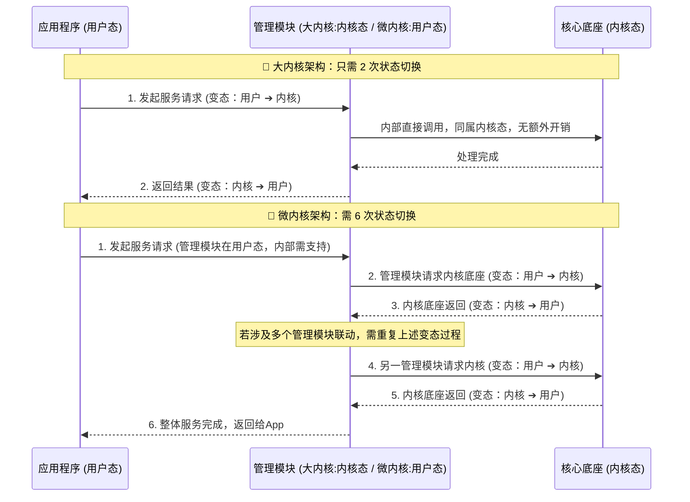

# 1.4 操作系统的体系结构 (大内核 vs 微内核)

本节重点探讨操作系统内部的架构设计问题，即**哪些功能应该被划分到内核中**。考试中常以选择题形式考查大内核与微内核的优缺点对比。

---

## 一、 操作系统内核的功能划分

操作系统的内部功能可以划分为**内核功能**和**非内核功能**。内核是操作系统最核心、最基本的部分。

### 1. 与硬件关联最紧密的核心模块（必须放在内核中）

- **时钟管理**：利用时钟中断来实现计算机的计时功能，是实现多道程序并发运行的基石。
- **中断处理**：负责处理各种内外中断信号，是操作系统夺回 CPU 控制权的途径。
- **原语 (Primitive)**：
  - **特性**：具有**原子性**（一气呵成，要么全做要么不做）。
  - **执行机制**：执行过程**不可被中断**。即使在执行原语的这一小段程序时有外部中断信号到来，CPU 也会坚持把原语执行完，再去处理外部中断。

### 2. 管理相关的非底层模块

- **包含内容**：进程管理、存储器管理、设备管理等。
- **特点**：更多是对数据结构的操作，不会直接、频繁地涉及到底层硬件。这部分功能是否放在内核中，直接决定了操作系统的体系结构走向。

---

## 二、 大内核与微内核体系结构对比

根据对上述“管理模块”的划分位置，衍生出了两种截然不同的内核设计架构：

| 对比维度         | 大内核 (宏内核 / Macrokernel)                                                     | 微内核 (Microkernel)                                                                              |
| :--------------- | :-------------------------------------------------------------------------------- | :------------------------------------------------------------------------------------------------ |
| **功能划分**     | 将所有功能（底层硬件操作 + 各类资源管理）**全部**包含在操作系统内核中。           | 内核中**仅保留**与硬件接触最紧密的部分（时钟、中断、原语等）。                                    |
| **运行状态**     | 所有管理功能都运行在**内核态**。应用程序运行在**用户态**。                        | 核心硬件模块运行在**内核态**。进程/存储/设备等管理模块移至**用户态**运行。                        |
| **CPU 状态切换** | 应用程序请求系统服务时，只需很少的切换次数（如 2 次：用户态 ➔ 内核态 ➔ 用户态）。 | 应用程序请求服务时，各管理模块由于在用户态，仍需频繁请求内核支持，导致极高的切换次数（如 6 次）。 |
| **优点**         | **性能高**。因为减少了 CPU 状态转换的开销。                                       | 内核功能少，**结构清晰，方便维护**，可靠性高。                                                    |
| **缺点**         | 内核代码庞大，结构混乱，**难以维护**。                                            | 需要频繁在核心态和用户态之间切换，导致**性能较低**。                                              |
| **典型代表**     | Linux、UNIX                                                                       | Windows NT                                                                                        |

---

## 三、 图解：两种架构下的状态切换开销差异

CPU 状态转换（从用户态切到核心态，再切回）是**有成本的**，会消耗不少时间。频繁切换会显著降低系统性能。

👇 **大内核与微内核请求服务流程对比图**

---

> **⚠️ 考场答题规范提示**：
> 在日常学习中，为了形象记忆，我们常把 CPU 从用户态切换到核心态的过程戏称为“变态”。但在正式的考试简答题中，**切勿使用该词**，必须使用专业术语：**“CPU 状态的转换”**。
