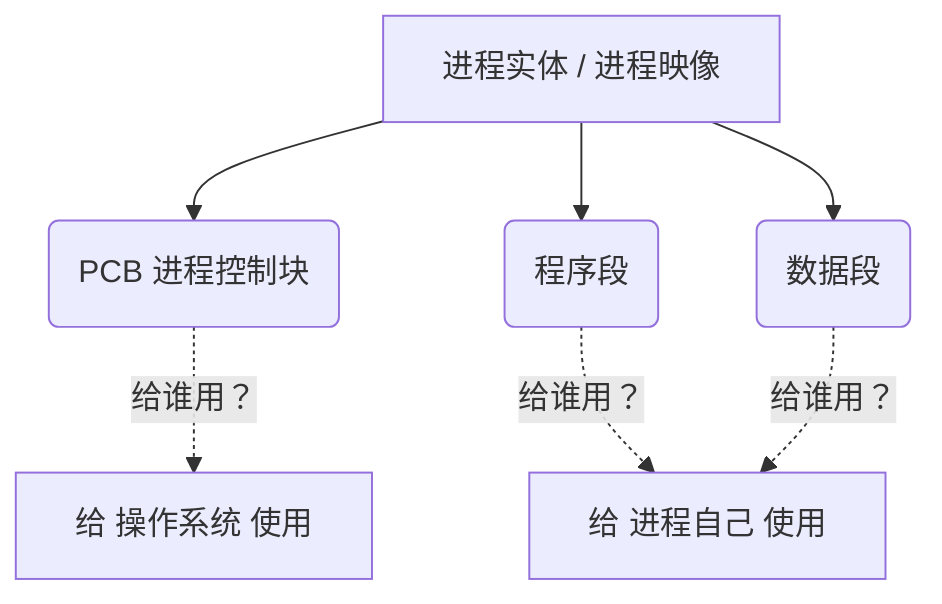

# 操作系统：第二章 进程管理

> **导语**
> 各位同学大家好，本节我们将正式进入操作系统“处理机管理”相关的内容。在第一章中，我们经常提到“系统正在运行的程序”或“进程”。对于很多跨考或非科班的同学来说，**进程**和**程序**这两个概念极易混淆。
> 本节将从直观的生活经验出发，带大家彻底搞懂：什么是进程？它由哪些部分组成？有哪些重要特征？

---

## 一、 进程与程序的区别（动态与静态）

为了直观理解，我们来看一个日常使用电脑的例子：
在 Windows 任务管理器中，我们可以看到系统正在运行的各种进程。假如我打开了一次 QQ，进程列表中就会出现一个 QQ 相关的条目；如果我**同时登录 3 个 QQ 号**，双击了 3 次 QQ 程序，此时进程列表中就会出现 **3 条** QQ 相关的进程信息。

虽然这 3 次运行的都是同一个 `QQ.exe` 可执行文件，但它的 3 次执行对应了 3 个不同的进程。

### 核心对比：程序 vs 进程

| 比较维度     | 程序 (Program)                        | 进程 (Process)                     |
| :----------- | :------------------------------------ | :--------------------------------- |
| **本质属性** | **静态的**                            | **动态的**                         |
| **存在形态** | 存放在磁盘里的可执行文件（如 `.exe`） | 程序在内存中的一次执行过程         |
| **内容构成** | 一系列指令的集合                      | 进程控制块 (PCB) + 程序段 + 数据段 |
| **对应关系** | 1 个程序                              | 可以对应多个进程（如多开 QQ）      |

---

## 二、 进程的标识符：PID

既然多个进程可以基于同一个程序运行（如 3 个“腾讯 QQ”进程），操作系统如何在背后区分它们呢？

为了解决这个问题，操作系统在创建一个进程时，会给它分配一个**唯一的、不重复的 ID**，叫做 **PID (Process ID，进程标识符)**。

- **通俗理解**：PID 就相当于人类世界的**身份证号**。无论进程名字叫什么，PID 都是独一无二的。

> **观察实例（以 macOS 活动监视器为例）：**
>
> 1. 观察系统中按 PID 排序的进程，所有 PID 均不重复。
> 2. 打开一个名为 `Typora` 的程序，系统为其分配了一个 PID（如 `2641`）。
> 3. 关闭 `Typora` 后再次打开，系统会分配一个新的 PID（如 `2642`）。
> 4. **结论**：在许多操作系统中，新建进程的 PID 分配策略通常是简单递增的（每次 +1）。

---

## 三、 进程的组成（进程实体/进程映像）

一个进程在内存中究竟长什么样？更严谨地说，我们称之为**进程实体（进程映像）**。

> **注**：进程是动态的运行过程，而“进程实体”是静态的，可以理解为进程在运行过程中**某一时刻的“快照”或“照片”**。

进程实体由以下**三个部分**组成：

### 1. PCB (Process Control Block, 进程控制块)

PCB 是给**操作系统（管理者）**使用的数据结构，它是**进程存在的唯一标志**。
当进程被创建时，OS 为其创建 PCB；当进程结束时，OS 回收其 PCB。OS 管理进程所需的所有信息都存放在这里。

**PCB 中通常包含以下四类信息：**

1. **进程描述信息**：如 `PID`（进程ID）、`UID`（所属用户ID）。
2. **进程控制和管理信息**：如 进程当前的状态（就绪/运行/阻塞）、CPU 使用时间、网络流量使用情况等。
3. **资源分配情况**：如 分配了多少内存、正在使用哪些 I/O 设备、打开了哪些文件（帮助 OS 管理系统资源）。
4. **处理机相关信息**：用于进程切换时保存上下文信息（后续章节详细讲解）。

> **💡 源码扩展：Linux 中的 PCB**
> 在 Linux 内核源码的 `sched.h` 文件中，PCB 被定义为 `task_struct` 结构体。这个结构体包含了 `state`（进程状态）、`fields`（打开的文件）、`io_context`（I/O信息）等众多字段，代码长达 1900 多行，非常复杂。我们只需知道：**OS 管理进程所需要的信息都在 PCB 中**。

### 2. 程序段 (Program Segment)

存放程序运行所需的**指令序列**。程序从磁盘读入内存时，其包含的一条条机器指令就放在这里，供 CPU 读取并执行。

### 3. 数据段 (Data Segment)

存放程序运行过程中产生的**各种数据**。比如程序中定义的变量（如 `int x = 1;`执行 `x++` 后变为 `2`），这些数据内容就保存在数据段中。

> **回顾 QQ 多开的例子：**
> 同时挂 3 个 QQ 号，这 3 个进程的**程序段是相同的**（都在运行 QQ 的代码指令）；但是它们的 **PCB 不同**（PID不同），**数据段也不同**（因为登录的账号、聊天记录等数据各不相同）。

---

## 四、 进程的定义

结合上述“进程实体”的概念，我们可以给出进程的标准定义：

**进程是进程实体的一次运行过程，是系统进行资源分配和调度的独立单位。**

- **资源分配的独立单位**：操作系统是以进程为单位来分配内存、磁盘 IO 等资源的。
- **调度的独立单位**：操作系统决定让哪个进程上 CPU 运行（即进程调度）。

---

## 五、 进程的特征

相比于静态的程序，进程拥有以下五个主要特征（重在理解）：

| 特征名称      | 详细说明                                                                                                 | 重点提示                           |
| :------------ | :------------------------------------------------------------------------------------------------------- | :--------------------------------- |
| **1. 动态性** | 进程是程序的一次执行过程，它是动态地产生、变化和消亡的。进程实体的数据段（如变量 x）会在运行中不断变化。 | 🌟 **进程最基本的特性**            |
| **2. 并发性** | 内存中同时存在多个进程实体，各进程可以交替并发地执行。                                                   |                                    |
| **3. 独立性** | 进程能够独立运行、独立获得资源、独立接受调度。                                                           | _注：引入线程后，调度单位会有变化_ |
| **4. 异步性** | 各并发进程以各自独立的、不可预知的速度向前推进。这可能导致执行结果不确定（需通过“进程同步”机制解决）。   |                                    |
| **5. 结构性** | 每个进程的结构都是一致的，都由 **PCB、程序段、数据段** 组成。                                            |                                    |

---

## 六、 本节总结与排坑提示

1. **核心组成**：进程（实体） = `PCB` + `程序段` + `数据段`。
2. **唯一标志**：**PCB** 是进程存在的唯一标志。只要是 OS 管理需要用到的数据，都在 PCB 里；进程自身业务逻辑需要的数据，在程序段和数据段里。
3. **关键特性**：**动态性**是进程最基本的特性。
4. **⚠️ 考点预警（提前挖坑）**：
   在传统的操作系统中，进程既是“资源分配”的基本单位，也是“接受调度”的基本单位。但在后续章节**引入了“线程 (Thread)”概念之后，进程不再是接受调度的基本单位，但它依然是获得资源的基本单位**。这点在后续学习中需特别注意！
