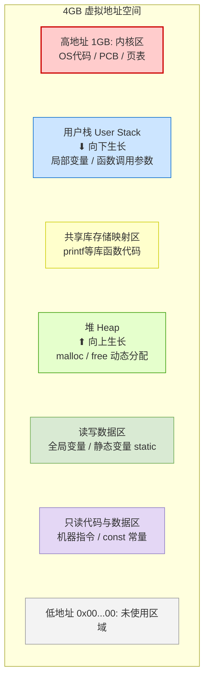

# 操作系统：进程的内存映像

> **导语**
> 各位同学大家好，在这个视频中我们要探讨“进程的内存映像”。也就是说，一个进程在运行的时候，它在内存里边到底是什么样子的？
> 本节我们将以 32 位计算机系统为例，结合 C 语言程序，带大家从低地址到高地址，扒开进程内存的“千层套路”。

---

## 一、 32位系统虚拟地址空间总览

假设计算机系统是 **32位** 的，这意味着每个进程拥有 $2^{32}$ Bytes = **4 GB 的虚拟地址空间**。
地址范围从 `0x00000000` 一直到 `0xFFFFFFFF`。

操作系统会将这 4GB 的空间划分为两大部分：

1.  **高地址的 1 GB（内核区）**：
    - 用于存储操作系统内核数据，如：进程的 **PCB**、**页表**。
    - 存储操作系统的内核代码（如进程调度程序）。
    - **注意**：普通程序员编写的用户程序**无法直接访问**这片内核数据区。
2.  **低地址的 3 GB（用户区）**：
    - 供用户进程自身使用，存储我们编写的代码、变量和动态分配的内存。

---

## 二、 进程内存映像详解（从低地址到高地址）

下面我们通过图解，详细拆解用户区（低 3GB）的具体划分情况：



### 1. 未使用区域 (Reserved)

在地址最低的部分，有一片进程不会使用的区域（如 `0x00000000` 附近，这也是为什么 C 语言中访问空指针 `NULL` 会报错的原因）。

### 2. 只读代码与数据区 (Read-only Segment)

- **只读代码**：我们编写的 C 语言程序经过编译、链接后翻译成的**机器指令**存放在这里。程序运行期间只能读、不能修改。
- **只读数据**：C 语言中使用 `const` 关键字修饰的常量（长变量）也存放在这里。程序运行期间，其值不可改变。
- **特性**：大小在进程启动时就已确定，整个运行期间大小固定不变。

### 3. 读写数据区 (Read/Write Data Segment)

- 存储既可以读也可以写的数据。
- **对应 C 语言**：**全局变量**（定义在函数外的变量）和 **静态变量**（使用 `static` 关键字修饰的变量）。
- **特性**：大小在进程启动时确定，运行时大小固定。

### 4. 堆区 (Heap)

- **对应 C 语言**：使用 `malloc` 和 `free` 等函数动态申请和释放的内存空间。
- **特性**：大小可**动态增加或减少**（向上生长）。在 32 位系统中，堆区通常与下面的固定数据区共享约 1GB 的空间上限（具体视系统而定）。你程序里最多能 `malloc` 多少内存，很大程度取决于底下那两片区域占了多少。

### 5. 共享库存储映射区 (Memory Mapping Region)

- **对应 C 语言**：调用的系统库函数（如 `printf`、`scanf` 等）。
- **特性**：这些库函数的指令代码存放在这片区域。调用的库函数越多，该区域越大。

### 6. 用户栈 (User Stack)

- **对应 C 语言**：函数内的 **局部变量**、函数调用的 **参数**、返回值、上一层函数的状态信息等。
- **特性**：大小可**动态增加或减少**（向下生长，朝向堆区）。每调用一层函数，栈区就向低地址方向开辟新空间；函数返回时释放。

---

## 三、 C 语言代码实战与考点总结

在考试中，最常见的题型是：**给一段 C 语言代码，问某个变量存放在进程内存映像的哪个区域？**

以下面的代码为例，我们来对号入座：

```c
#include <stdio.h>
#include <stdlib.h>

#define MAX_VAL 1024       // 宏定义

int a = 10;                // a: 全局变量
const int b = 20;          // b: const 关键字修饰的常量

int main() {
    static int c = 30;     // c: 静态变量
    int d = 40;            // d: 局部变量

    // p 自身是一个局部指针变量，但它指向的内存是通过 malloc 分配的
    int *p = (int *)malloc(sizeof(int) * 10);

    printf("Hello World
"); // 调用共享库函数

    free(p);
    return 0;
}
```

### 🎯 变量存放位置速查表

| 数据/变量名称     | 代码示例                  | 存放的内存区域       | 是否可动态改变大小 |
| :---------------- | :------------------------ | :------------------- | :----------------- |
| **机器指令**      | 编译后的可执行代码        | **只读代码与数据区** | 否（启动时固定）   |
| **`const` 常量**  | `const int b = 20;`       | **只读代码与数据区** | 否（启动时固定）   |
| **全局变量**      | `int a = 10;`             | **读写数据区**       | 否（启动时固定）   |
| **静态变量**      | `static int c = 30;`      | **读写数据区**       | 否（启动时固定）   |
| **动态分配空间**  | `malloc(sizeof(int)*10);` | **堆区 (Heap)**      | **是**（向上生长） |
| **局部变量/参数** | `int d = 40;`             | **用户栈 (Stack)**   | **是**（向下生长） |
| **系统库函数**    | `printf(...)`             | **共享库存储映射区** | 视调用情况而定     |

---

## 四、 易错点解析：宏定义 vs `const`

很多同学会误以为用 `#define` 宏定义的常量（如 `#define MAX_VAL 1024`）也存在于只读数据区中，**这种理解是错误的！**

- **`const` 变量**：会在内存的**只读数据区**分配真实的存储空间（如 4 个字节）来存放数据。
- **宏定义 `#define`**：**不会**在内存中专门分配独立的存储空间。
  - 在预编译阶段，编译器会自动把代码中的宏名称（如 `MAX_VAL`）直接替换为对应的数值（`1024`）。
  - 最终，这个数值（`1024`）会被当作**立即数**（计算机组成原理中的概念）**直接隐含在程序的机器指令当中**。

**结论**：`const` 修饰的常量存在只读区；`#define` 宏定义不分配专属内存，而是直接嵌在指令里。
