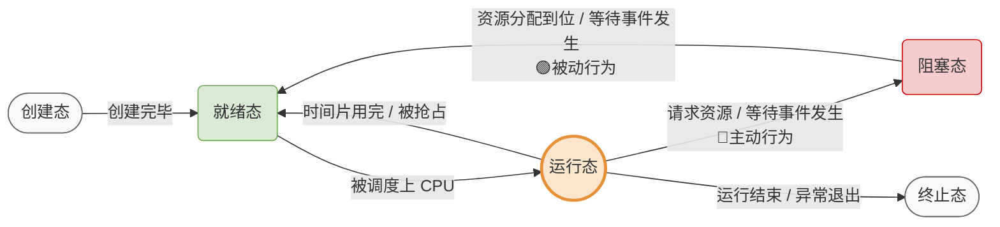
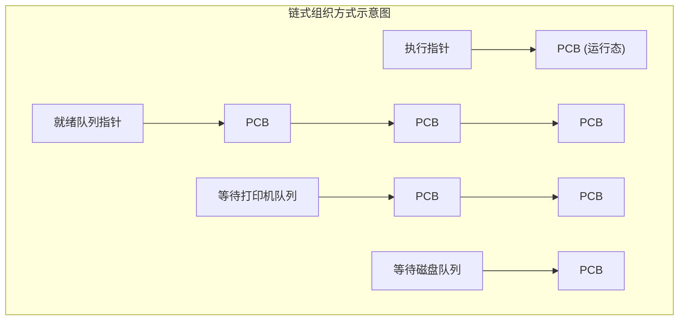

# 操作系统：进程的状态与转换

> **导语**
> 各位同学大家好，本节我们将学习“进程的状态与状态转换”相关的知识点。
> 我们将详细介绍进程在整个生命周期中所拥有的各种状态，以及它们在什么情况下会发生相互转换。同时，我们还会探讨“进程的组织方式”，即操作系统如何有条理地管理成百上千个进程的 PCB。

---

## 一、 进程的五大状态（经典“丁字裤”模型）

进程在生命周期中会经历不同的阶段，这就是进程的状态。最经典的是**五状态模型**，其中**运行态、就绪态、阻塞态**是进程生命周期中占据绝大部分时间的三种**基本状态**。

### 1. 状态详解

| 状态名称 (别名)     | 状态解析                                                                                                                      | 资源占有情况                                                                              |
| :------------------ | :---------------------------------------------------------------------------------------------------------------------------- | :---------------------------------------------------------------------------------------- |
| **创建态 (新建态)** | 进程正在被创建。操作系统为其分配系统资源（如内存），并初始化 PCB。                                                            | 正在分配资源，尚未就绪。                                                                  |
| **就绪态**          | 进程已具备运行条件，但由于 CPU 正忙（被其他进程占用），暂时不能运行。                                                         | **拥有除 CPU 以外的所有必要资源。** (万事俱备，只欠 CPU)                                  |
| **运行态**          | 进程正在 CPU 上运行（CPU 正在执行该进程的指令序列）。                                                                         | **同时拥有 CPU 和其他所有必要资源。** _注：单核CPU同一时刻最多只有1个进程处于运行态。_ |
| **阻塞态 (等待态)** | 进程在运行过程中，由于**请求等待某个事件发生**（如请求打印机资源、等待其他进程响应等）而暂时无法继续执行，被剥夺 CPU 使用权。 | 放弃 CPU，且缺少其他某项必要资源/事件。                                                   |
| **终止态 (结束态)** | 进程主动调用 `exit` 结束，或因不可修复的错误（如除以 0）被动终止。操作系统开始回收该进程的资源和 PCB。                        | 正在被剥夺所有资源，即将从系统中消失。                                                    |

---

## 二、 进程状态的转换机理

进程状态之间的转换有严格的方向性和触发条件。我们通过一幅流程图来梳理它们之间的关系：

### 核心转换路径剖析（⚠️ 高频考点）

1.  **就绪态 ➔ 运行态**：
    - **原因**：CPU 空闲时，操作系统从就绪进程中调度一个进程上 CPU 运行。
2.  **运行态 ➔ 就绪态**：
    - **原因**：进程的**时间片用完**，或者在抢占式调度中被优先级更高的进程抢占。
    - **特点**：此时进程**依然具备运行的所有条件**，只是暂时失去了 CPU 的使用权。
3.  **运行态 ➔ 阻塞态**：
    - **原因**：进程执行过程中请求某个资源（如打印机）或等待某个事件，但暂时无法满足。
    - **特点**：这是进程**主动**发出系统调用（如请求 I/O）而导致的行为。
4.  **阻塞态 ➔ 就绪态**：
    - **原因**：进程所等待的资源被分配到位，或等待的事件终于发生（如打印机空闲了）。
    - **特点**：这是由外部事件触发的，对于进程自身而言是一种**被动**行为。

> **⛔ 排坑预警（绝对不可能发生的转换）**
>
> - **阻塞态 ➔ 运行态 (❌)**：阻塞的进程即使等到了资源，也必须先进入**就绪态**排队，等待操作系统的再次调度，不能直接强行上 CPU。
> - **就绪态 ➔ 阻塞态 (❌)**：进程进入阻塞态是因为它发出了主动请求。而一个处于就绪态的进程根本不在 CPU 上运行，不可能发出任何请求指令！

---

## 三、 进程的组织方式

系统中存在大量的进程，操作系统是如何记录和管理它们的当前状态的呢？

- **记录状态**：在进程的 PCB（进程控制块）中，有一个特定的变量（如 `state`）用来记录当前所处的状态（例如用 1 表示创建态，2 表示就绪态等）。
- **组织方式**：操作系统会将处于相同状态的进程 PCB 组织在一起。常见的组织方式有以下两种：

### 1. 链式方式（主流方式）

操作系统管理一系列的队列指针，将相同状态的 PCB 用链表串起来。

- **执行指针**：指向当前处于运行态的进程的 PCB。
- **就绪队列指针**：指向所有处于就绪态进程的 PCB 队列。为了方便调度，往往会将优先级更高的进程放在队头。
- **阻塞队列指针**：指向处于阻塞态的进程的 PCB 队列。
  - _优化思路_：为了提高效率，操作系统通常会**根据阻塞原因的不同**，将阻塞队列细分为多个子队列（例如：“等待打印机队列”、“等待磁盘队列”等）。

### 2. 索引方式（了解即可）

操作系统为不同的状态建立各自的**索引表**。

- **就绪索引表指针** ➔ 指向一张就绪索引表，表中的每个表项指向一个处于就绪态的 PCB。
- **阻塞索引表指针** ➔ 指向一张阻塞索引表，表中的每个表项指向一个处于阻塞态的 PCB。

---

## 四、 本节总结

本小节的绝对核心是**进程的五大状态及相互转换的机理（特别是运行、就绪、阻塞三者之间的转换条件和方向）**。
这是考研和各类考试中最高频的选择题考点。请务必结合生活逻辑去理解“时间片用完”、“等待资源”等场景，避免死记硬背。
