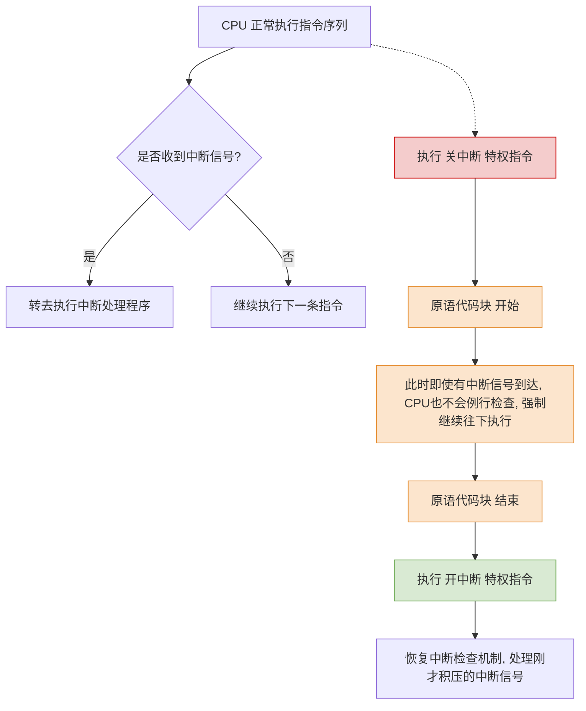

# 操作系统：进程控制与原语实现

> **导语**
> 各位同学大家好！在这个小节中，我们将学习**进程控制**相关的知识点。
> 进程控制的主要功能是对系统当中的所有进程实施有效的管理，包括创建新进程、撤销已有进程、以及实现进程的状态转换等功能。说白了，**进程控制就是要实现进程的状态转换**。我们将深入探讨操作系统是如何通过“原语”安全、原子地完成这些转换的。

---

## 一、 什么是进程控制？

进程控制的核心任务就是**实现进程的状态转换**。

- **创建新进程**：让一个进程从无到有，经历“创建态”最终进入“就绪态”。
- **撤销已有进程**：让进程进入“终止态”，最终将其从系统中干掉（清除）。
- **状态切换**：例如在“就绪态”、“运行态”、“阻塞态”之间进行合理的切换调度。

---

## 二、 如何实现进程控制？—— 原语 (Primitive)

进程控制（状态转换）的过程必须由操作系统内核中的**原语**来实现。

### 1. 原语的特性：原子性 (一气呵成)

原语是一种特殊的内核程序，其执行具有**原子性**，即：**原语的运行必须一气呵成，中间绝对不可以被中断。**

### 2. 为什么进程控制必须“一气呵成”？

我们通过一个反例来理解：
假设系统要将一个进程从“阻塞态”唤醒至“就绪态”，这至少需要做两件事：

1.  **修改状态标志**：将 PCB 中的 `state` 变量从 2 (阻塞) 改为 1 (就绪)。
2.  **移动 PCB 位置**：将该 PCB 从阻塞队列中摘除，并挂载到就绪队列中。

**反例场景**：
如果操作系统刚做完第1步（把 `state` 设为了就绪），突然来了一个外部中断信号，CPU 暂停了当前任务去处理中断。
**导致后果**：此时该进程的 `state` 标志显示它是“就绪”的，但它的 PCB 却依然躺在“阻塞队列”里。关键数据结构（状态标志与所在队列）发生了**信息不统一**！这会严重干扰操作系统的后续管理，甚至导致系统崩溃。

**结论**：为了保证关键数据结构的一致性，进程状态转换的过程必须是一气呵成的。

---

## 三、 原语是如何实现“一气呵成”的？（关中断与开中断）

原语的原子性是通过两条**特权指令**来实现的：**关中断** 和 **开中断**。

- **常规状态**：CPU 每执行完一条指令，都会例行检查是否有外部中断信号需要处理。
- **关中断指令**：执行该指令后，CPU **不再例行检查**中断信号，无视外部干扰，闷头往下执行指令。
- **开中断指令**：执行该指令后，CPU **恢复**每次执行完指令后检查中断信号的习惯。
- **实现原理**：将原语的代码包裹在“关中断”和“开中断”之间，这段代码序列的执行就自然变得不可中断了。

> **思考：为什么这两个指令是“特权指令”？**
> 如果允许普通用户程序使用这两个指令，流氓软件就可以在程序开头写个“关中断”，结尾写个“开中断”，从而一直霸占 CPU 资源。因此，它们只能在内核态由操作系统使用。

---

## 四、 核心控制原语详解

这些原语内部所做的具体事情**不需要死记硬背**，只需理解其背后的逻辑即可。所有原语干的活无非三类：**更新 PCB 信息**、**将 PCB 插入合适队列**、**分配/回收资源**。

### 1. 进程的创建（创建原语）

- **功能**：使进程从 创建态 ➔ 就绪态。
- **主要动作**：
  1.  申请一个空白的 PCB。
  2.  为新进程分配所需资源（如内存空间）。
  3.  初始化 PCB 信息（如分配 PID、设置 UID 等）。
  4.  将该 PCB 插入就绪队列。
- **触发场景**：用户登录、作业调度、提供服务、应用请求等。

### 2. 进程的撤销（撤销原语）

- **功能**：使进程进入 终止态，最终从系统中彻底清除。
- **主要动作**：
  1.  找到对应 PCB，若正在运行则立即剥夺 CPU。
  2.  杀掉该进程的所有**子进程**（进程间的关系通常是树形结构）。
  3.  回收该进程占有的资源，归还给父进程或操作系统。
  4.  删除 PCB。
- **触发场景**：正常结束（`exit`）、异常结束（除以0、非法指令）、外界干预（任务管理器强杀）。

### 3. 进程的阻塞与唤醒（阻塞原语 & 唤醒原语）

⚠️ **注：阻塞和唤醒原语必须成对使用！进程因何阻塞，就应由何唤醒。**

| 原语名称     | 状态转换方向    | 触发方式                   | 主要动作                                                                                   |
| :----------- | :-------------- | :------------------------- | :----------------------------------------------------------------------------------------- |
| **阻塞原语** | 运行态 ➔ 阻塞态 | 进程**主动**请求等待某事件 | 1. 找到PCB   2. **保护进程运行现场**   3. 设置状态为阻塞态   4. 将PCB插入等待队列 |
| **唤醒原语** | 阻塞态 ➔ 就绪态 | 等待的事件发生 (被动)      | 1. 找到PCB   2. 将PCB从等待队列移除   3. 设置状态为就绪态   4. 将PCB插入就绪队列  |

### 4. 进程的切换（切换原语）

- **功能**：让当前运行进程下 CPU (运行 ➔ 就绪/阻塞)，让另一个就绪进程上 CPU (就绪 ➔ 运行)。
- **主要动作**：
  1.  将原进程的**运行环境（上下文）存入其 PCB**。
  2.  将原进程 PCB 移入相应队列。
  3.  从就绪队列挑选一个新进程上 CPU。
  4.  从新进程的 PCB 中**恢复其运行环境**。

---

## 五、 深度解析：保存与恢复“运行环境”

这是理解进程并发执行最核心的硬件层面知识，对于跨考同学尤其重要。

### 1. CPU 中的寄存器与中间结果

CPU 内部包含许多寄存器用于存放程序运行时的关键数据：

- **PSW (程序状态字寄存器)**：存 CPU 状态信息。
- **PC (程序计数器)**：存放**下一条将要执行的指令的地址**。
- **IR (指令寄存器)**：存放当前正在执行的指令。
- **通用寄存器**：存放运算过程中的中间数据。

### 2. 为什么要保存运行环境？

假设进程 A 执行 `x++` 需要分为多步底层指令。当它刚好把 `x` 的值加 1 并存放在**通用寄存器**中时，突然被操作系统切换下去了。
接着，进程 B 上 CPU 运行。因为**寄存器是所有进程共用的物理硬件**，进程 B 在运行过程中必然会产生新的数据，从而**覆盖掉**进程 A 之前留在通用寄存器里的运算中间结果。
如果进程 A 再次被调度上 CPU 时没有恢复它之前的寄存器数据，程序就彻底乱套了，无法继续执行。

### 3. 运行环境的保存与恢复机制

- **进程上下文 (Context) / 运行环境**：指进程运行过程中，寄存器里存储的那些中间结果（如 PC 指向哪里、通用寄存器里的数据是多少）。
- **下 CPU（保存）**：操作系统将当前 CPU 所有关键寄存器的数据（特别是 PC 和通用寄存器）“打包备份”存入该进程自己的 PCB 中。
- **上 CPU（恢复）**：操作系统从该进程的 PCB 中将之前备份的寄存器数据重新写回 CPU 硬件中。此时 CPU 依靠恢复后的 `PC` 寄存器，就能精准知道应该从哪一条指令继续往下执行了。

---

## 总结

本节重点理解：

1.  **原语的原子性**及其通过**关/开中断特权指令**实现的原理。
2.  各类控制原语在背后更新数据结构（PCB 和队列）的通用逻辑。
3.  **运行环境（上下文）保存与恢复**对于进程并发执行的决定性意义。
