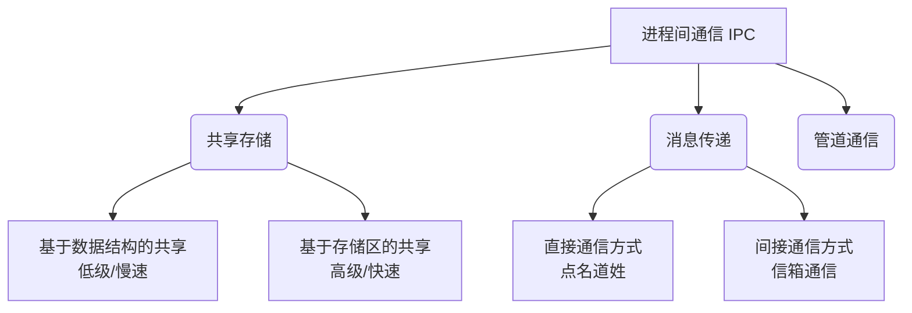

# 操作系统：进程间通信 (IPC)

> **导语**
> 在多进程并发运行的系统中，进程之间难免需要相互配合和数据交互。例如，将微博里的文章分享给微信好友，就涉及到了两个不同应用（进程）之间的数据传递。这就是**进程间通信 (Inter-Process Communication, IPC)**。
> 本小节我们将详细探讨进程间通信的必然性，以及操作系统支持的三种核心通信方式：共享存储、消息传递和管道通信。

---

## 一、 为什么需要操作系统的支持？

在了解通信方式之前，首先要明白一个核心安全机制：**进程的内存地址空间是相互独立的**。

- **安全隔离**：为了防止恶意软件（如垃圾 APP）随意读取或篡改其他进程（如微信）的私密数据，操作系统严格禁止一个进程直接访问另一个进程的内存空间。
- **通信困境**：由于进程 $P$ 无法直接将数据写入进程 $Q$ 的地址空间，它们之间的数据交换**必须通过操作系统内核的介入与支持**才能安全完成。

---

## 二、 进程间通信的三种基本方式

操作系统主要提供以下三种方式来实现进程间的数据交互：

---

### 1. 共享存储 (Shared Memory)

**【原理】**
操作系统在内存中划出一片**特殊的共享存储区**。进程 $P$ 和进程 $Q$ 通过系统调用（如 Linux 中的 `shm_open` 和 `mmap`），将这片共享区域**映射**到各自的虚拟地址空间中。这样，两者都可以对这片区域进行读写操作，从而实现数据交换。

**【核心要求：互斥访问】**
因为共享区域是开放的，如果多个进程同时写入，会导致数据覆盖冲突。因此，**各个进程对共享存储区的访问必须是互斥的**（通常由进程自行调用操作系统提供的同步互斥工具，如 PV 操作来实现）。

**【两种共享分类】**

| 分类             | 原理说明                                                                  | 特点                 | 级别         |
| :--------------- | :------------------------------------------------------------------------ | :------------------- | :----------- |
| **基于数据结构** | 共享区只能存放特定格式的数据（如一个长度为3的 `int` 数组）。操作受限。    | 灵活性差，速度慢     | **低级通信** |
| **基于存储区**   | OS 只负责划定一片连续内存（如 4KB），数据怎么存、存哪里全由进程自己决定。 | 灵活性极高，速度最快 | **高级通信** |

---

### 2. 消息传递 (Message Passing)

**【原理】**
进程间的数据交换以**格式化的消息 (Message)** 为单位。消息由“消息头”（包含发送方、接收方、长度等信息）和“消息体”（具体数据）组成。操作系统提供了 `send` 和 `receive` 原语来实现消息传递。

消息传递分为两种具体方式：

#### ① 直接通信方式（“点名道姓”）

- **机制**：发送方必须明确指明接收方的 PID。
- **流程**：
  1.  进程 $P$ 在自己的用户空间准备好消息。
  2.  调用 `send(Q, message)`，操作系统将消息**复制到内核空间**，并挂载到进程 $Q$ PCB 的**消息队列**中。
  3.  进程 $Q$ 调用 `receive(P, message)`，操作系统将消息从内核复制到 $Q$ 的用户空间。

#### ② 间接通信方式（“信箱通信”）

- **机制**：通过一个中间实体——**信箱 (Mailbox)** 进行转交。不要求“点名道姓”。
- **流程**：
  1.  进程 $P$ 调用 `send(A, message)`，将消息发送到**信箱 A**。
  2.  进程 $Q$ 调用 `receive(A, message)`，从**信箱 A** 中提取消息。
- **特点**：允许多个进程向同一个信箱发消息，也允许多个进程从同一个信箱读消息。

---

### 3. 管道通信 (Pipe)

**【原理】**
“管道”是指用于连接一个读进程和一个写进程以实现它们之间通信的一个**共享文件** (pipe 文件)。
在内存层面上，管道本质上是操作系统开辟的一个**大小固定的内存缓冲区（可以理解为一个循环队列）**。

**【管道通信的四大核心特性】**

1.  **单向半双工通信**：
    - 如同真实的水管，数据流向是**单向**的（从写端流向读端）。
    - 同一时刻只允许单向传输（半双工）。如果需要**双向同时通信（全双工），必须申请建立两个管道**。
2.  **先进先出 (FIFO) 限制**：
    - 与“共享存储”的随意读写不同，管道的数据读写必须严格遵循**先进先出**的原则。数据只能被顺序写入和顺序读出。
3.  **读写阻塞机制**：
    - **写满则阻塞**：因为管道（缓冲区）大小固定，当管道**被写满**时，写进程将被**阻塞**，直到读进程取走数据腾出空间才被唤醒。
    - **读空则阻塞**：当管道**被读空**时，读进程将被**阻塞**，直到写进程再次写入数据才被唤醒。
4.  **互斥访问**：
    - 各个进程对管道的访问也必须是互斥的，但这通常**由操作系统自动保证**，无需进程自己写代码控制。

---

## 三、 三种通信方式的终极对比

| 通信方式     | 数据传输媒介               | 同步/互斥责任方           | 传输速度与灵活性           | 特殊限制                                     |
| :----------- | :------------------------- | :------------------------ | :------------------------- | :------------------------------------------- |
| **共享存储** | 共享内存区域               | **进程自己** (利用PV操作) | 速度极快，极其自由         | 存在覆盖风险，需严密控制                     |
| **消息传递** | 消息队列 / 信箱 (内核接管) | **操作系统**              | 以消息为单位，结构清晰     | 数据需在用户态和内核态间来回复制             |
| **管道通信** | 内存循环队列 (特殊文件)    | **操作系统**              | 字节流传输，受制于管道大小 | 必须**先进先出**；单向**半双工**；有读写阻塞 |
