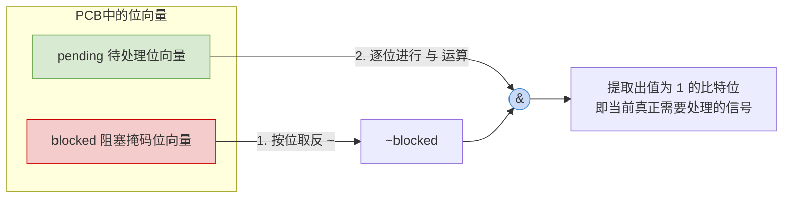
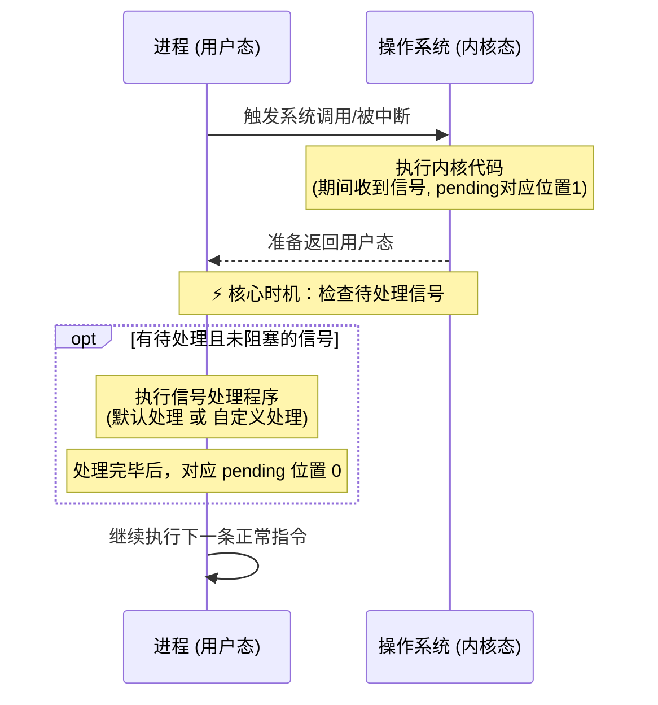

# 操作系统：进程间通信——信号 (Signal) 机制

> **导语**
> 本节我们将详细探讨2025届考研大纲新增的核心考点——**信号 (Signal)**。
> ⚠️ **避坑提示**：**信号 (Signal)** 和 **信号量 (Semaphore)** 是完全不同的两个概念。信号量主要用于实现进程间的同步与互斥；而**信号主要用于实现进程间的通信**。

---

## 一、 信号的作用

信号被归为进程间的一种通信方式。它的核心作用是：**通知某个进程，某个特定的事件已经发生**。当进程收到信号后，就需要对该信号进行相应的处理。

不同的操作系统对信号类型的定义不同。在 Linux（符合 POSIX 标准）中，定义了数十种信号，每种信号都有自己的**序号**和**信号名**（信号名本质上是宏定义的常量）。

**典型信号示例**：

- **`SIGINT` (序号 2)**：在终端运行程序时按下 `Ctrl+C` 触发。操作系统的内核会向该进程发送此信号，默认处理是**终止当前进程**。
- **`SIGFPE` (序号 8)**：浮点异常信号（Floating Point Exception）。当程序出现 Bug（如整数除以零）时触发。默认处理是**终止当前进程，并转储内存**（即 Dump Core，把崩溃时的内存数据保存到硬盘中）。

---

## 二、 信号的发送与保存

### 1. 信号的保存机制

信号的信息保存在每个进程的 **PCB（进程控制块）** 中。具体通过两个 $n$ 比特的**位向量 (Bit Vector)** 来记录：

- **`pending` (待处理位向量)**：记录当前进程收到了哪些信号但还未处理。
- **`blocked` (被阻塞/信号掩码位向量)**：记录当前进程屏蔽（阻塞）了哪些信号。

> _机制解析_：假如系统有 8 种信号，就用 8 个比特表示。如果 `blocked` 的末尾两个比特为 1，意味着进程屏蔽了 7 号和 8 号信号。具体屏蔽哪些信号，进程可以通过系统调用自行设置。

### 2. 信号的发送机制 (`kill` 函数)

最灵活、最常用的发送信号的系统调用是 `kill(pid, signal_num)`：

- **参数 1 (`pid`)**：目标进程的 ID（发给谁）。
- **参数 2 (`signal_num`)**：信号的序号（发什么信号）。

**发送规则与特点**：

1.  **内核发送**：操作系统内核拥有最高权限，可以向任何用户进程发送信号。
2.  **用户进程相互发送**：用户进程可以调用 `kill` 函数给其他进程发送信号，但**受权限限制**（例如普通进程不能随意向其他关键进程发送 `SIGKILL`，否则系统会大乱）。也可以给自己发送信号。
3.  **重复信号丢弃**：由于 `pending` 是一个位向量，一种信号类型只对应 1 个比特位。如果进程重复收到同类信号，对应的比特位由 0 变 1 后，后续到达的重复同类信号将被**简单地丢弃**。同时，进程也无法从位向量中区分出信号到底是哪个进程发来的。

---

## 三、 信号的处理时机 (When)

进程收到信号后并不会立即响应，而是有一个特定的检查时机：
**每次进程从“内核态”返回到“用户态”时，都会例行检查是否有待处理的信号。**

触发状态切换的常见场景：

- 进程发起**系统调用**，处理完毕返回时。
- 进程收到**中断**（如 I/O 中断），中断处理完毕返回时。

### 检查逻辑图解

操作系统如何判断需要处理哪个信号？通过对两个位向量进行逻辑运算：
`实际需要处理的信号 = pending & (~blocked)`

_注：如果同时存在多个不同类型的待处理信号，通常会优先处理序号更小的信号。_

---

## 四、 信号的处理方式 (How)

当检测出有待处理的信号时，进程会执行对应的信号处理程序。处理方式主要分为两类：

### 1. 默认处理 (Default)

操作系统为每一类信号都设置了默认的信号处理程序：

- **终止进程 / 转储内存**（如 `SIGINT`, `SIGFPE`）。
- **忽略 (Ignore)**：相当于操作系统提供了一个空函数，收到信号后什么也不做（如 `SIGWINCH` 窗口大小改变信号的默认处理就是忽略）。

### 2. 用户自定义处理 (Custom)

操作系统允许用户进程为某些信号编写**自定义的信号处理程序**。自定义程序会**覆盖掉**系统的默认处理逻辑。

- **作用域**：各个进程的自定义处理程序只作用于其自身，相互独立。
- **应用案例 (UI适配)**：当应用窗口大小发生变化时，进程会收到 `SIGWINCH` 信号。如果执行默认处理（忽略），UI 将无法响应变形。开发者可以自定义该信号的处理程序，在收到信号时动态调整按键、按钮的位置。

---

## 五、 信号与异常的关系

**结论：信号常作为操作系统的“异常处理”的一种配套/补充机制。**

- **完全由 OS 处理的异常**：如“缺页异常”，操作系统内核会自动捕获并完成所有处理（调页），不需要用户进程配合。
- **需要用户进程配合补充的异常**：如“整数除以零”。
  - 发生异常时，内核会捕获并向引发异常的进程发送 `SIGFPE` 信号。
  - **如果不做自定义处理**：触发默认处理，程序直接崩溃闪退（用户体验极差）。
  - **如果做了自定义处理**：开发者可以捕获 `SIGFPE` 信号，在自定义的信号处理函数中弹出提示框“输入出错：不能除以0！”，从而避免程序闪退。

---

## 六、 核心考点速记总结

1.  **本质**：信号是进程间通信机制，用于通知事件发生；位向量 (`pending`, `blocked`) 保存在 PCB 中。
2.  **处理时机**：进程从**内核态返回用户态**时。
3.  **重复信号**：同类重复信号会被简单丢弃（位向量限制）。
4.  **特例限制（必考）**：在 Linux 系统中，有极个别信号**既不允许被阻塞，也不允许被用户自定义处理**（必须执行 OS 的默认动作），最典型的代表是：
    - **`SIGKILL` (强制杀死进程)**
    - **`SIGSTOP` (暂停进程)**
