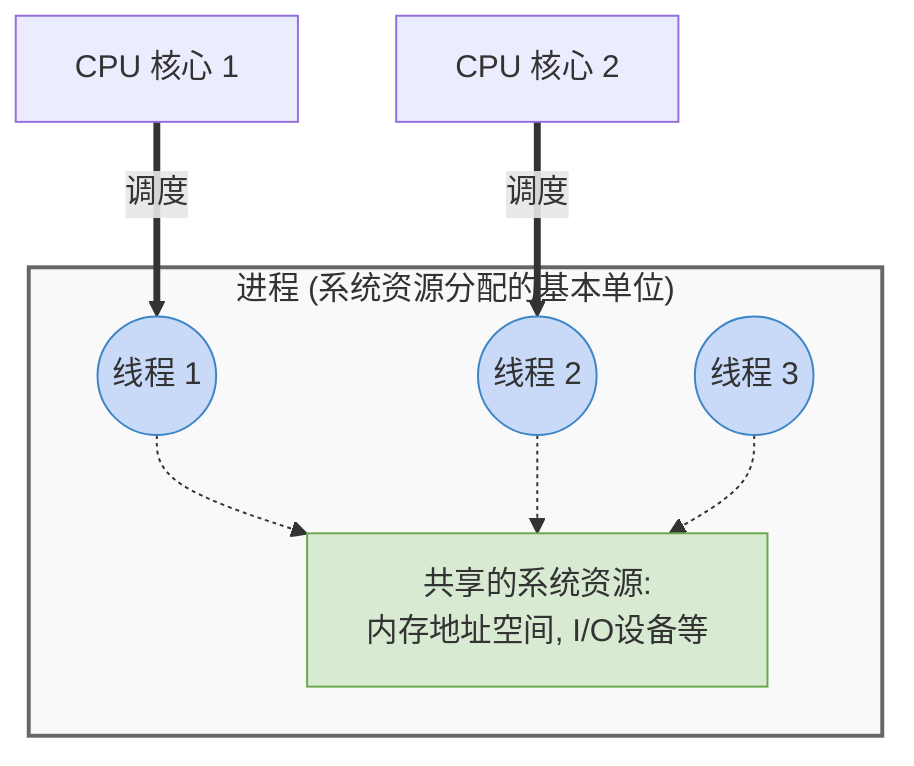

# 操作系统：线程的概念与属性

> **导语**
> 各位同学大家好，在这个小节中我们会学习“线程”相关的一系列知识点。
> 首先我们会用一个例子来介绍什么是线程，为什么要引入线程机制？在引入线程机制之后，比起传统的进程机制带来了哪些变化？最后，我们会总结梳理线程拥有哪些重要的属性。

---

## 一、 什么是线程？为什么要引入线程？

### 1. 技术的演进历程

- **无进程时代**：在很久很久以前，系统中的各个程序只能**串行执行**。例如，想要一边听音乐一边聊 QQ 是无法实现的，只能做完一件事再做另一件事。
- **传统的进程时代**：引入了进程机制后，系统可以实现**进程间的并发**。例如，可以一边运行 QQ 进程，一边运行音乐播放器进程。
- **引入线程的时代**：进一步思考，QQ 作为一个单独的进程，在运行过程中可以同时做很多事情：视频聊天、文字聊天、传送文件等。如果传统的进程只能顺序（串行）执行一系列代码，这些功能就不可能在用户看来同时发生。为了满足**一个进程内同时处理多个任务**的需求，人们引入了**线程机制**。

### 2. 线程的定义

- **本质**：线程可以理解为是一种**轻量级的进程**。
- **执行流的最小单位**：在没有引入线程之前，一个进程对应一份代码，只能顺序执行（进程是执行流的最小单位）；引入线程后，一个进程可以包含多个线程，每个线程可以有自己不同的代码，也可以运行同一份代码。这些线程会被 CPU 并发处理，因此**线程成为了程序执行流的最小单位**。

---

## 二、 引入线程机制后带来的变化

引入线程机制后，系统的调度服务对象不再是进程，而是进程当中的线程。我们通过以下表格对比传统机制与引入线程后的变化：

| 比较维度     | 传统进程机制                             | 引入线程机制后                                                                           |
| :----------- | :--------------------------------------- | :--------------------------------------------------------------------------------------- |
| **调度单位** | 进程是处理机（CPU）调度的基本单位        | **线程**是处理机（CPU）调度的基本单位                                                    |
| **资源分配** | 进程是系统资源分配的基本单位             | **进程**依然是资源分配的基本单位（线程几乎不拥有系统资源）                               |
| **并发性**   | 只能实现**进程之间**的并发执行           | 不仅进程间可以并发，**同一进程内的各个线程之间**也能并发执行，进一步提高了系统的并发度。 |
| **系统开销** | 并发需要切换进程的运行环境，开销**较大** | 同一进程内的线程切换不需要切换进程的运行环境，开销**较小**                               |

> 💡 **通俗理解：系统开销为什么降低了？（图书馆占座的例子）**
>
> - **进程切换（高开销）**：你在图书馆使用一张书桌，突然一个**不认识的人**要用这张桌子。你需要把你的书（运行环境）全部收走，他再把自己的书放上来。这个收放过程需要付出很大代价。
> - **同一进程内的线程切换（低开销）**：这个时候如果是你的**舍友**想要用这张书桌，因为你们认识（属于同一个进程），你可以不收走桌子上的书，直接让他接着用。由于不需要挪动运行环境，切换的开销就会大幅降低。

---

## 三、 线程的组织架构与图解

在引入线程后，进程和线程、以及系统资源之间的关系可以用下图直观表示：

---

## 四、 线程的重要属性总结

根据以上的讲解，我们将线程的核心属性归纳为以下几点：

1.  **调度的基本单位**：线程是基本的 CPU 执行单元，也是程序执行流的最小单位。
2.  **多核并行支持**：在多 CPU（多核）计算机中，同一个进程内的多个线程可以分配到不同的 CPU 核心上并行运行。
3.  **管理数据结构**：每个线程都有一个**线程 ID (TID)** 和一个**线程控制块 (TCB, Thread Control Block)**，类似于进程的 PCB，用于管理线程。
4.  **基本状态**：和进程类似，线程也拥有三种基本状态：**就绪**、**运行**和**阻塞**。
5.  **资源拥有情况**：线程几乎不拥有系统资源，系统资源主要分配给进程。
6.  **资源共享与通信**：
    - 同一进程中的不同线程，可以**共享**该进程所拥有的系统资源（如内存地址空间、I/O 设备等）。
    - 因为共享内存地址空间，同一进程内的线程间通信**不需要操作系统干预**，可以直接通过共享内存完成信息传递。
7.  **关于切换的系统开销**：
    - **同进程内的线程切换**：不会引起进程切换，系统开销**小**。
    - **不同进程间的线程切换**：会引起进程切换（需要切换进程的运行环境），系统开销**大**。
