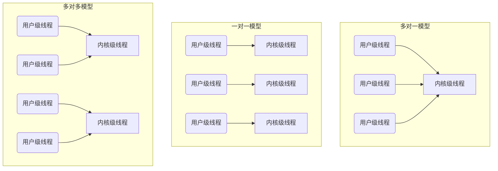

# 操作系统：线程的实现方式与多线程模型

> **导语**
> 各位同学大家好，在上个小节中我们学习了线程的基本概念，本小节我们将深入探讨**线程的实现方式**以及几种常见的**多线程模型**。
> 线程的实现方式主要分为：**用户级线程 (User-Level Thread, ULT)** 和 **内核级线程 (Kernel-Level Thread, KLT)**。在现代操作系统中，这两种方式往往被结合起来使用，从而衍生出了不同的多线程模型。

---

## 一、 线程的两种实现方式

### 1. 用户级线程 (User-Level Thread, ULT)

在早期的操作系统中，系统本身只认识“进程”，不支持“线程”。所谓的线程，是程序员通过**线程库 (Thread Library)** 在应用程序内部自行实现的。

**【工作原理与特点】**

- **管理机构**：用户级线程的创建、销毁、调度等所有管理工作都由**应用程序的线程库**完成。
- **状态切换开销**：线程的切换在**用户态**下即可完成，不需要请求操作系统的服务，因此**无需 CPU 切换到内核态**。
- **系统感知**：操作系统完全意识不到用户级线程的存在，在它眼里只有一个完整的进程在运行。

> **💡 伪代码辅助理解：**
> 假设一个 QQ 进程需要同时处理视频、文字和文件传输。在不支持线程的系统中，我们可以用一个 `while` 循环（最简陋的线程库）来轮流执行这三段代码逻辑：
>
> ```c
> int i = 0;
> while (true) {
>     if (i % 3 == 0) { 视频聊天处理逻辑(); }
>     if (i % 3 == 1) { 文字聊天处理逻辑(); }
>     if (i % 3 == 2) { 文件传输处理逻辑(); }
>     i++;
> }
> ```
>
> 这里的每一段独立的处理逻辑，其实就可以被视为一个“用户级线程”。

**【优缺点总结】**

- 🌟 **优点**：线程切换在用户空间完成，不需要 CPU 变态（用户态 ↔ 内核态），管理开销小，效率高。
- ⚠️ **缺点**：
  - **一阻全阻**：如果其中一个用户级线程被阻塞（例如视频聊天请求摄像头失败），整个循环就会卡住，导致同一进程内的所有线程都被阻塞。并发度不高。
  - **无法利用多核**：因为操作系统调度的基本单位仍然是进程，无论进程内有多少个用户级线程，该进程最多只能被分配到一个 CPU 核心上，线程无法真正并行运行。

---

### 2. 内核级线程 (Kernel-Level Thread, KLT)

随着操作系统的发展，现代操作系统（如 Windows, Linux）开始原生支持线程。这种在操作系统层面实现的线程就是内核级线程。

**【工作原理与特点】**

- **管理机构**：内核级线程的管理工作由**操作系统内核**完成。
- **状态切换开销**：内核级线程的切换必须由操作系统介入，因此**需要 CPU 从用户态切换到内核态**。
- **系统感知**：操作系统能够清晰地感知和管理每一个内核级线程。**内核级线程是处理机 (CPU) 调度的基本单位。**

**【优缺点总结】**

- 🌟 **优点**：
  - **并发能力强**：如果一个内核级线程被阻塞，进程内的其他内核级线程依然可以继续执行。
  - **支持多核并行**：多核 CPU 环境下，进程中的多个内核级线程可以被分配到不同的 CPU 核心上真正的并行执行。
- ⚠️ **缺点**：线程的管理需要操作系统的支持，频繁的线程切换会导致 CPU 频繁在用户态和内核态之间转换，管理成本高，开销大。

---

## 二、 三种多线程模型

为了结合用户级线程（管理开销小）和内核级线程（并发能力强）的优势，我们将若干个用户级线程映射到内核级线程上，形成了三种经典的多线程模型。

> 🔑 **核心理解视点**：
>
> - **用户级线程**：是“代码逻辑的载体”。
> - **内核级线程**：是“运行机会的载体”（CPU 分配的实体）。



### 1. 多对一模型 (Many-to-One)

将多个用户级线程映射到一个内核级线程。

- **本质**：退化成了纯粹的用户级线程实现方式。
- **优点**：线程管理开销极小，效率高。
- **缺点**：一个线程阻塞会导致整个进程阻塞；在多核系统中无法实现真正的并行。

### 2. 一对一模型 (One-to-One)

将一个用户级线程映射到一个独立的内核级线程。

- **优点**：并发能力极强。一个线程阻塞，其他线程不受影响；完美支持多核并行。
- **缺点**：创建用户级线程就必须创建一个对应的内核级线程，如果有大量的线程，内核级线程的数量会暴增，导致管理成本极高，系统开销大。

### 3. 多对多模型 (Many-to-Many)

将 $n$ 个用户级线程映射到 $m$ 个内核级线程上（要求 $n \ge m$）。

- **优点（集大成者）**：
  - 克服了多对一模型并发度不高、“一阻全阻”的缺点（如果一个内核级线程阻塞，其他内核级线程仍可运行）。
  - 克服了一对一模型中内核级线程数量过多、开销太大的缺点。
- **灵活性**：可以让复杂的逻辑（如视频聊天）独占一个内核级线程运行，而将简单的逻辑（如文字聊天、文件传输）组合在一起共享另一个内核级线程。

---

## 三、 本节总结与考点提炼

1.  **用户视角 vs 系统视角**：
    - 用户级线程是程序员在用户态通过线程库看到的。
    - 内核级线程是操作系统在内核态看到并负责调度的。
2.  **调度单位**：引入内核级线程后，**内核级线程才是处理机 (CPU) 分配的基本单位**。
3.  **阻塞机制的判断（高频考点）**：
    - 在**多对一模型**中：一个用户级线程阻塞 ➔ 绑定的唯一内核级线程阻塞 ➔ 整个进程阻塞。
    - 在**多对多模型**中：必须是**该进程所有的内核级线程都被阻塞时**，我们才认为该进程进入了阻塞状态。
