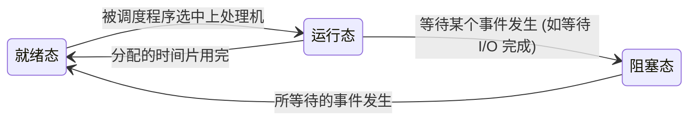

# 操作系统：线程的状态转换与组织控制

> **导语**
> 各位同学大家好，本节我们将学习**线程的状态与转换**，以及**线程的组织与控制**。
> 实际上，线程在这些方面与进程非常相似，甚至更为精简。我们将重点掌握线程的三大核心状态及其转换逻辑，并深入剖析线程控制块（TCB）中保存的关键信息。

---

## 一、 线程的状态与转换

线程的状态及其转换机制与进程几乎“一模一样”。在大部分考点中，我们通常只关注最核心的**三状态模型**：运行态、就绪态和阻塞态。

### 1. 三状态转换逻辑图

### 2. 状态转换详解

- **运行态 ➔ 就绪态**：正在运行的线程分配到的时间片用完了，它就会被迫下处理机，回到就绪态等待下一次调度。
- **就绪态 ➔ 运行态**：处于就绪态的线程被调度程序选中，即可上处理机开始运行。
- **运行态 ➔ 阻塞态**：正在运行的线程发出了某种请求（例如等待 I/O 操作完成），它必须等待该事件发生，此时主动进入阻塞态。
- **阻塞态 ➔ 就绪态**：阻塞线程所等待的事件终于发生了（如 I/O 结束），它便从阻塞态恢复到就绪态，重新具备上处理机的资格。

---

## 二、 线程的组织与控制：TCB (线程控制块)

与进程使用 PCB (Process Control Block) 类似，操作系统为了管理线程，为每个线程建立了一个专门的数据结构——**TCB (Thread Control Block，线程控制块)**。
线程的控制，本质上就是让线程在各种状态之间来回切换，并更新 TCB 中的相应信息。

### 1. TCB 的核心内容结构

| 字段名称            | 作用说明                                                                                                                                              | 归属类别               |
| :------------------ | :---------------------------------------------------------------------------------------------------------------------------------------------------- | :--------------------- |
| **TID (Thread ID)** | 线程的唯一标识符（类似于进程的 PID）。                                                                                                                | 基本标识               |
| **程序计数器 (PC)** | 指明该线程目前执行到了代码的哪个位置。                                                                                                                | 🌟 **运行环境 (现场)** |
| **通用寄存器**      | 保存代码运行过程中的各项中间结果。                                                                                                                    | 🌟 **运行环境 (现场)** |
| **堆栈指针 (SP)**   | 指向该线程在内存中专属的堆栈区域。堆栈用于保存**函数调用信息**（如返回地址）以及**局部变量**。为了节省 TCB 空间，TCB 中只存指针，不存完整的堆栈数据。 | 🌟 **运行环境 (现场)** |
| **运行状态**        | 记录线程当前处于就绪、运行还是阻塞态（若阻塞，可能还会详细记录阻塞原因）。                                                                            | 状态与调度             |
| **线程优先级**      | 用于线程调度或系统分配资源时作为策略参考。                                                                                                            | 状态与调度             |

> **💡 重点剖析：什么是“线程运行现场/运行环境”？**
> 表格中标注为“🌟 运行环境”的 **PC、通用寄存器、堆栈指针** 是线程切换时最核心的保护对象：
>
> - **下处理机时**：系统必须将这些现场信息**保存**到该线程的 TCB 中。
> - **上处理机时**：系统从 TCB 中**取出**这些信息，填回 CPU 的相应硬件寄存器中（例如将堆栈指针恢复到 SP 寄存器），从而**恢复**线程此前的运行环境，让代码继续准确无误地执行。

---

## 三、 线程的组织方式

有了 TCB 之后，系统需要将所有线程的 TCB 规律地组织起来分类管理。这就形成了**线程表**。不同的操作系统可能会采取不同的组织策略：

- **按进程组织**：为每个进程单独设置一张它所属的线程表。
- **全局组织**：将系统当中所有的线程集中起来，组成一张全局的线程表。
- **按状态组织**：根据线程当前的状态，分门别类地组织成“就绪线程表”、“阻塞线程表”等。

**总结：** 线程的组织与控制，核心思路与进程管理如出一辙，仅仅是将管理对象与保存的现场数据缩小到了“更精简”的线程级别。
