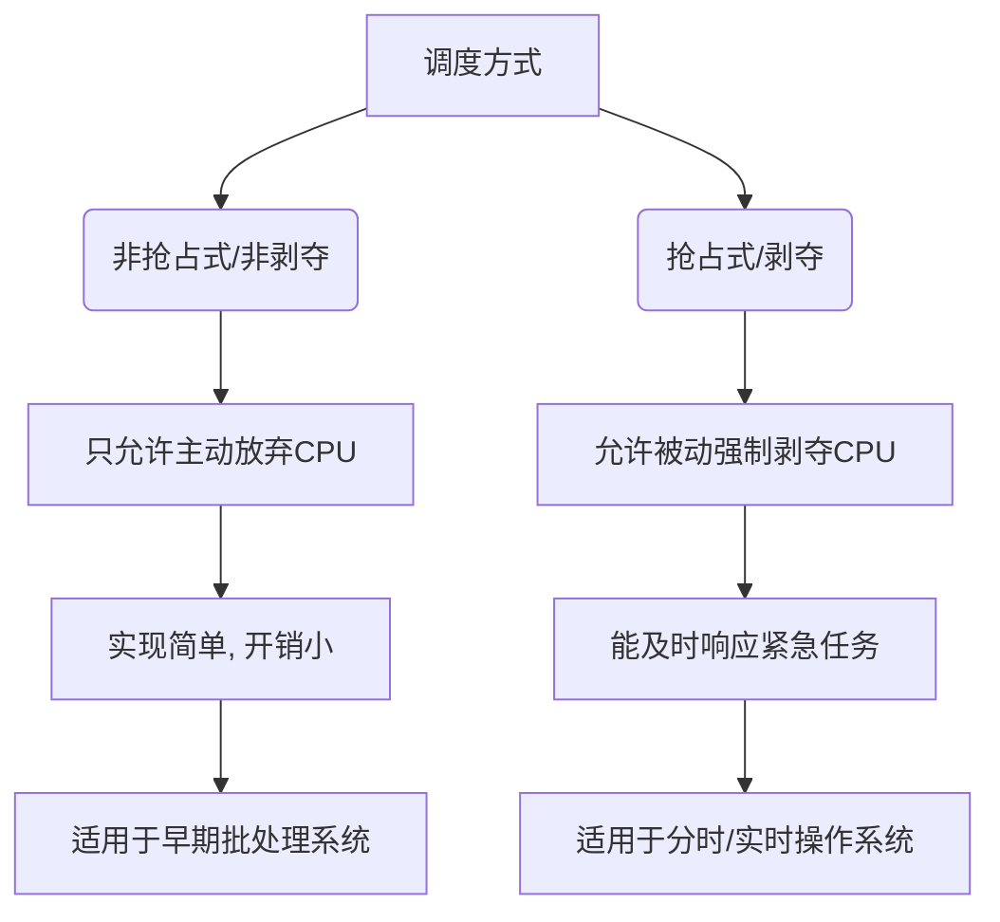
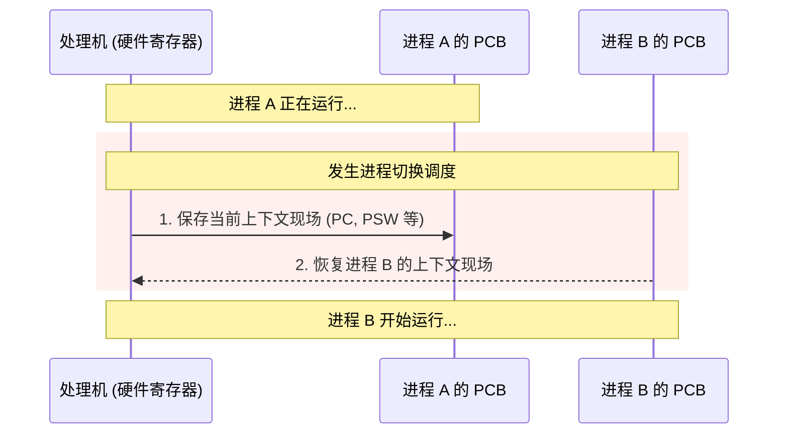

# 操作系统：进程调度的时机、方式与过程

> **导语**
> 本节课主要探讨进程调度相关的一系列核心知识点：包括**进程调度的时机**（何时能调度、何时不能）、**进程调度的方式**（抢占式与非抢占式），以及**进程调度与切换的过程和区别**。这些内容是理解后续复杂调度算法的基石。

---

## 一、 进程调度的时机

进程调度（低级调度）是指按照一定的算法，从就绪队列中选择一个进程，为其分配处理机（CPU）。

### 1. 需要进行进程调度与切换的情况

主要分为两大类：

- **主动放弃处理机**
  - 进程正常终止。
  - 运行过程中发生异常而不得不终止。
  - 进程发出 I/O 请求，主动请求进入阻塞状态（等待 I/O 完成）。
- **被动放弃处理机**
  - 分给进程的**时间片用完**。
  - 有更紧急的事情需要处理（如更高级别的中断）。
  - 有**优先级更高**的进程进入了就绪队列，当前进程被强行剥夺 CPU 使用权。

### 2. 不能进行进程调度与切换的情况

在以下三种特殊时期，系统**严格禁止**进行进程调度与切换：

1.  **在处理中断的过程中**：中断处理过程复杂且与底层硬件息息相关，很难在处理到一半时进行进程调度和切换。
2.  **进程在操作系统内核程序临界区中**：内核程序临界区通常用于访问某种内核数据结构（如就绪队列）。如果在解锁前发生调度，会影响操作系统内核的后续有序管理工作。
3.  **在原子操作过程中（原语）**：原语（如修改 PCB 状态位并将其移入新队列）是一气呵成的，如果只做了一半就发生切换，会导致数据不匹配，带来系统安全隐患。

### 3. ⚠️ 重难点辨析：内核程序临界区 vs 普通程序临界区

> **注意：** “进程在处于临界区时不能进行处理机调度” 这一表述是**错误**的。必须区分是哪种临界区！

- **临界资源**：一个时间段内只允许一个进程使用的资源（各进程需互斥访问）。
- **临界区**：访问临界资源的那段代码。

| 临界区类型         | 访问的资源示例         | 是否允许调度？ | 原因分析                                                                                                                                                |
| :----------------- | :--------------------- | :------------: | :------------------------------------------------------------------------------------------------------------------------------------------------------ |
| **内核程序临界区** | 进程的就绪队列         |   **不允许**   | 访问前会上锁。若不解锁就发生调度，会导致其他内核程序无法访问就绪队列，直接阻塞内核的日常管理工作。                                                      |
| **普通程序临界区** | 打印机 (慢速 I/O 设备) |    **允许**    | 访问打印机时也会上锁。但由于打印机极慢，如果不允许调度，CPU 将一直空等该进程打印结束，严重降低系统并发度和 CPU 利用率。且普通资源未解锁不影响内核管理。 |

---

## 二、 进程调度的方式

根据“当前运行的进程是否可以被强行剥夺处理机资源”，进程调度方式分为两类：

### 1. 非剥夺调度方式（非抢占式）

- **规则**：只允许进程**主动**放弃处理机。在运行过程中即便有更紧迫的任务到达，当前进程也会继续使用 CPU，直到其终止或主动进入阻塞态。
- **特点**：实现简单，系统管理开销小。
- **缺点**：无法及时处理紧急任务，只适用于早期的**批处理系统**。

### 2. 剥夺调度方式（抢占式）

- **规则**：当一个进程正在执行时，若有某个更为重要或紧迫的进程需要处理，系统可以**强行暂停**正在执行的进程，剥夺其 CPU 资源分配给紧迫进程。
- **特点**：可以优先处理紧急进程，也常用于实现让各进程“时间片轮转”执行。
- **适用场景**：适合于后期的**分时操作系统**和**实时操作系统**。

---

## 三、 进程的切换与过程

### 1. 广义调度与狭义调度的区别

- **狭义的进程调度**：仅指“从就绪队列中选中一个要运行的进程”。（注意：选中的进程可能就是刚刚暂停的进程，也可能是另一个新进程）。
- **进程切换**：指一个进程让出处理机，由另一个进程占用处理机的完整过程。
- **广义的进程调度**：包含了 **狭义调度 + 进程切换** 这两个步骤。

### 2. 进程切换的核心步骤

当发生进程切换时，系统在背后主要完成了两件大事：

1.  **保存旧现场**：对原来正在运行的进程，保存其处理机的运行环境（包括程序计数器 PC、程序状态字 PSW、各种数据寄存器等）。这些数据会被保存到该进程的 **PCB (进程控制块)** 中。
2.  **恢复新现场**：对新选中的进程，从其 PCB 中读出原先保存的运行环境信息，并将这些数据恢复到相应的硬件寄存器中。

### 3. 核心结论：进程切换是有代价的！

从上述步骤可以看出，进程切换绝非一瞬间完成，读写寄存器和内存（保存与恢复 PCB 数据）需要付出一定的时间代价。

- **启示**：不能简单地认为“进程切换越频繁，进程的并发度就越高”。
- 如果进程调度与切换**过于频繁**，系统会将大部分时间浪费在上下文切换的开销上，导致真正用于推进进程执行的时间锐减，从而**降低整个系统的效率**。
- 这一点对于理解后续的“时间片轮转调度算法”中时间片大小的设定至关重要。
