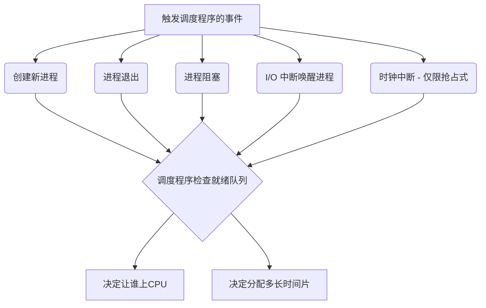

# 操作系统：调度程序与闲逛进程

> **导语**
> 本节课主要探讨操作系统内核中负责状态转换的核心模块——**调度程序**，以及当系统无任务可做时运行的**闲逛进程**。这两个概念是理解操作系统底层资源分配与状态流转的关键。

---

## 一、 调度程序 (Scheduler)

调度程序是操作系统内核中极其重要的一个程序模块，主要负责进程在**就绪、运行、阻塞**状态之间的转换。

### 1. 调度程序的核心任务

调度程序主要负责决定以下两件事：

- **让谁运行**：采用何种调度算法（如先来先服务、短作业优先、时间片轮转等）从就绪队列中挑选进程。
- **运行多长时间**：为不同的进程分配不同的时间片大小。

### 2. 调度程序的触发时机

调度程序的唤醒（开始工作）通常由以下事件触发：

- **创建新进程**：就绪队列发生改变，新进程可能需要抢占当前运行进程的 CPU。
- **进程退出**：当前进程正常或异常终止，CPU 资源空闲，需调度新进程上处理机。
- **进程阻塞**：当前进程因等待 I/O 等事件主动放弃 CPU，需调度新进程。
- **发生 I/O 中断**：可能使某些阻塞进程回到就绪态，就绪队列改变，需检查是否需要抢占。

### 3. 抢占式与非抢占式策略的区别

调度策略的不同，直接影响调度程序的唤醒机制：

| 调度策略     | 触发时机特征                           | 时钟中断的作用                                                                          |
| :----------- | :------------------------------------- | :-------------------------------------------------------------------------------------- |
| **非抢占式** | 仅在运行进程**主动**阻塞或退出时触发。 | **不会**由时钟中断唤醒调度程序。                                                        |
| **抢占式**   | 就绪队列改变时随时可能触发抢占。       | **每过一个或 $k$ 个时钟中断**，都会例行唤醒调度程序，检查是否有新就绪进程需要抢占 CPU。 |

### 4. 调度的基本单位

- **不支持内核级线程的操作系统**：调度的基本对象是**进程**。
- **支持内核级线程的操作系统**：调度的基本对象（基本单位）是**内核级线程**，而进程仅作为资源分配的基本单位。

---

## 二、 闲逛进程 (Idle Process)

实际的操作系统中，**CPU 永远不可能空闲**。当就绪队列中没有任何其他就绪进程时，调度程序就会选中**闲逛进程**上处理机运行。闲逛进程相当于系统的“备胎”。

### 闲逛进程的核心特性

1.  **优先级最低**：在所有就绪进程中优先级绝对垫底。只要有任何其他真实的就绪进程存在，闲逛进程都会立即下处理机。
2.  **执行零地址指令**：
    - 反复执行不需要访存、甚至不需要访问寄存器的零地址指令。
    - **优势**：极大地降低 CPU 能耗，让 CPU 在“闲逛”时更省电。
3.  **高频检查中断**：
    - 在执行完闲逛进程的每一条指令后，在**指令周期的末尾会例行检查中断**。
    - 一旦检测到中断（例如 I/O 完成或时钟中断），就能迅速唤醒调度程序，检查是否有新进程就绪，从而及时让闲逛进程让出 CPU。
