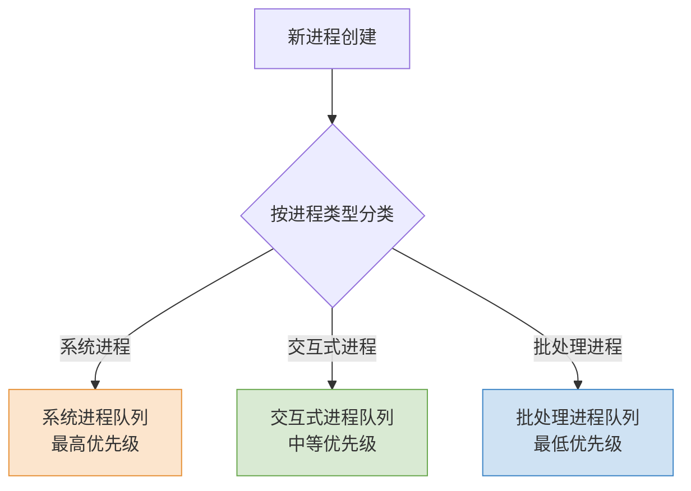
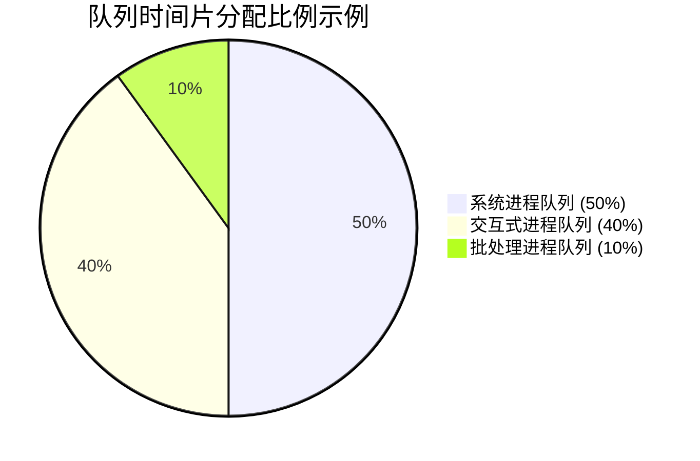

# 操作系统：多级队列调度算法

> **导语**
> 本文梳理了多级队列调度算法的核心概念、队列划分原则、队列间与队列内的调度策略，并附带了核心知识点与对比表格，方便日常查阅与打印。

---

## 一、 算法概念与核心思想

- **核心思想**: 系统按进程类型设置多个就绪队列，每个队列拥有独立的优先级。
- **工作流程**: 进程创建后，先进行分类，再插入到对应的队列中。
- **优先级排序**: 不同队列的优先级不同，通常规则为：**系统进程 > 交互式进程 > 批处理进程**。

---

## 二、 多级队列调度算法举例

### 队列划分示例

1.  **最高优先级：系统进程**（如内存管理进程）。
2.  **中等优先级：交互式进程**（如游戏、打字软件）。
    - _原因_: 需要及时响应用户操作，提升使用体验。
3.  **最低优先级：批处理进程**（如 AI 模型训练、视频特效渲染）。
    - _原因_: 用户不关心后台任务的响应速度，更关注前台交互的流畅性。

> **扩展性**: 实际系统中可设置更多级别的队列，并不局限于这三类。

---

## 三、 队列之间的调度机制

队列之间的调度通常有以下两种常见方式：

### 方式 1：采取固定优先级

- **调度规则**: 高优先级队列不空时，低优先级队列中的进程永远不会被调度。
- **潜在问题**: 可能导致低优先级进程（如用户打字）长时间得不到响应，影响体验，甚至产生**“饥饿”**现象。

### 方式 2：采取时间片划分

- **调度规则**: 为每个队列分配固定的 CPU 时间比例，确保所有队列都能被响应。
- **举例说明**: 假设总时间片为 100 毫秒，可分配如下：
  - 系统进程队列：50%（50毫秒）
  - 交互式进程队列：40%（40毫秒）
  - 批处理进程队列：10%（10毫秒）
- **优点**: 在固定时间范围内，任何类型的进程都能至少被响应一次。

---

## 四、 各队列内部的调度策略

- **策略选择**: 每个队列内部可以独立选择调度算法。
- **举例说明**:
  - **系统进程队列**: 采用**优先级调度**，优先处理更紧急的进程。
  - **交互式进程队列**: 采用**时间片轮转（RR）**，保证各进程在短时间内都能被响应。
  - **批处理进程队列**: 采用**先来先服务（FCFS）**，简单高效。
- **灵活性**: 可根据实际需求为不同队列设置其他调度算法。

---

## 五、 知识小结

### 1. 核心知识点梳理

| 知识点                 | 核心内容                                                                                                                                   | 考试重点 / 易混淆点                                                    | 难度系数 |
| :--------------------- | :----------------------------------------------------------------------------------------------------------------------------------------- | :--------------------------------------------------------------------- | :------- |
| **定义**               | 系统按进程类型设置多个队列，并赋予不同优先级                                                                                               | 队列数量与进程分类对应关系                                             | ⭐⭐     |
| **队列优先级设计原则** | 系统进程 > 交互式进程 > 批处理进程                                                                                                         | **排序依据**：系统进程最高；交互式进程需及时响应；批处理进程可容忍延迟 | ⭐⭐⭐   |
| **队列调度策略**       | 1. **绝对固定优先级**：高优先级队列不空则低优先级永不运行 2. **时间片分配**：如系统50ms、交互40ms、批处理10ms，保证各类进程至少响应一次 | 绝对优先级可能导致低优先级进程**“饥饿”**                               | ⭐⭐⭐⭐ |
| **队列内部调度算法**   | 系统队列：优先级调度（按紧急程度） 交互队列：时间片轮转（保证短周期响应） 批处理队列：先来先服务                                     | 不同队列可混合使用不同调度算法                                         | ⭐⭐⭐   |
| **调度执行流程**       | 每次调度：先选中队列 $                                                                                                                     |

ightarrow$ 再按队列内算法选进程 $
ightarrow$ 上处理器运行 | **两级选择**：队列级 + 进程级 | ⭐⭐ |

### 2. 不同类型队列的综合对比

| 对比维度           | 系统进程队列     | 交互式进程队列           | 批处理进程队列       |
| :----------------- | :--------------- | :----------------------- | :------------------- |
| **优先级**         | 最高             | 中等                     | 最低                 |
| **典型场景**       | 操作系统内核任务 | 打字、游戏、鼠标键盘响应 | AI模型训练、视频渲染 |
| **调度算法示例**   | 优先级调度       | 时间片轮转 (RR)          | 先来先服务 (FCFS)    |
| **时间片分配示例** | 50ms（50%）      | 40ms（40%）              | 10ms（10%）          |
| **响应要求**       | 立即响应         | 快速响应                 | 可容忍延迟           |
