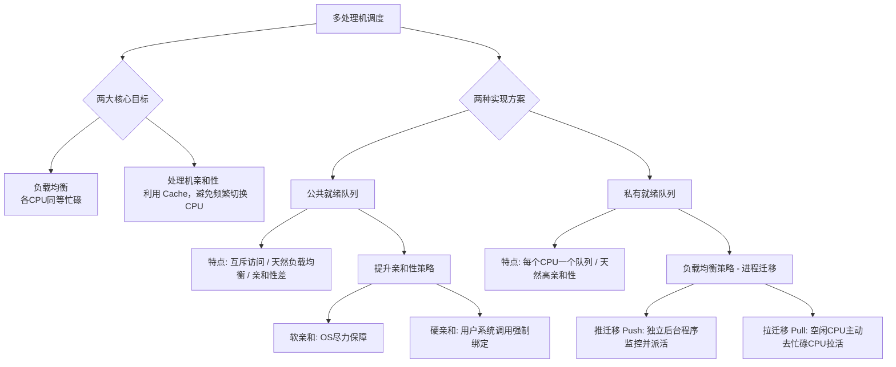

# 操作系统：多处理机调度 (2025考研新增考点)

> **导语**
> 各位同学大家好，本节课我们将探讨 2025 考研大纲中新增的考点：**多处理机调度**。
> 当系统从单核升级为多核（多处理机）时，调度程序不仅要决定“让谁运行”，还要决定“让它在哪运行”。这带来了新的挑战和目标。我们将深入探讨两大核心目标，以及应对这些挑战的两种队列设计方案（公共就绪队列与私有就绪队列）。

---

## 一、 多处理机调度的新问题与新目标

在单处理机环境下，调度只需解决一维问题（选哪个进程上 CPU）。而在多处理机环境下，调度变成了二维问题（选哪个进程，上哪个 CPU）。由此引出两个全新的调度目标：

### 1. 负载均衡 (Load Balancing)

- **目标**：尽可能让所有的 CPU 保持同等的忙碌状态，避免“一核有难，多核围观”（例如 CPU 1 负载 50%，CPU 4 负载 95%）。
- **意义**：充分利用多核算力，提升系统整体吞吐量。

### 2. 处理机亲和性 (Processor Affinity)

- **目标**：尽可能让一个进程在其整个生命周期内，**被调度到同一个 CPU 上运行**。
- **原理 (Cache 的作用)**：
  每个 CPU 核都有自己私有的 Cache（高速缓存）。当进程 $P_4$ 在 CPU 4 上运行时，CPU 4 的 Cache 会缓存大量 $P_4$ 的数据。
  - 如果下次调度 $P_4$ 依然在 CPU 4 运行，它可以直接利用 Cache 中的数据，运行极快（命中率高）。
  - 如果下次把 $P_4$ 调度到了 CPU 1 运行，由于 CPU 1 的 Cache 没有 $P_4$ 的数据（冷启动），$P_4$ 不得不频繁访问极慢的主存去取数据，导致运行速度大幅下降。

---

## 二、 解决方案一：公共就绪队列 (Common Ready Queue)

所有的就绪进程（的 PCB）统一放在内核区的一个全局就绪队列中。每个 CPU 空闲时，都来这个队列里“抢活干”。

### 1. 核心机制

- **调度动作**：任意一个 CPU 空闲时运行调度程序，根据调度算法（如优先级、时间片轮转）从公共队列中挑选一个进程到自己身上运行。
- **互斥访问 (必考点)**：因为多个 CPU 可能同时空闲并同时运行调度程序去访问这个队列，为了防止把同一个进程分配给两个不同的 CPU，**调度程序在访问公共就绪队列时，必须上锁 (互斥访问)**。

### 2. 优缺点分析

- **优点 - 天然负载均衡**：只要公共队列里有活，哪个 CPU 空闲了就会主动去拿，绝对不会出现某个 CPU 闲着没事干的情况。
- **缺点 - 亲和性差**：进程经常在不同的 CPU 之间流转（这次被 CPU 1 拿走，下次可能被 CPU 3 拿走），Cache 命中率低。

### 3. 如何在公共队列中提升亲和性？

- **软亲和 (Soft Affinity)**：由**操作系统的调度程序**尽最大努力去保障。调度时尽量倾向于把进程分给上次运行过它的那个 CPU，但在极度不均衡等不得已的情况下，允许切换 CPU。
- **硬亲和 (Hard Affinity)**：由**用户程序员**通过系统调用 (System Call) 强制要求。系统绝对保证该进程永远只在某个或某几个特定的 CPU 上运行。

---

## 三、 解决方案二：私有就绪队列 (Private Ready Queue)

操作系统为系统内的**每一个 CPU 都单独配备一个私有的就绪队列**。

### 1. 核心机制

- **调度动作**：CPU 空闲时，调度程序**只检查自己的**私有就绪队列，并从中挑选进程运行。
- **优点 - 天然的亲和性**：因为进程平时就待在某个固定 CPU 的私有队列里，所以总是会在同一个 CPU 上运行，完美发挥 Cache 性能。

### 2. 负载均衡的实现 (核心考点)

既然队列是私有的，很容易出现“旱的旱死，涝的涝死”。如何解决负载不均衡？主要依靠以下两种**任务迁移 (Migration)** 策略：

#### A. 推迁移 (Push Migration) —— “包工头派活”

- **机制**：系统中有一个专门的**特定系统程序（类似包工头）**，它会**周期性**地检查各个 CPU 的负载情况。
- **动作**：如果发现 CPU 4 过载，而 CPU 1 空闲，该程序就会强行把 CPU 4 私有队列中的部分进程，**“推” (Push)** 到 CPU 1 的私有队列中。

#### B. 拉迁移 (Pull Migration) —— “好同事互助”

- **机制**：没有专门的监工程序。而是依靠**每个 CPU 自己的调度程序**。
- **动作**：CPU 1 在运行调度程序时，不仅看自己的队列，还会**周期性**地偷瞄一眼其他 CPU 的负载（例如规定每调度 10 次就检查一次全局负载）。如果 CPU 1 发现自己很闲而 CPU 4 很忙，CPU 1 就会主动从 CPU 4 的队列中**“拉” (Pull)** 几个进程到自己的队列里来分担。

_(注：无论是推迁移还是拉迁移，任务转移的过程中必然会牺牲掉被转移进程的“处理机亲和性”，这是为了全局负载均衡而做出的妥协。)_

---

## 四、 本节知识体系速记导图

**【复习重点总结】**

1.  理解多处理机环境下引入 **处理机亲和性** 的底层逻辑（为了利用 CPU Cache）。
2.  掌握公共队列必须 **互斥（上锁）** 访问的原理。
3.  清晰辨析 **推迁移 (Push)** 与 **拉迁移 (Pull)** 的动作主体是谁（特定系统程序 vs 调度程序本身）。
