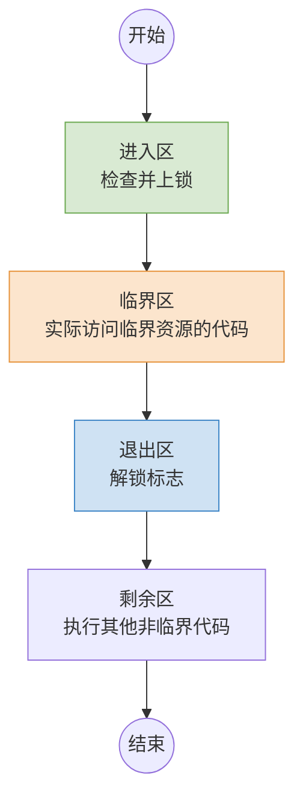

# 操作系统：进程同步与进程互斥

> **导语**
> 本节课我们将探讨操作系统中非常核心的两个概念：**进程同步**与**进程互斥**。通过生动的例子，我们将理解为什么并发执行的进程需要受到制约，以及操作系统如何管理进程对临界资源的访问。

---

## 一、 进程同步 (直接制约关系)

### 1. 为什么需要进程同步？

之前我们学习过**进程的异步性**：并发执行的进程会以各自独立的、不可预知的速度向前推进。
然而，在实际应用中，这种“不可预知”有时是我们无法接受的。

**生活化例子**：
假设老渣并发执行两个约会进程：

- **进程 1 (一号)**：指令1 (吃饭) $\rightarrow$ 指令2 (让老渣交出心)
- **进程 2 (二号)**：指令1 (让老渣交出心)
  由于异步性，可能出现进程 2 先执行指令1（老渣的心给了二号），随后进程 1 执行指令2时就会失败（心没了）。
  如果一号要求“必须做老渣的初恋”，二号要求“必须找有恋爱经验的”，那么就**必须严格保证推进顺序**：一号的指令2 **必须** 在二号的指令1 之前执行。

**计算机例子 (管道通信)**：
写进程和读进程并发执行。但我们**必须保证**“写数据”发生在“读数据”之前，否则读进程会读到空数据。

### 2. 进程同步的概念

**进程同步**就是为了解决进程异步性带来的问题。
它指的是：两个或多个进程为了**相互协调来合作完成某项工作**，在某些执行点上必须按照特定的**工作次序**（谁先谁后）来推进。
这种因为合作而产生的制约关系，被称为进程的 **直接制约关系**。

---

## 二、 进程互斥 (间接制约关系)

### 1. 临界资源的概念

并发执行的进程不可避免地需要共享系统资源。

- **同时共享方式**：宏观上允许多个进程同时访问（微观上可能是交替的）。
- **互斥共享方式**：在一个时间段内**只允许一个进程访问**的资源。这种资源就被称为 **临界资源**（如：打印机、摄像头、某些内存变量）。

### 2. 进程互斥的概念

**进程互斥**是指：当一个进程正在访问某临界资源时，另一个想要访问该临界资源的进程**必须等待**。直到当前进程访问结束并释放资源后，另一个进程才能去访问。
因为进程间并没有直接的合作关系，仅仅是因为争抢同一资源而产生的制约，所以这被称为 **间接制约关系**。

### 3. 对临界资源的互斥访问：代码逻辑四部分

在代码逻辑上，实现对临界资源的互斥访问可以分为四个部分：

| 代码区域                       | 核心作用       | 说明                                                                             |
| :----------------------------- | :------------- | :------------------------------------------------------------------------------- |
| **进入区** (Entry Section)     | **检查与上锁** | 检查临界区是否可进入。若可进入，则设置“正在访问”标志（上锁），阻止其他进程进入。 |
| **临界区** (Critical Section)  | **访问资源**   | 实际用于**访问临界资源的那段代码**（也称临界段）。                               |
| **退出区** (Exit Section)      | **解锁**       | 解除“正在访问”的标志（解锁），允许其他进程进入。                                 |
| **剩余区** (Remainder Section) | 其他处理       | 做一些与访问临界资源无关的其他处理代码。                                         |

> **⚠️ 易错考点提示**：
> 很多题目会故意混淆视听，声称“进入区和退出区是用于访问临界资源的代码”。这是**错误**的！真正访问资源的代码仅仅在**临界区**。进入区和退出区只是负责“上锁”和“解锁”。

---

## 三、 实现进程互斥需遵循的四大原则

如果进程暂时进不了临界区，该怎么处理？为了保证系统的整体性能和公平性，任何实现进程互斥的算法或机制，都应当遵循以下四个基本原则（非常重要）：

1.  **空闲让进**
    - **含义**：如果临界区空闲（没有进程在访问），应允许一个请求进入临界区的进程**立即进入**临界区。
2.  **忙则等待**
    - **含义**：如果已有进程正在访问临界区，其他试图进入的进程**必须等待**。
3.  **有限等待**
    - **含义**：对请求访问的进程，应保证其在**有限的时间内**能够进入临界区。
    - **目的**：防止进程发生“饥饿”（永远等不到资源）的现象。
4.  **让权等待**
    - **含义**：当进程暂时进不了临界区时，该进程应**立即释放处理机 (CPU)**。
    - **目的**：防止进程处于“**忙等待**”（即进不去临界区，却一直霸占着 CPU 空转循环检查，白白浪费 CPU 资源）。

_(注：这四大原则将在下一节讲解“进程互斥的软件/硬件实现方法”时作为核心评价标准。)_

---

## 四、 本节知识脉络速记

- **进程同步 (直接制约)**：为了合作，强调**执行的先后次序**。
- **进程互斥 (间接制约)**：为了争抢**临界资源**，强调**不能同时进入**。
- **访问逻辑四件套**：进入区(上锁) $\rightarrow$ 临界区(访问) $\rightarrow$ 退出区(解锁) $\rightarrow$ 剩余区。
- **互斥四大原则**：**空闲让进、忙则等待、有限等待、让权等待**。
