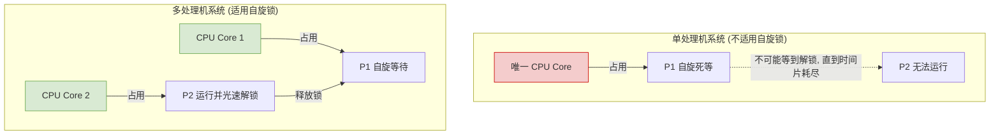

# 操作系统：互斥锁与自旋锁 (新考点)

> **导语**
> 本节课我们将探讨用于实现进程互斥的新考点——**锁 (Lock)**。我们将深入理解锁的基本概念、自旋锁（Spinlock）的“盲等”特性，以及为什么自旋锁在多处理机系统中大放异彩，而在单处理机系统中却显得十分低效。

---

## 一、 锁的基本概念与操作

**锁**是用于实现进程互斥的一种简单方法。
你可以简单地将锁理解为一个**布尔型 (Boolean) 的变量**，它只有两种状态：

- `true` (或 `1`)：表示当前**已上锁**。
- `false` (或 `0`)：表示当前**没有上锁** (空闲)。

对锁的操作主要依赖两个基础函数：

- **`acquire()`**：上锁（获得锁）。进入临界区前调用，如果已被上锁，则在此等待。
- **`release()`**：解锁（释放锁）。退出临界区后调用。

---

## 二、 互斥锁的核心缺陷：盲等 (Busy Waiting)

使用锁实现互斥的主要缺点是**盲等**（也称忙等待）。

### 1. 什么是盲等？

如果一个进程暂时进不了临界区，它就会被卡在 `while` 循环里不断地进行条件检查，在原地“打转”。

- **结果**：导致 CPU 计算资源的白白浪费。
- **定性**：这**违反了“让权等待”的原则**。

### 2. 盲等的误区澄清 (重点细节)

> **疑问**：如果一个进程在盲等，它会一直死死霸占着处理机永远不放吗？
> **解答**：**不会！**
> 虽然它在盲等，但操作系统的调度程序依然在工作。当该进程分配到的**时间片用完**时，调度程序依然会强行让它下处理机。所以，并不是说一旦开始盲等，处理机就永远卡死了，它的时间片耗尽后依然会让出 CPU。

---

## 三、 自旋锁 (Spinlock)

由于盲等的过程需要不断地循环检查，就像“自己在原地旋转跳跃，闭着眼”，因此这类锁通常被称为**自旋锁**。

### 1. 常见的自旋锁机制

我们之前学过的很多互斥实现方法，本质上都属于自旋锁：

- **软件实现**：单标志法。
- **硬件实现**：TSL 指令 (Test-and-Set)、Swap 指令。
  > **总结**：这些方法都用于解决进程互斥问题，且都存在**盲等**的通病，违背了“让权等待”原则。

### 2. 自旋锁的优点

既然盲等会浪费 CPU，为什么还要设计自旋锁呢？

- **优势**：在等待锁的期间，**不需要切换进程的上下文**。
- **原理**：进程上下文切换的代价（时间开销）是非常大的。如果对临界区上锁的时间极短，那么让进程稍微“原地转两圈”（自旋等待）直接拿到锁，其付出的时间代价反而比“进程休眠 $\rightarrow$ 上下文切换 $\rightarrow$ 进程唤醒”的代价要**低得多**。

---

## 四、 自旋锁的适用场景对比 (多处理机 vs 单处理机)

自旋锁的“原地打转”特性，决定了它在不同硬件架构下的表现天差地别。

### 1. 多处理机系统：极度适用 (天然契合)

- **场景描述**：假设进程 P1 在 Core 1 上运行并自旋等待；同时，已上锁的进程 P2 在 Core 2 上运行。
- **运行结果**：P1 只会吃掉 Core 1 的计算能力，而 Core 2 照常工作。由于 P2 运行极快，它会迅速用完临界区并执行 `release()` 解锁。此时，正在 Core 1 上自旋的 P1 会**立刻发现锁已解开**，顺利进入临界区。
- **结论**：全程未发生昂贵的进程切换，盲等时间极短，**代价极低，非常高效**。

### 2. 单处理机系统：极度不适用 (纯属浪费)

- **场景描述**：假设进程 P1 在唯一的一个 CPU 核心上运行并触发了自旋等待。
- **运行结果**：P1 吃掉了整个系统**唯一**的核。既然 CPU 被 P1 占着，上锁的进程 P2 根本没机会上处理机去执行解锁操作！
- **结论**：在单处理机系统中，P1 在自旋时**绝对不可能**等到锁被释放。它只能徒劳地转到自己的**时间片全部耗尽**，被系统强制踢下处理机，P2 才有机会运行并解锁。这完全是白白浪费了一个时间片！

