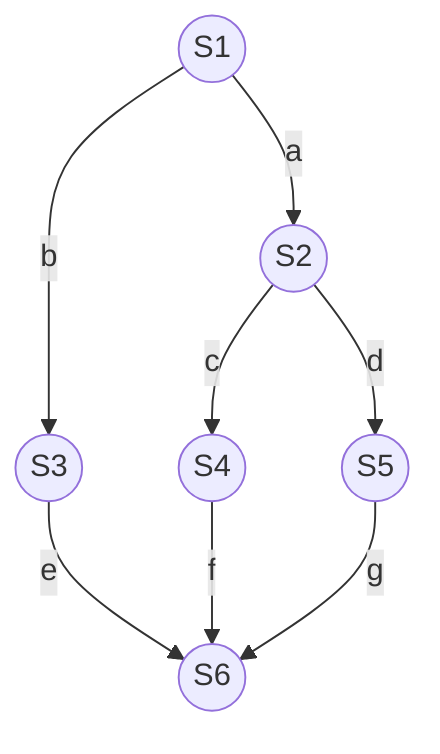

# 操作系统：用信号量机制实现进程互斥、同步与前驱关系

> **导语**
> 本节课是操作系统的绝对核心考点，几乎每年必出大题！
> 前面我们学习了信号量机制（特别是记录型信号量），它通过 `block` 和 `wakeup` 原语完美解决了“盲等”问题，实现了让权等待。本节课我们将学习如何利用这套强大的机制（P/V 操作）来**真正实现进程的互斥与同步**。请务必掌握核心口诀：“**互斥 P/V 夹住临界区，同步前 V 后 P**”。

---

## 一、 用信号量机制实现进程互斥

在进程互斥中，某些资源（临界资源）在同一时刻只允许一个进程访问。

### 1. 实现步骤与代码套路

1. **分析临界区**：确定哪段代码是用于访问临界资源的。
2. **设置互斥信号量**：定义一个信号量 `mutex`，其**初始值设定为 1**。（物理意义：进入临界区的“名额”只有 1 个）。
3. **加锁与解锁**：
   - 在临界区**之前**执行 P 操作（申请名额）。
   - 在临界区**之后**执行 V 操作（归还名额）。

```c
semaphore mutex = 1; // 互斥信号量，表示进入临界区的名额，初始为 1

// 进程 P1
P(mutex);       // 申请进入临界区
临界区代码;      // 访问临界资源
V(mutex);       // 离开临界区，释放名额

// 进程 P2
P(mutex);       // 申请进入临界区
临界区代码;      // 访问临界资源
V(mutex);       // 离开临界区，释放名额
```

### 2. 逻辑推演

- 如果 P1 先执行 `P(mutex)`，`mutex` 变为 0，P1 顺利进入临界区。
- 此时若 P2 也执行 `P(mutex)`，`mutex` 变为 -1。因为没有名额了，P2 会被**自动阻塞**（进入等待队列），完美实现让权等待。
- P1 执行完临界区后执行 `V(mutex)`，`mutex` 变为 0。系统发现有人在排队，于是**自动唤醒** P2，P2 得以进入临界区。

### 3. ⚠️ 互斥必背注意事项

- 如果未做特殊说明，直接写 `semaphore mutex = 1;` 即可，**默认其为记录型信号量**（带有阻塞队列功能）。
- 对**不同**的临界资源（如打印机、摄像头），必须设置**不同**的互斥信号量（如 `mutex1`, `mutex2`）。
- **P、V 操作必须成对出现**！缺少 P 会导致失去互斥保护，缺少 V 会导致其他进程永远阻塞。

---

## 二、 用信号量机制实现进程同步

进程的**异步性**导致并发进程的执行顺序不可预知。**进程同步**就是要解决这个问题，强制让代码按照我们期望的先后顺序执行（例如：必须先写数据，再读数据）。

### 1. 核心口诀与实现步骤

解决同步问题的终极必杀技：**前 V 后 P**！

1. **分析什么必须在前，什么必须在后**。
2. **设置同步信号量**：定义一个信号量 `S`，**初始值设定为 0**。（物理意义：刚开始这种“前置条件满足”的资源是没有的）。
3. **放置 P/V 操作**：
   - 在**“前操作”之后**执行 **V(S)**。（前操作完成，产生一个资源，唤醒等待者）。
   - 在**“后操作”之前**执行 **P(S)**。（后操作开始前，必须申请资源；若前操作没做完，后操作就老老实实阻塞等待）。

### 2. 代码示例与逻辑推演

要求：进程 P2 的 `代码 4` 必须在进程 P1 的 `代码 2` 之后执行。

```c
semaphore S = 0; // 同步信号量，初始值为 0

// 进程 P1
代码 1;
代码 2;          // 必须先执行的 "前操作"
V(S);           // 前操作完成，执行 V 操作 (前V)
代码 3;

// 进程 P2
P(S);           // 后操作开始前，执行 P 操作 (后P)
代码 4;          // 必须后执行的 "后操作"
代码 5;
代码 6;
```

**逻辑推演：**

- **若 P1 先执行**：执行完代码 2 后，执行 `V(S)`，信号量 `S` 从 0 变成 1。随后 P2 执行到 `P(S)`，由于 `S=1`，名额充足，P2 顺利执行代码 4。满足顺序。
- **若 P2 先执行**：P2 先执行到 `P(S)`，此时 `S` 初始为 0。P2 申请不到资源，**立刻被阻塞**。直到 P1 执行完代码 2 并执行 `V(S)`，P2 才会被系统**唤醒**，进而执行代码 4。完美保证了顺序！

---

## 三、 进阶：进程的前驱关系

前驱关系本质上就是**更复杂的、多级的进程同步问题**。

### 1. 问题描述

假设有 6 句代码（$S_1 \sim S_6$），要求严格按照下图的有向边顺序执行（例如：$S_1$ 完成后才能执行 $S_2$ 和 $S_3$；$S_2$ 完成后才能执行 $S_4$ 和 $S_5$ ...）



### 2. 解题套路

不要被复杂的图吓倒，记住核心原则：**每一条有向边，代表一对一前一后的同步关系。**

1. **为每一条边设置一个同步信号量**（如图中的 $a, b, c, d, e, f, g$），**初始值全为 0**。
2. 严格套用 **“前 V 后 P”** 口诀。
   - 对于边 $a$ ($S_1 
ightarrow S_2$)：在 $S_1$ 之后写 `V(a)`，在 $S_2$ 之前写 `P(a)`。
   - 对于节点 $S_6$：它前面有 3 条边连过来，所以在 $S_6$ 之前必须连续写 3 个 P 操作：`P(e); P(f); P(g);`。

### 3. 完整代码实现

```c
semaphore a=0, b=0, c=0, d=0, e=0, f=0, g=0; // 每条边一个信号量，全为 0

P1() {
    S1;       // S1 是所有进程的起点
    V(a);     // 前 V
    V(b);     // 前 V
}

P2() {
    P(a);     // 后 P
    S2;
    V(c);     // 前 V
    V(d);     // 前 V
}

P3() {
    P(b);     // 后 P
    S3;
    V(e);     // 前 V
}

P4() {
    P(c);     // 后 P
    S4;
    V(f);     // 前 V
}

P5() {
    P(d);     // 后 P
    S5;
    V(g);     // 前 V
}

P6() {
    P(e);     // 后 P
    P(f);     // 后 P
    P(g);     // 后 P
    S6;       // 必须等 S3, S4, S5 全部执行完 (并执行了对应的 V 操作)，S6 才能解除阻塞往下走
}
```

_推演验证：如果 P6 最先被调度上 CPU，它会瞬间在 `P(e)` 处被阻塞，必须乖乖等前面的节点执行完毕。_

---

## 四、 本节知识脉络速记表

| 目的         | 信号量设置         | 核心操作口诀         | 物理意义                                                       |
| :----------- | :----------------- | :------------------- | :------------------------------------------------------------- |
| **进程互斥** | `mutex = 1`        | **P、V 夹住临界区**  | P: 申请名额 (抢锁) <br> V: 归还名额 (解锁)                     |
| **进程同步** | `S = 0`            | **前 V 后 P**        | 前操作完成后，V 操作产生一个“条件满足”的资源，唤醒阻塞的后操作 |
| **前驱关系** | 每条边一个 `S = 0` | 依然是 **前 V 后 P** | 复杂的多级同步，本质是对“前V后P”的批量应用                     |
| **资源分配** | `S = N` (资源总数) | P 申请，V 释放       | 例如 3 台打印机，`S=3`。代表对多个同类互斥资源的统一管理       |

> **学习提醒**：本节只是“开胃菜”，展示了 P/V 操作的基本语法套路。从下一节开始，我们将用这些套路去攻克大名鼎鼎的经典同步互斥问题（如生产者-消费者问题、读者-写者问题）。请务必把“**互斥用PV夹住，同步用前V后P**”深刻印在脑子里！
