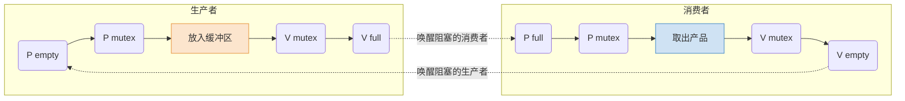

# 操作系统：经典同步互斥问题——生产者-消费者问题

> **导语**
> 本节课我们将学习操作系统中极其经典的进程同步与互斥问题：**生产者-消费者问题**。
> 这是一个综合性很强的问题，不仅要求实现对临界资源（缓冲区）的互斥访问，还隐含了两对相互制约的同步关系。我们将一步步分析问题，并利用上一节学过的 P/V 操作（信号量机制）给出标准的解题套路。

---

## 一、 问题描述与关系分析

### 1. 问题描述

- 系统中有一组**生产者进程**和一组**消费者进程**。
- **生产者进程**：每次生产一个产品，并将其放入缓冲区。
- **消费者进程**：每次从缓冲区中取出一个产品并消费。
- **缓冲区**：两者共享一个初始为空、大小为 $n$ 的缓冲区（即有 $n$ 个小格子可以放产品）。

### 2. 核心关系分析 (解题第一步)

通过分析问题，我们可以找出其中隐含的**一个互斥关系**和**两个同步关系**。

#### A. 互斥关系 (临界资源的保护)

- **问题**：缓冲区是有限的共享资源。如果两个生产者同时发现缓冲区为空，并同时向同一个位置写入数据，会导致**数据覆盖**。
- **结论**：缓冲区属于**临界资源**，所有生产者和消费者在访问缓冲区时，必须**互斥地**进行。

#### B. 同步关系一 (生产者等待消费者)

- **问题**：缓冲区大小有限（只能放 $n$ 个产品）。如果缓冲区已满，生产者就不能继续放产品，必须阻塞等待。
- **制约逻辑**：只有当消费者从缓冲区取走产品（释放出空闲格子）后，生产者才能继续生产放入。
- **先后顺序**：**消费者取走产品 (前) $\rightarrow$ 生产者放入产品 (后)**。

#### C. 同步关系二 (消费者等待生产者)

- **问题**：如果缓冲区为空，消费者就取不到产品，必须阻塞等待。
- **制约逻辑**：只有当生产者向缓冲区放入产品后，消费者才能从中取出消费。
- **先后顺序**：**生产者放入产品 (前) $\rightarrow$ 消费者取出产品 (后)**。

---

## 二、 信号量设置与代码实现

### 1. 信号量设置 (解题第二步)

根据上述分析，我们需要设置三种信号量：

1.  **互斥信号量 `mutex`**：用于实现对缓冲区的互斥访问，初始值为 **`1`**。
2.  **同步信号量 `empty`**：表示**空闲缓冲区**的数量（生产者需要的资源）。初始值为 **`n`**。
3.  **同步信号量 `full`**：表示**缓冲区中产品**的数量（消费者需要的资源）。初始值为 **`0`**（初始时缓冲区为空）。

### 2. 核心代码结构 (解题第三步：前V后P)

```c
semaphore mutex = 1;  // 互斥信号量，实现对缓冲区的互斥访问
semaphore empty = n;  // 同步信号量，表示空闲缓冲区的数量
semaphore full = 0;   // 同步信号量，表示产品的数量，即非空缓冲区的数量

// 生产者进程
producer() {
    while(1) {
        生产一个产品;

        P(empty);     // 1. 申请空闲缓冲区。如果没空位，生产者在此阻塞。(后P)
        P(mutex);     // 2. 申请进入临界区，准备操作缓冲区。(互斥)

        把产品放入缓冲区;

        V(mutex);     // 3. 离开临界区，释放互斥锁。
        V(full);      // 4. 产品数量+1。唤醒可能在等待产品的消费者。(前V)
    }
}

// 消费者进程
consumer() {
    while(1) {
        P(full);      // 1. 申请产品。如果没产品，消费者在此阻塞。(后P)
        P(mutex);     // 2. 申请进入临界区，准备操作缓冲区。(互斥)

        从缓冲区取出一个产品;

        V(mutex);     // 3. 离开临界区，释放互斥锁。
        V(empty);     // 4. 空闲缓冲区+1。唤醒可能在等待空位的生产者。(前V)

        使用产品;
    }
}
```



---

## 三、 核心避坑指南 (必考大雷区)

### 1. 连续的 P 操作顺序能颠倒吗？(死锁预警)

**绝对不能！实现互斥的 P 操作必须放在实现同步的 P 操作之后。**
_(即：必须先 `P(empty/full)`，再 `P(mutex)`)_

**如果颠倒了会发生什么？(产生死锁)**
假设我们颠倒了生产者的 P 操作顺序：

1.  当前缓冲区已**满** (`empty = 0`, `full = n`)。
2.  生产者执行 `P(mutex)`，成功上锁（`mutex = 0`）。
3.  生产者接着执行 `P(empty)`。因为没有空位了，**生产者被阻塞**。
4.  此时轮到消费者执行。消费者首先执行 `P(mutex)`，但此时互斥锁已经被处于阻塞状态的生产者拿走了（`mutex = 0`），**消费者也被阻塞**。
    **结果**：生产者抱着互斥锁，等待消费者来取走产品；而消费者必须等生产者交出互斥锁才能去取产品。双方**互相等待**，产生了经典的**死锁 (Deadlock)**！

### 2. 连续的 V 操作顺序能颠倒吗？

**可以！**
V 操作只是释放资源并唤醒其他进程，本身**绝对不会导致调用者阻塞**。因此，`V(mutex)` 和 `V(full)` 的先后顺序即使颠倒，也不会引发死锁问题。

### 3. 为什么“生产产品”和“使用产品”的代码不在 P/V 之间？

从逻辑上来说，把这两步放进 P/V 操作（临界区）内部是不会报错的。
但是，这么做会导致**临界区代码变得非常长**，进程对缓冲区（临界资源）的占用时间会大幅增加，严重降低了各个进程交替访问临界区的并发效率。因此，非必要操作应尽量**移出临界区**。
