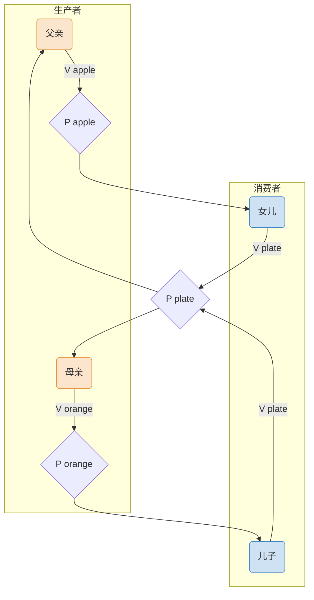

# 操作系统：经典同步互斥问题——多生产者与多消费者问题

> **导语**
> 本节课我们继续学习进程同步互斥的进阶经典模型：**多生产者与多消费者问题**（以“父子母女吃水果”为例）。
> 这里的“多”，并不是指数量上的多，而是指**类别（种类）**上的多。通过本节课，我们要深刻理解：如何从“事件”而非“进程”的角度去抽象同步关系，以及当缓冲区大小为 1 时，互斥信号量为什么有时可以省略。

---

## 一、 问题描述与关系分析

### 1. 场景描述

- 桌子上有一个盘子（**缓冲区**），最多只能放 **1个** 水果（`大小为1`，`初始为空`）。
- **父亲 (Producer 1)**：专门往盘子里放**苹果**。
- **母亲 (Producer 2)**：专门往盘子里放**橘子**。
- **女儿 (Consumer 1)**：专门等盘子里的**苹果**，取出并吃掉。
- **儿子 (Consumer 2)**：专门等盘子里的**橘子**，取出并吃掉。

### 2. 核心关系分析 (解题第一步)

#### A. 互斥关系

- 盘子是临界资源，任何时刻只能有一个人（进程）对盘子进行操作（放或取）。因此对盘子的访问必须是**互斥**的。

#### B. 同步关系 (关键在于“事件”抽象)

千万不能以“进程行为”来建立同步关系（比如：女儿取苹果 $\rightarrow$ 父亲放苹果；女儿取苹果 $\rightarrow$ 母亲放橘子... 这样会导致关系网极其混乱）。
**正确的思维：将前后制约关系抽象为“事件”！**

1.  **同步关系 1 (父亲 $\rightarrow$ 女儿)**：
    - **事件前**：父亲把苹果放入盘子。
    - **事件后**：女儿才能取出苹果。
2.  **同步关系 2 (母亲 $\rightarrow$ 儿子)**：
    - **事件前**：母亲把橘子放入盘子。
    - **事件后**：儿子才能取出橘子。
3.  **同步关系 3 (儿子/女儿 $\rightarrow$ 父亲/母亲)**：
    - **事件前**：盘子变空（无论谁吃掉的）。
    - **事件后**：父亲或母亲才能往里放水果。

---

## 二、 信号量设置与代码实现

### 1. 信号量设置

根据上述分析，我们需要设置 1 个互斥信号量和 3 个同步信号量：

1.  `mutex = 1`：实现对盘子的互斥访问。
2.  `apple = 0`：表示盘子中**苹果**的数量（同步信号量 1）。
3.  `orange = 0`：表示盘子中**橘子**的数量（同步信号量 2）。
4.  `plate = 1`：表示盘子中**还能放多少个水果**（也就是空闲盘子的数量，同步信号量 3）。

### 2. 核心代码结构 (前V后P套路)

```c
semaphore mutex = 1;  // 互斥信号量
semaphore apple = 0;  // 苹果数量
semaphore orange = 0; // 橘子数量
semaphore plate = 1;  // 盘子容量

// 父亲进程
Dad() {
    while(1) {
        准备一个苹果;
        P(plate);     // 1. 申请盘子 (后P)
        P(mutex);     // 2. 申请互斥锁
        把苹果放入盘子;
        V(mutex);     // 3. 释放互斥锁
        V(apple);     // 4. 苹果数量+1，唤醒女儿 (前V)
    }
}

// 母亲进程
Mom() {
    while(1) {
        准备一个橘子;
        P(plate);     // 1. 申请盘子 (后P)
        P(mutex);     // 2. 申请互斥锁
        把橘子放入盘子;
        V(mutex);     // 3. 释放互斥锁
        V(orange);    // 4. 橘子数量+1，唤醒儿子 (前V)
    }
}

// 女儿进程
Daughter() {
    while(1) {
        P(apple);     // 1. 申请苹果 (后P)
        P(mutex);     // 2. 申请互斥锁
        从盘中取出苹果;
        V(mutex);     // 3. 释放互斥锁
        V(plate);     // 4. 盘子变空，唤醒父母 (前V)
        吃掉苹果;
    }
}

// 儿子进程
Son() {
    while(1) {
        P(orange);    // 1. 申请橘子 (后P)
        P(mutex);     // 2. 申请互斥锁
        从盘中取出橘子;
        V(mutex);     // 3. 释放互斥锁
        V(plate);     // 4. 盘子变空，唤醒父母 (前V)
        吃掉橘子;
    }
}
```



---

## 三、 深度思考：互斥信号量 `mutex` 能否省略？

在这个特定的问题中，如果我们**删掉所有的 `P(mutex)` 和 `V(mutex)`**，会发生死锁或数据覆盖吗？
**答案：不会！在这个特定场景下，`mutex` 是可以省略的。**

### 1. 为什么容量为 1 时可以省略？

请看三个同步信号量的初始值：`plate = 1`, `apple = 0`, `orange = 0`。
这三个变量中，**任何时刻最多只有一个变量的值为 1**。

- 四个进程的起始操作都是对这三个变量执行 P 操作。
- 因为同一时刻只有一个信号量 $>0$，意味着**同一时刻绝对只有一个进程能通过 P 操作往下执行**，其余 3 个进程必定被阻塞。
- 这就天然实现了“同一时刻只有一个进程能访问盘子（临界区）”的互斥效果。

### 2. 如果盘子容量改为 2 呢？

如果盘子容量为 2（`plate = 2`），且省略了 `mutex`：

- 父亲和母亲可能**同时**顺利通过 `P(plate)`。
- 接着他们可能同时向盘子（缓冲区）写入数据，导致**数据覆盖**！
  **结论**：当缓冲区大小 $>1$ 时，绝对不能省略互斥信号量！

> **考试策略提示**：
>
> 1. 如果题目明确规定缓冲区大小为 1，且你能精准推断出同步信号量自带了互斥效果，可以省略 `mutex`（显得你理解极深）。
> 2. 但如果在考场上时间紧迫或拿不准，**强烈建议永远加上 `mutex`**！加上互斥锁不仅绝对正确，而且不会扣分。
> 3. **底线原则**：如果加 `mutex`，一定要牢记上一节课的铁律——**实现互斥的 P 操作，必须放在实现同步的 P 操作之后！** 否则必死锁！

---

## 四、 本节核心总结

1.  **“多”的含义**：指不同类别的生产者生产不同类别的产品。
2.  **解题心法**：分析同步关系时，不要拘泥于“进程”，必须上升到“**事件的先后发生关系**”。（例如：不是女儿等父亲，而是女儿在等“盘子里有苹果”这个事件）。
3.  **缓冲区容量的玄机**：`容量=1` 且同步信号量能天然限流时，可省略互斥锁；`容量>1` 时，必须加互斥锁。
