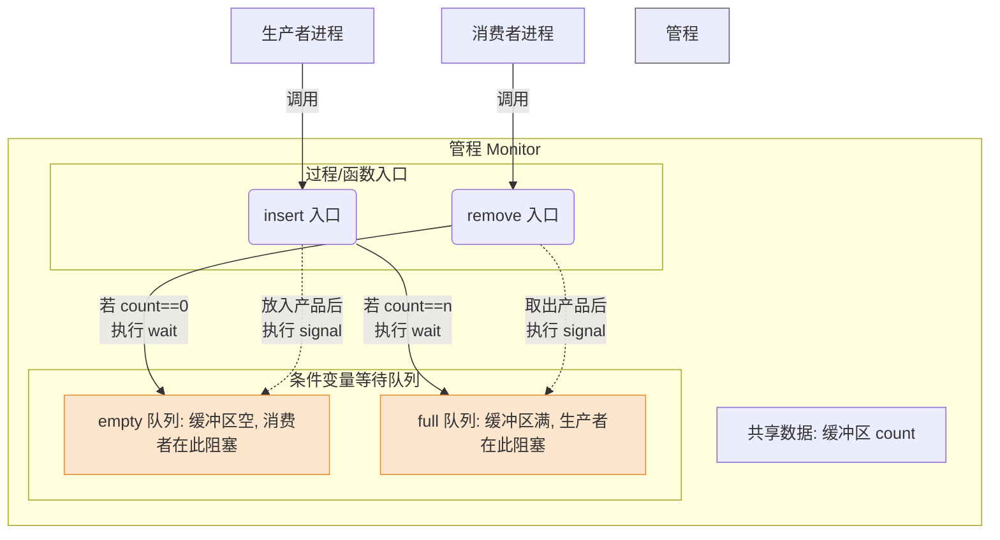

# 操作系统：管程 (Monitor)

> **导语**
> 本节课我们将介绍操作系统中一种高级的同步机制——**管程**。
> 我们将从历史发展的角度了解为什么要引入管程，深入剖析管程的定义与基本特征（选择题高频考点），并通过经典的“生产者-消费者问题”以及 Java 中的 `synchronized` 关键字，帮助大家将抽象的理论具象化。

---

## 一、 为什么要引入管程？

在管程出现之前，人们主要使用**信号量机制 (P/V 操作)** 来实现进程的同步与互斥。

- **信号量的痛点**：
  编写程序极其困难，且非常容易出错。
  例如，在生产者-消费者问题中，如果将“实现互斥的 P 操作”放在了“实现同步的 P 操作”之前，极易导致系统陷入**死锁**。程序员必须在写代码时小心翼翼地关注每一个 P/V 操作的顺序。
- **管程的诞生**：
  为了解放程序员，让并发编程更加轻松、安全，1973 年 Brinch Hansen 首次在 Pascal 语言中引入了管程的概念。
  **管程本质上也是用于实现进程的同步与互斥**，但它是一种**封装好的、更高级的同步机制**。

---

## 二、 管程的定义与组成

管程就像面向对象编程中的一个“类 (Class)”。为了实现进程对共享资源的互斥或同步访问，一个管程通常由以下四个部分组成：

1.  **管程的名字**：标识这个管程。
2.  **局部于管程的共享数据结构**：例如生产者-消费者问题中的“缓冲区”。这些数据被封装在管程内部。
3.  **对该数据结构进行操作的一组过程 (函数)**：例如 `insert()` 和 `remove()` 函数。外界只能通过这些预设的函数来操作管程内部的数据。
4.  **初始化语句**：对管程内部的共享数据设置初始值。

---

## 三、 管程的基本特征 (核心考点必背)

为了利用管程安全地实现互斥与同步，管程被设计为具有以下核心特征（常在选择题中原话出现）：

1.  **数据私有，对外暴露接口**：
    局部于管程的数据，只能被局部于管程的过程（函数）所访问。一个进程**只有通过调用管程内的过程，才能进入管程访问共享数据**。
    _(类比：你不能直接去银行金库拿钱，必须通过银行柜员(管程函数)来帮你存取。)_
2.  **互斥访问 (最核心特征)**：
    **每次仅允许一个进程在管程内执行某个内部过程。**
    即使管程里定义了多个函数，同一时刻也绝对只有一个进程能够进入管程内部执行代码。如果有其他进程试图同时调用管程函数，它们会被暂时阻挡在管程外部排队等待。
    > **⚠️ 重要拓展**：这种互斥特性是**由编译器负责在底层实现的**。程序员在编写管程函数时，完全不需要自己去写复杂的 P/V 加锁解锁逻辑，直接写业务代码即可，编译器会自动保证互斥！

---

## 四、 用管程解决生产者-消费者问题 (机制剖析)

我们用类 C 语言的伪代码（类似 `monitor ... end monitor` 语法）来看看管程是如何大显身手的。

### 1. 互斥的实现

- 生产者进程只需调用管程提供的 `insert(item)` 函数。
- 消费者进程只需调用管程提供的 `remove()` 函数。
- 如果两个生产者同时调用 `insert()`，编译器底层机制会阻挡第二个生产者，让其排队等待第一个执行完毕。**程序员无需操心互斥锁。**

### 2. 同步的实现 (条件变量)

如何在管程中解决“缓冲区满则生产者阻塞，缓冲区空则消费者阻塞”的同步问题呢？
管程引入了**条件变量 (Condition Variables)** 以及配套的 `wait` 和 `signal` 操作。

- **定义条件变量**：如 `condition full, empty;`
- **等待操作 (`wait`)**：
  当消费者发现缓冲区为空时，它会在代码中调用 `empty.wait()`。
  此时，该消费者进程会**主动释放管程的使用权（让出入口）**，并把自己挂到 `empty` 这个条件变量的等待队列中。
- **唤醒操作 (`signal`)**：
  当生产者放入一个产品后，它会调用 `empty.signal()`，将等待在 `empty` 队列头部的消费者唤醒，让其重新获得进入管程执行的资格。



---

## 五、 编程语言中的管程影子：Java 的 `synchronized`

管程并不是停留在理论上的东西，现代编程语言中大量应用了管程的思想。

在 Java 中，如果我们使用 **`synchronized`** 关键字来修饰一个函数（方法）：

```java
class MonitorExample {
    // 加上 synchronized 关键字，这个函数在同一时间段内只能被一个线程执行！
    public synchronized void insert() {
        // 业务逻辑...
    }
}
```

这其实就是管程机制的体现。如果多个线程同时调用 `insert()` 函数，Java 虚拟机会自动让后面来的线程排队等待，完美实现了互斥，彻底隐藏了底层的复杂细节。

---

## 六、 本节核心总结

1.  **引入目的**：解决信号量机制编程麻烦、极易出错（如导致死锁）的问题。
2.  **核心思想**：**封装**。把复杂的互斥、同步细节隐藏在管程内部，对外只暴露简单安全的函数接口。
3.  **必考特征**：
    - 外部进程只能通过管程的“入口”访问共享数据。
    - **每次仅允许一个进程在管程内部执行。**（互斥由**编译器**实现，无需程序员操心）。
4.  **同步机制**：管程内部通过设置**条件变量**及对应的**等待 (`wait`) / 唤醒 (`signal`) 操作**来实现进程的同步。
