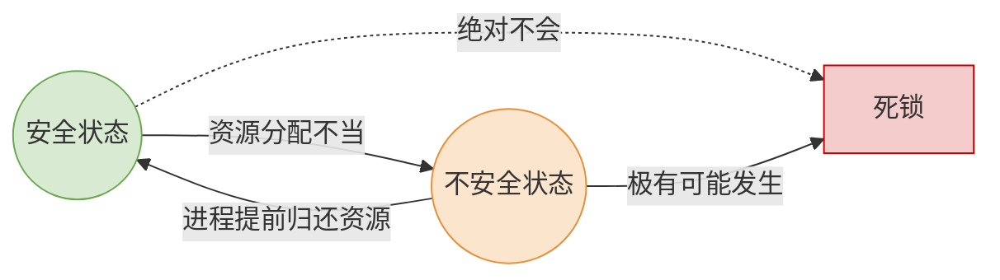
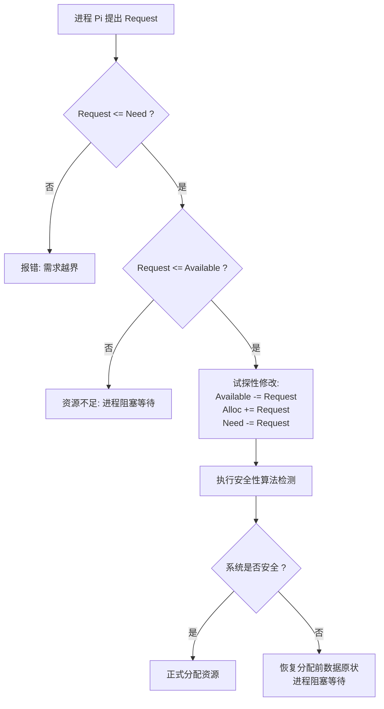

# 操作系统：避免死锁与银行家算法

> **导语**
> 各位同学大家好，本小节我们将深入学习死锁处理的第二种核心策略——**避免死锁**。
> 我们将通过一个生动的“银行家贷款”例子，带大家直观理解什么是**安全序列**和**不安全状态**，并厘清它们与死锁之间的逻辑联系。最后，我们将详细拆解用于避免死锁的最著名算法：**银行家算法（Banker's Algorithm）**。本节内容是大题与选择题的高频考区，非常重要！

---

## 一、 核心概念：安全序列与不安全状态

为了直观理解，我们引入一个生活化的例子：**银行家贷款模型**。
假设你是一位掌握 100 亿资金的银行家，BAT（企业 B、企业 A、企业 T）三家企业找你贷款，并承诺了最大借款额度。江湖规矩：如果最终给企业的钱达不到它承诺的最大需求，之前借出的钱它就无法产生效益，你也收不回来。

### 1. 初始状态分析

假设当前你的资金分配如下（手头总共有 100 亿）：

| 企业       | 最大需求 (Max) | 已借走 (Allocation) | 还能借多少 (Need = Max - Allocation) |
| :--------- | :------------: | :-----------------: | :----------------------------------: |
| **企业 B** |     70 亿      |        20 亿        |                50 亿                 |
| **企业 A** |     40 亿      |        10 亿        |                30 亿                 |
| **企业 T** |     50 亿      |        30 亿        |                20 亿                 |
| **合计**   |       -        |  **已借出 60 亿**   |    **银行家剩余可用资金：40 亿**     |

---

### 2. 借款请求的预判 (不安全与安全)

#### 场景一：企业 B 请求再借 30 亿 —— 【引发不安全状态】

如果你答应了 B：

- 你手里的剩余资金变为：$40 - 30 = 10$ 亿。
- 企业 B 还需要：$50 - 30 = 20$ 亿。
- 此时，B 还需要 20 亿，A 还需要 30 亿，T 还需要 20 亿。
- **结果**：你手里的 10 亿**无法满足任何一家**企业的最终需求，大家都会因为资金链断裂而卡死。这就是**死局**！此时系统进入了**不安全状态**。

#### 场景二：企业 A 请求再借 20 亿 —— 【保持安全状态】

如果你答应了 A：

- 你手里的剩余资金变为：$40 - 20 = 20$ 亿。
- 企业 A 还需要：$30 - 20 = 10$ 亿。
- **破局思路（寻找安全序列）**：
  1.  你手里有 20 亿，刚好可以满足 **企业 T** (只需 20 亿)。你把 20 亿借给 T。
  2.  T 拿到钱后顺利完成项目，连本带利归还了它手里的所有钱 (原本的30亿 + 刚借的20亿 = 50亿)。此时你手里有 **50 亿**。
  3.  手里有了 50 亿，刚好可以满足 **企业 B** (需 50 亿)。借给 B，B 完成后归还，你手里就有 **70 亿**。
  4.  最后把 10 亿借给 **企业 A**，A 完成归还。所有资金全部收回！
- **结果**：只要按照 `T -> B -> A` 或 `T -> A -> B` 的顺序依次满足，大家都能圆满完成。这种能让所有进程顺利完成的推进顺序，就叫 **安全序列**。

---

## 二、 安全状态、不安全状态与死锁的逻辑关系

通过上述例子，我们可以得出以下重要结论（**选择题极易设坑点**）：

1.  **安全状态**：如果系统中**能找到至少一个**安全序列，说明系统处于安全状态。**安全状态下绝对不会发生死锁。**
2.  **不安全状态**：如果系统**找不到任何一个**安全序列，系统进入不安全状态。
3.  **不安全状态 $\neq$ 死锁**：进入不安全状态，只是说明“有可能”发生死锁（比如 BAT 同时发难要钱）。如果企业并没有真的提出最大需求，死锁暂时不会发生。
4.  **死锁必定不安全**：如果系统已经发生了死锁，那它一定处于不安全状态。

---

## 三、 银行家算法 (Banker's Algorithm)

**核心思想**：在资源分配之前，先“试探性”地分配，然后用安全性算法预判本次分配是否会导致系统进入不安全状态。如果安全才真分配，否则让进程阻塞等待。由 Dijkstra 提出。

### 1. 数据结构定义

将单维的“钱”扩展到多维的“系统资源”（如打印机、扫描仪等）。假设有 $n$ 个进程，$m$ 种资源：

- **最大需求矩阵 `Max`** ($n \times m$)：各个进程对各种资源的最大需求。
- **已分配矩阵 `Allocation`** ($n \times m$)：系统已经分配给各个进程的资源数。
- **最多还需矩阵 `Need`** ($n \times m$)：`Need = Max - Allocation`。
- **可用资源向量 `Available`** ($m$)：系统当前剩余的各种资源总数。
- **请求向量 `Request`** ($m$)：某进程当前提出的一组资源申请量。

### 2. 银行家算法核心步骤 (预判与试探)

假设进程 $P_i$ 提出了 `Request_i` 的申请：

1.  **检查请求是否越界**：如果 `Request_i > Need_i`，报错！（你申请的超过了你当初承诺的最大值）。
2.  **检查系统是否够借**：如果 `Request_i > Available`，说明当前系统剩余资源不够，进程 $P_i$ 必须**阻塞等待**。
3.  **试探性分配**：假设同意分配，修改相应数据：
    - `Available = Available - Request_i`
    - `Allocation_i = Allocation_i + Request_i`
    - `Need_i = Need_i - Request_i`
4.  **执行安全性算法**：利用更新后的数据检查系统是否安全。
    - 如果**安全**：正式完成分配！
    - 如果**不安全**：本次分配作废，**恢复数据原状**，让进程 $P_i$ 阻塞等待。

---

## 四、 安全性算法步骤 (寻找安全序列)

安全性算法本质上是一个不断扫描和模拟资源回收的过程：

1.  初始化一个布尔数组 `Finish`，所有进程标为 `false`。
2.  在进程集合中寻找一个满足以下条件的进程：
    - 未结束：`Finish[i] == false`
    - 能满足：`Need_i <= Available`
3.  如果找到了：
    - 将其加入**安全序列**。
    - 假设它能顺利执行完毕并归还资源：更新剩余可用资源 `Available = Available + Allocation_i`。
    - 将其标记为已完成：`Finish[i] = true`。
4.  重复步骤 2 和 3，直到：
    - 所有进程的 `Finish` 都变为 `true` $\rightarrow$ **系统安全**！
    - 找不到满足条件的进程，且还有进程 `Finish == false` $\rightarrow$ **系统不安全**！

> **💡 笔算做题技巧：**
> 在考场上手算时，直接用 `Available` 向量与各个进程的 `Need` 向量对比，谁的 `Need` 能够被满足，谁就可以立刻加入安全序列。把它加入后，直接把它的 `Allocation` 加到 `Available` 上，再去匹配剩下的进程。只要能完整排出一个序列，系统就是安全的。

---

## 五、 总结建议

1.  **切忌死记代码**：银行家算法的核心是“预判+试探”，安全性算法的核心是“模拟执行并回收资源”。请务必先理解逻辑图，再对照代码（或矩阵计算），切忌本末倒置。
2.  **概念辨析必考**：**“不安全状态未必发生死锁，发生死锁一定处于不安全状态”**，这句话在期末考试和考研选择题中几乎是必考点。
3.  **多加练习**：纸上得来终觉浅，一定要找几道给出 $Max$ 和 $Allocation$ 矩阵的真题，亲自手算一遍 $Need$ 并找出安全序列。
