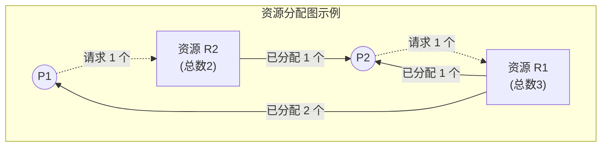

# 操作系统：死锁的检测和解除

> **导语**
> 本节课我们将学习处理死锁的最后一种策略：**死锁的检测和解除**。如果系统既不采取死锁预防，也不采取死锁避免策略，那么死锁就很有可能发生。此时，操作系统需要提供两种机制：一是能够**检测**出系统是否已经发生了死锁；二是当发现死锁后，能够采取强硬手段**解除**它。

---

## 一、 死锁的检测

为了检测死锁，我们需要一种数据结构来保存系统资源的请求和分配信息，并基于此设计一种算法。

### 1. 数据结构：资源分配图

资源分配图是一种有向图，包含两种节点和两种边：

- **两种节点**：
  - **进程节点**：通常用圆圈表示（如 $P_1, P_2$），代表系统中的进程。
  - **资源节点**：通常用矩形表示（如 $R_1, R_2$），代表一类资源。矩形内部的小圆点数量表示该类资源的**总个数**。
- **两种边**：
  - **请求边**：从 **进程节点 $\rightarrow$ 资源节点**。表示进程正在请求分配一个该类资源（此时处于等待状态）。
  - **分配边**：从 **资源节点 $\rightarrow$ 进程节点**。表示该类资源中已经有一个分配给了这个进程。

_(注：上图中 $P_2$ 请求 $R_1$，但 $R_1$ 的 3 个已被全部分配，故 $P_2$ 阻塞；$P_1$ 请求 $R_2$，$R_2$ 还有 1 个空闲，故 $P_1$ 可满足、不阻塞。)_

---

### 2. 死锁检测算法 (化简资源分配图)

死锁检测的核心思想是**尝试消除资源分配图中的所有边**。

**算法步骤（死锁定理）：**

1.  在资源分配图中，找到一个**既不阻塞又不是孤点**的进程节点 $P_i$。
    - **不阻塞**：指该进程申请的资源数量，系统当前**还能满足**（剩余空闲数 $\ge$ 请求数）。
    - **不是孤点**：指至少有一条边与该进程相连。
2.  **消去边**：假设该进程能顺利执行完毕，它会释放手中占有的所有资源。因此，将与 $P_i$ 相连的所有**请求边**和**分配边**全部消除。此时 $P_i$ 变成了一个孤点。
3.  $P_i$ 释放资源后，可能会唤醒其他原本因缺少资源而阻塞的进程，使它们变为“不阻塞”状态。
4.  **重复上述过程**，不断寻找不阻塞的节点并消除其边，直到无边可消。

> **核心结论（死锁定理判断标准）**：
>
> - 如果图能够被**完全简化**（即所有的边都被消除，所有进程都成了孤点），则说明此时系统**没有发生死锁**。
> - 如果图**不可以被完全简化**（最终还剩下一部分进程互相连着边消不掉），则说明系统**发生了死锁**！
> - 最终**还连着边的那些进程，就是处于死锁状态的进程**。（注意：并非系统中所有进程都死锁，能被消掉边的进程是正常的）。

> **一句话速记算法**：**依次消除与不阻塞进程相连的边，直到无边可消。若有残留，即为死锁。**

---

## 二、 死锁的解除

一旦通过检测算法发现系统发生了死锁，就必须立即采取措施解除它。解除死锁的针对对象是**那些在化简后依然连着边的死锁进程**。

### 1. 解除死锁的三种方法

| 方法名称                              | 具体操作                                                                                 | 优缺点说明                                                                                                                           |
| :------------------------------------ | :--------------------------------------------------------------------------------------- | :----------------------------------------------------------------------------------------------------------------------------------- |
| **1. 资源剥夺法**                     | 暂时**挂起**某些死锁进程（移到外存），并强行抢占它的资源，分配给其他死锁进程以打破僵局。 | 需注意恢复机制，且应防止被挂起的进程长期得不到资源而**饥饿**。                                                                       |
| **2. 撤销进程法**   _(终止进程法)_ | 强制撤销部分甚至全部死锁进程，直接剥夺其所有资源。                                       | **优点**：简单粗暴，见效快。 **缺点**：**代价极大**！如果进程已经运算了很久即将结束，直接杀掉会导致功亏一篑，之前的工作全部白费。 |
| **3. 进程回退法**                     | 让一个或多个死锁进程**回退**到足以打破死锁的地步（交出刚拿到的资源）。                   | **缺点**：实现困难，要求操作系统必须能够记录进程的执行历史，并设置“还原点（Checkpoint）”。                                           |

### 2. “牺牲”谁？（剥夺/撤销/回退的选择策略）

面对死锁，必须让部分进程做出牺牲。操作系统通常会综合以下维度来决定“对谁下手”：

1.  **进程优先级**：优先牺牲优先级低的进程。
2.  **已执行时间**：优先牺牲执行时间**较短**的进程（因为它的沉没成本低，重头再来的代价小）。
3.  **还要多久完成**：优先牺牲还需要很长时间才能完成的进程。
4.  **已占用资源量**：优先牺牲已经占用了**很多资源**的进程（打土豪分田地，把它干掉能释放大量资源，迅速解除死锁）。
5.  **交互式 vs 批处理式**：优先牺牲**批处理式**进程。（因为把交互式进程干掉会直接影响用户的屏幕体验，引发用户强烈不满；而批处理后台任务重新算一遍影响不大）。

---

## 三、 本节总结

1.  **死锁检测的核心**：理解并掌握如何通过“资源分配图”找**不阻塞进程**来消除边，最终根据**是否能完全简化**来判断死锁。
2.  **死锁定理的内涵**：类似于安全序列，只要能按某种顺序让所有进程顺利归还资源，就不会死锁。
3.  **死锁解除的策略**：常在选择题中考察“牺牲策略”的合理性。记住核心原则：**力求代价最小，见效最快，且不打扰用户**。
