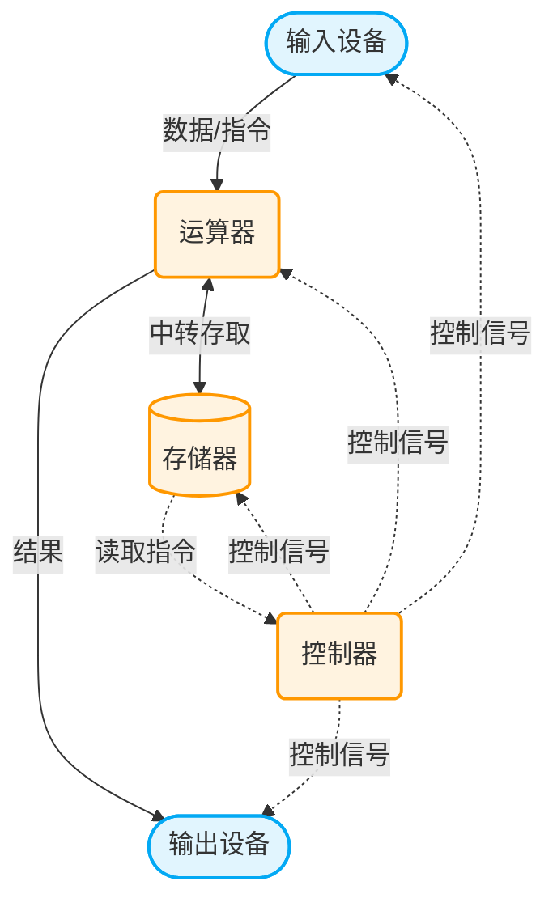
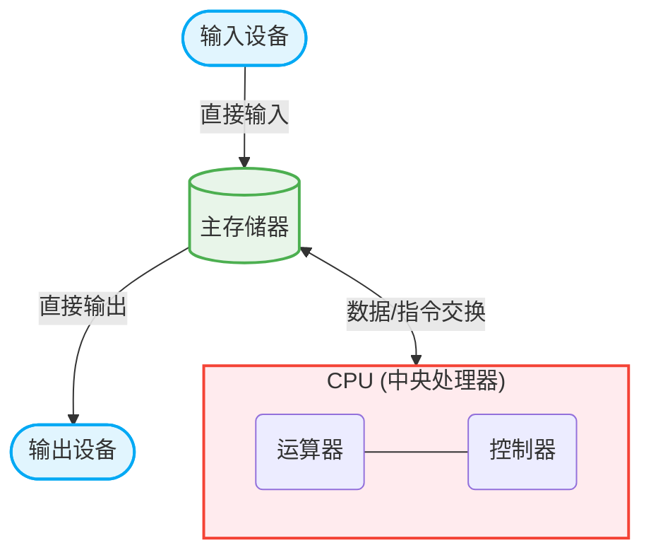
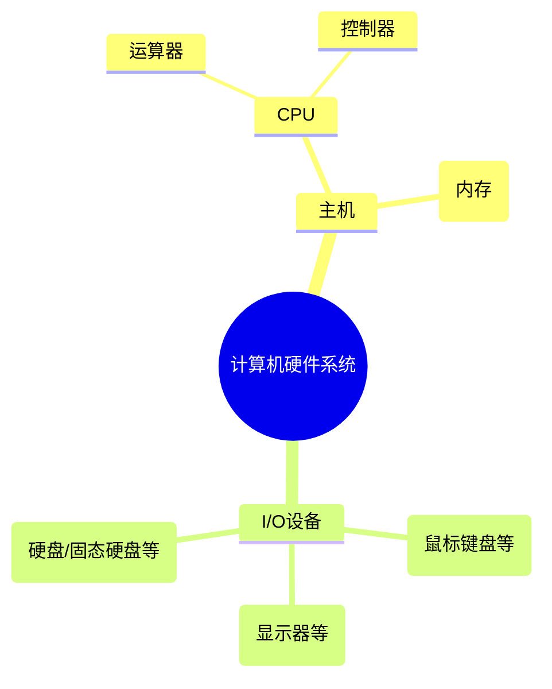

# 1.2.1+1.2.2 计算机硬件的基本组成

## 一、 引言：软硬件关系与现代计算机结构

- **硬件**：计算机的物理基础，决定计算机系统性能的上限。
- **软件**：决定可以将硬件性能发挥到什么程度。
- **现代计算机结构**：是在冯·诺依曼结构基础上的优化。

---

## 二、 冯·诺依曼结构与“存储程序”概念

| 计算机类型      | 执行方式                                     | 特点与缺陷                                                               |
| :-------------- | :------------------------------------------- | :----------------------------------------------------------------------- |
| **早期 ENIAC**  | **手动接线**：每一步指令需人工连接线缆       | **效率低下**：计算极快，但“说一句做一句”，速度优势被手工接线耗时抵消。   |
| **冯·诺依曼机** | **存储程序**：提前将指令存入主存储器（内存） | **自动执行**：计算机根据指令一条条自动运行，“一口气输入，自动执行到底”。 |

> 💡 **核心思想**：“存储程序”是将需要执行的一系列指令以**二进制代码**的方式提前输入到计算机的主存中，这是计算机实现自动化执行的基础。

---

## 三、 计算机的五大基本部件

计算机本质是处理数据的加工厂，主要由以下五大部件配合完成：

1.  **输入设备**：将信息（运算数据和程序指令）转换成机器能识别的**二进制数**输入计算机。
2.  **存储器（主存/内存）**：存放数据和程序指令。
3.  **运算器**：实现**算术运算**（加减乘除）和**逻辑运算**（与、或、非）。
4.  **输出设备**：将运算器处理后的结果，转换成人类能看懂的形式输出。
    - _(注：输入设备和输出设备统称为 **I/O 设备**)_
5.  **控制器**：用电信号协调其他部件工作。负责**解析存储器里的指令**，指挥运算器执行。

---

## 四、 冯·诺依曼计算机的特点（核心考点）

1.  **五大部件组成**：输入设备、输出设备、存储器、运算器、控制器。

2.  **同等地位存储**：指令和数据同等地位存放在存储器中，在存储器中通过**地址**进行访存。
3.  **二进制表示**：指令和数据均为二进制，方便用电信号表示 `0` 和 `1`。
4.  **存储程序**：提前将指令和数据存入存储器。
5.  **指令的组成**：
    - **操作码**：指明进行何种操作（如加减乘除）。
    - **地址码**：指明要操作的数据在内存中的地址。
6.  **以“运算器”为中心**：无论是输入还是输出，数据必须经过运算器中转。会导致大量占用运算器时间，降低计算效率。

👇 **传统冯·诺依曼架构图（以运算器为中心）**

---

## 五、 现代计算机结构的优化

为了解决传统结构“以运算器为中心”导致的效率瓶颈，现代计算机进行了架构优化：

- **以“存储器”为中心**：输入设备直接将数据放入存储器，输出设备直接从存储器取走结果，解放了运算器的时间。
- **CPU 的诞生**：运算器和控制器逻辑关系紧密，随着集成电路发展，两者被集成到同一芯片上，即 **CPU（微处理器）**。

👇 **现代计算机架构图（以存储器为中心）**

---

## 六、 系统组成与核心概念细化

### 1. 系统层级与主机/辅存划分

- **主机**：由 **CPU** 和 **主存储器** 组成。 _(注意：原理中的主机不包含硬盘等外设)_。
- **辅存（I/O设备）**：如机械硬盘。App平时存放在辅存，运行时才会将代码和数据读入**主存**。
- **CPU 工作细节**：控制器解析指令并发出控制信号；主存与CPU直接交换数据（参与运算的变量、需解析的指令）。

### 2. 软硬件逻辑等效性

在计算机系统中，软件和硬件在逻辑上是等效的（同一个功能既可用硬件也可用软件实现）。

| 实现方式     | 优势               | 劣势               | 举例                               |
| :----------- | :----------------- | :----------------- | :--------------------------------- |
| **硬件实现** | 效率高、执行速度快 | 成本高、灵灵活差   | 在运算器中设计专门的“乘法电路”硬件 |
| **软件实现** | 成本低、灵活性高   | 效率较低、耗时更长 | 用软件编写多条“加法指令”来模拟乘法 |

> **总结**：计算机本质上就是一个**数据的加工厂**——数据输入到计算机当中，经过各部件协同处理完之后，再输出给人类。
