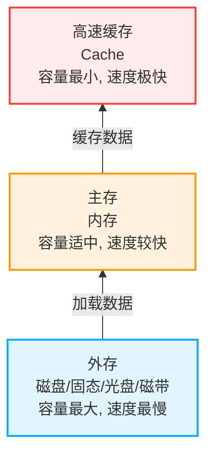
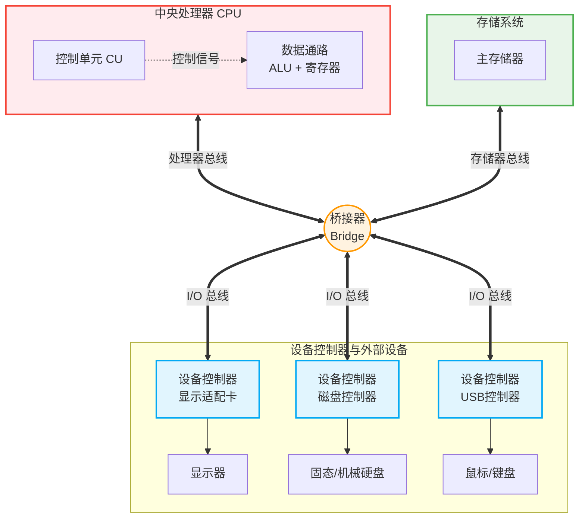

# 1.2.2 计算机硬件的基本组成（现代工程化视角）

## 一、 经典冯·诺依曼结构 vs 现代工程化结构

在早期的理论体系中，冯·诺依曼结构将计算机硬件分为**五大部件**（运算器、控制器、存储器、输入设备、输出设备）。随着技术的发展，四零八考试及现代教材更倾向于使用**现代工程化**的视角来拆解计算机硬件。

这两种理论体系并不冲突，只是现代视角更强调**部件内部的层级划分**与**部件之间的互联互通**。

### 1. 结构划分对比

| 组成模块          | 经典冯·诺依曼结构     | 现代工程化结构（重点）           | 差异说明                                                                             |
| :---------------- | :-------------------- | :------------------------------- | :----------------------------------------------------------------------------------- |
| **核心处理(CPU)** | **运算器 + 控制器**   | **数据通路 + 控制单元**          | 现代结构将运算器、寄存器及内部连线统称为“数据通路”；“控制器”与“控制单元”为同义替换。 |
| **存储系统**      | **存储器** (特指主存) | **分层存储** (Cache、主存、外存) | 现代存储器发展出多级存储结构，以平衡速度与容量。                                     |
| **外部设备**      | **输入/输出设备**     | **设备 + 设备控制器**            | 现代结构不仅关注设备本身(机械部分)，更强调连接主机的“设备控制器(电子部分)”。         |
| **互联机制**      | _(未单独强调)_        | **总线 (Bus)**                   | 现代结构引入了“总线”概念，作为连接各部件的数据通路。                                 |

---

- 运算器=ALU（核心）+ 各类寄存器
- 控制器(负责指挥其他部件工作 整个计算机的核心大脑)
  > （指挥运算器,存储器的读写输入输出设备的启动停止等）
- 存储器主要指主存

## 二、 现代计算机硬件的四大核心部分

### 1. CPU (中央处理器)

CPU 的核心作用是负责执行指令，现代视角下它由以下两个大部分组成：

1.  **控制单元 (控制器 / CU)**
    - **功能**：负责**指令译码**。分析一条指令的具体功能（如加减乘除），以及确定运算数据所在的内存位置。
    - **控制信号**：分析完毕后，产生相应的控制信号去指挥其他硬件（如控制主存的读写）完成指令功能。
2.  **数据通路**
    - **组成**：算术逻辑单元 (ALU) + 各类寄存器 + 内部连线 (CPU内部总线)。
    - **功能**：
      - **ALU**：负责实现算术运算和逻辑运算。
      - **寄存器**：暂存操作数及运算结果。
      - **内部连线**：实现数据在 ALU 与寄存器之间的流通配合。

### 2. 存储器 (多级分层结构)

现代计算机的存储器系统呈现出明显的多级分层特征，主要分为**内存**和**外存**。

- **内存 (主存储器)**：
  - 包含**主存**和**高速缓存 (Cache)**。
  - **Cache**：集成在 CPU 内部，离 CPU 最近，读写速度最快。用于存放近期频繁使用的数据（如正在打的游戏中本局使用的十个英雄建模）。_（类比：裤子口袋，放手机等急需品）_
  - **主存**：CPU 可以直接读写主存里的数据。日常生活中买电脑常说的“内存 16G”，其实指的就是主存容量。_（类比：出门背的书包）_
- **外存 (辅助存储器)**：
  - 包括直接插在主板上的磁盘、固态硬盘(SSD)，以及独立存储海量数据的光盘、磁带等。
  - **特点**：容量大，速度慢。**CPU 不能直接读写外存数据**。启动游戏时的“进度条加载”，就是把外存的数据读入主存的过程。_（类比：家里的卧室，容量大但拿取慢）_

### 3. 外部设备与设备控制器

一个完整的外部设备（I/O 设备）通常由**机械部分**和**电子部分**两部分组成：

1.  **外部设备 (机械部分)**：看得见摸得着的实体。
    - **输入设备**：如鼠标、键盘。
    - **输出设备**：如显示器。
    - **输入/输出设备**：如硬盘（既可读出也可写入）。
2.  **设备控制器 (电子部分)**：
    - 又称 **I/O 控制器** 或 **接口**。它是插口背后集成的小芯片，负责控制外设并与主机进行信息传输与交换。
    - **典型例子**：
      - USB 控制器（插鼠标/键盘的背后）。
      - 显示适配卡（连接显示器的芯片）。
      - 磁盘控制器（SATA / M.2 接口背后的芯片）。
      - 网络适配器（网卡）。
      - 蓝牙控制器（控制蓝牙信号收发）。

### 4. 总线 (Bus)

总线是计算机各大部件之间**传输信息的介质**（数据公路）。

- **内部总线**：在 CPU 内部，连接 ALU 和各类寄存器的连线（数据通路的一部分）。
- **系统总线 / 外部总线**：连接 CPU、主存和各类 I/O 设备的连线。
  - 在典型的多总线结构中，会有**处理器总线**、**存储器总线**和 **I/O 总线**。
  - 这些总线通常通过**桥接器 (Bridge)** 连接在一起。桥接器就像是连接几条城际公路的“环岛”，让数据在各大部件之间自由互联互通。

---

## 三、 现代计算机多总线硬件架构图

以下图表展示了现代工程化视角下的计算机硬件协同工作方式：

> **总结与学习提示：**
> 本节课旨在建立现代计算机组成的**粗略框架认知**。将系统拆分为**CPU（控制+数据通路）、存储（多级）、设备与接口、总线**四个维度。各部件的具体原理（如数据的计算、存储器的访问原理、总线仲裁、I/O 机制等）将在后续章节深入展开。日常语境中所说的“内存”默认指代主存。
