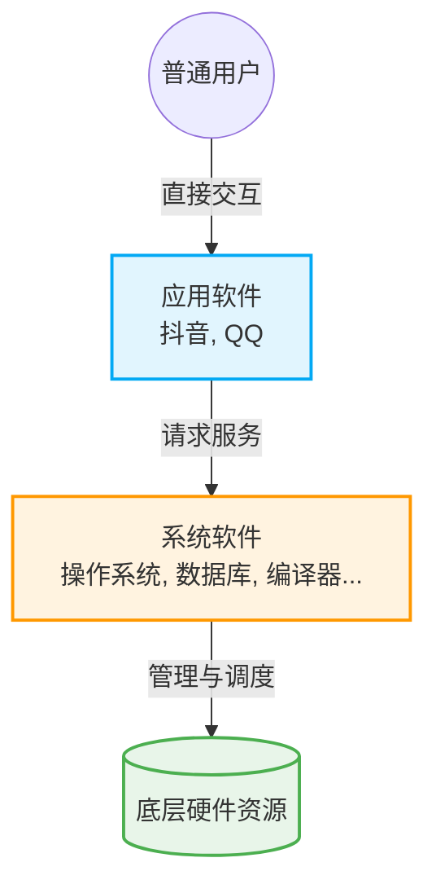

# 1.3 计算机系统的软件体系与软硬关系

## 一、 软件的分类与层次关系

一个完整的计算机系统由**硬件**和**软件**组成。用户主要通过使用软件来满足特定需求，而这些软件最终运行在底层的硬件之上。

计算机软件进一步可以划分为两大类：**系统软件**和**应用软件**。

### 1. 软件层次与功能区分

| 软件类型     | 核心功能                                                                             | 典型代表                                                               | 特点                 |
| :----------- | :----------------------------------------------------------------------------------- | :--------------------------------------------------------------------- | :------------------- |
| **应用软件** | 直接为用户提供服务，解决用户的特定需求。                                             | 抖音、QQ                                                               | 直接面向最终用户。   |
| **系统软件** | 负责管理底层硬件资源，并**向上层应用软件提供服务与支持**（类似于软件世界的“基建”）。 | 操作系统、数据库管理系统、网络驱动、语言处理程序、服务程序、标准程序库 | 面向硬件和上层软件。 |

> 💡 **系统软件如何为应用软件提供服务？**
>
> - **操作系统**：抖音和 QQ 运行时，必须得到安卓/iOS等操作系统的底层支持。
> - **数据库管理系统**：为应用软件开发中需要存储和查询数据的功能提供支持。
> - **网络软件**：如网卡驱动器，为应用软件通过网络传递信息提供基础网络功能。
> - **语言处理程序/服务程序**：应用软件开发离不开语言处理程序（如编译器）；开发中的调试离不开服务程序（如调试程序）；代码编写离不开**标准程序库**（如 C 语言的 `printf`）。

### 2. 软硬件系统层次结构图

---

## 二、 编程语言与翻译程序

计算机硬件只能识别由 0 和 1 组成的**二进制机器语言**。但程序员使用高级语言（如 C, Python）编写程序，因此需要借助**翻译程序**将高级语言转换为低级的机器语言。

### 1. 语言层级分类

- **低级语言**：机器语言（纯二进制）、汇编语言（采用助记符，比机器语言方便人类理解）。
- **高级语言**：如 C语言、Java、Python、JavaScript 等，接近自然语言。

### 2. 翻译程序的分类及工作流程

为了把高级语言翻译成低级的机器可以识别的语言，通常需要**编译器**、**汇编器**或**解释器**的帮助，这三者统称为**翻译程序**。

#### A. 编译执行流程（如 C 语言）

通常需要经过两步翻译过程（有的编程语言的编译器可以直接将高级语言翻译为机器语言，跳过汇编阶段）：

1.  **编译阶段**：**编译器（编译程序）**将高级语言源程序翻译成等价的**汇编语言**。
2.  **汇编阶段**：**汇编器（汇编程序）**将汇编语言翻译成等价的**机器语言程序**。

#### B. 解释执行流程（如 JavaScript, Python, Shell脚本）

不需要预先翻译成完整文件，而是通过**解释器（解释程序）**在程序运行时进行翻译。

### 3. 编译程序 vs 解释程序的区别（核心考点）

虽然解释程序和编译程序都是把高级语言翻译成机器语言，但两者的执行逻辑截然不同：

| 翻译程序类型               | 工作原理                                                                                    | 优缺点                                                                           |
| :------------------------- | :------------------------------------------------------------------------------------------ | :------------------------------------------------------------------------------- |
| **编译程序 (Compiler)**    | **一次性全部翻译**：将源程序全部翻译成机器语言程序（如 `.exe` 文件），然后再交由 CPU 执行。 | 翻译一次即可多次运行，**执行效率高**。                                           |
| **解释程序 (Interpreter)** | **逐句翻译执行**：程序执行时，每读取一句代码就翻译一句，翻译完立刻执行对应的机器语言指令。  | 方便跨平台和调试，但若某语句被多次执行，则需要被**多次重复翻译，导致效率降低**。 |

---

## 三、 软硬件的等效性与 ISA 界面

软件（程序）本质上是由若干条指令序列组成的，CPU 负责执行这些指令，完成功能目标。

### 1. 软硬件在逻辑功能上的等效性

同一个逻辑功能，**既可以用硬件来实现，也可以用软件来实现**，在逻辑上是等价的。

- **案例：计算 `985 * 6`**
  - **硬件实现路线**：如果 CPU 硬件设计了乘法电路，支持乘法指令，则可以直接使用一条“乘法指令”算出结果。（**特点**：制造成本高、电路复杂，但运算速度极快性能高）。
  - **软件实现路线**：假设 CPU 没有乘法电路，只支持加法指令。程序员可以编写软件程序，执行 6 条“加法指令”（985相加6次）来模拟乘法操作。（**特点**：无需复杂硬件，制造成本低，但运算耗时较长性能较低）。

### 2. 软硬件的界限：指令集体系结构 (ISA)

既然功能既可以由硬件也可以由软件实现，那么计算机系统到底需要多少种硬件电路？需要支持多少种基础指令？

- **指令集体系结构 (ISA, Instruction Set Architecture)**：
  - ISA 规定了**软件和硬件之间的界面**（界限）。
  - 在设计计算机系统时，设计 ISA 就是要定义这台计算机**可以支持哪些具体的指令**，以及每条指令的**作用和用法**。
  - 通过清晰地定义 ISA，就明确了哪些功能由底层硬件电路直接完成，哪些复杂功能由上层软件通过组合基础指令来完成。
