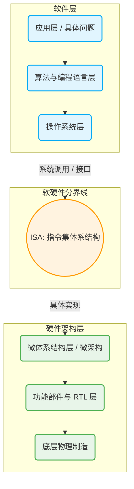

# 1.2.4 计算机系统的层次结构

计算机系统由多个层次构成，从上至下依次为应用层、编程语言层、操作系统层、指令集体系结构层（ISA）、微体系结构层以及功能部件与 RTL 层。在计算机组成原理课程中，重点关注的是**软硬件的分界线（ISA）**以及其下方的**硬件架构层**。

## 一、 计算机系统层次结构总览

👇 **计算机系统层次结构示意图**

---

## 二、 软件层：从应用到操作系统

### 1. 应用层与编程语言层

- **应用层**：用户使用自然语言提出具体需求或要解决的问题（如开发聊天软件或计算器）。
- **算法设计**：程序员通过设计算法来描述解决问题的具体步骤。
- **高级编程语言**：程序员使用 C、C++、Java、Python 等高级语言实现算法。
  - 高级语言可读性强，接近自然语言。
  - **硬件无关性**：高级语言代码与底层硬件架构无关，同一份代码（如 Hello World）既可以在 ARM 架构运行，也可以在 x86 架构运行。

### 2. 翻译程序（高级语言的底层转换）

计算机 CPU 只能直接执行由 `0` 和 `1` 组成的机器指令（机器语言）。高级语言需要通过“翻译程序”进行转换：

- **编译程序（编译器）**：将高级语言翻译为等价的汇编语言（汇编语言使用人类更易读的助记符，与机器指令一一对应）。某些编译器也可以直接将高级语言翻译为二进制机器语言。
- **汇编程序（汇编器）**：将汇编语言进一步翻译为等价的机器语言。
- **解释程序（解释器）**：对于 JavaScript 等脚本语言，由解释器直接将高级语言翻译为等价的机器语言并运行。
- _注：汇编语言和机器语言都直接与具体的 CPU 硬件架构相关，因此被称为“低级语言”或“机器级语言”。_

### 3. 操作系统层

- **核心功能**：操作系统隐藏了底层硬件的复杂细节，向上层程序员和用户提供方便易用的功能接口（如系统调用、图形化用户界面）。
- **作用**：对上层而言，操作系统相当于把底层硬件做了一层抽象封装，提供了一台功能完备、好用的“虚拟机器”。

---

## 三、 软硬件分界线：ISA 层

**ISA（Instruction Set Architecture，指令集体系结构）**是计算机系统软件和硬件的分界线。

- **定义功能**：ISA 层用指令的视角向软件层定义了硬件系统可以提供哪些功能。
- **核心规范**：规定了系统支持的指令集合、各指令的格式与操作类型、寻址方式、可访问的寄存器，以及 I/O 的编址方式（统一编址或独立编址）等。
- _示例_：规定系统需要支持加、减、乘、除、取数、存数等具体指令及其格式规范。

---

## 四、 硬件架构层：具体实现（核心考点）

ISA 层规定了“要做什么”，而其下方的硬件层则负责解决“如何实现这些功能”。

### 1. 微体系结构层（微架构）

- **核心功能**：描述处理器内部的硬件组织方式，以实现 ISA 层定义的各项功能。
- **设计范畴**：包括数据通路与控制单元的设计、流水线级数、缓存层次结构、分支预测机制等。
- **真题案例解析（以设计加减乘除指令为例）**：
  - **部件选择**：为了实现运算功能，微架构层需要决定是选用一个全功能的 ALU（算术逻辑单元），还是仅仅选用一个基础的加法器（如果 ISA 仅要求支持加法）。
  - **连线与组织**：设计单总线结构(每次只能传递一个数据)，配置暂存寄存器（Y, Z）以保证 ALU 双端数据输入顺利；配置通用寄存器组；使用系统总线连接 CPU 与主存储器(支持从内存里面取数存数指令的功能)。这些逻辑连接关系都在此层设计。

### 2. 功能部件与 RTL 层

在微架构设计的逻辑图基础上，进一步细化底层的物理设计。

- **功能部件设计**：明确各个硬件部件的内部实现和引脚连接方案。例如，ALU 芯片具体需要几个引脚，各引脚的具体功能是什么；译码器与多路选择器之间如何具体连线。
- **RTL（寄存器传输级）**：核心关注在**每一个时钟周期内**，数据从哪里来，经过什么通路，最终写入哪个寄存器。
  - _示例_：当控制信号 `PC_out` 和 `MAR_in` 有效时，数据在一个时钟周期内从 PC 寄存器经内部总线流入 MAR 寄存器。

---

## 五、 现实企业分工与架构生态案例

### 1. 科技企业在计算机层次中的分工

| 企业名称             | 主要业务聚焦层次            | 说明                                                                             |
| :------------------- | :-------------------------- | :------------------------------------------------------------------------------- |
| **微软 (Microsoft)** | **软件层** (应用、语言、OS) | 开发 Windows 操作系统、VS 编程 IDE 以及 Word/PPT 等应用软件。                    |
| **ARM**              | **ISA 与硬件架构层**        | 专门设计 ARM 指令集 (ISA)、微体系结构及 RTL 功能部件方案，但**不负责芯片制造**。 |
| **台积电 (TSMC)**    | **底层制造层**              | 专门负责根据芯片设计方案进行芯片的物理代工制造。                                 |
| **英特尔 (Intel)**   | **全硬件链路** (ISA 到制造) | 设计 x86 指令集、完成芯片架构设计，并且自己负责芯片制造落地。                    |

### 2. 案例分析：苹果公司 PC 芯片架构转换 (2020)

- **历史背景**：2020 年前，苹果 Mac 电脑使用基于 **x86 ISA** 的英特尔处理器。
- **架构转换**：2020 年，苹果推出 M 系列芯片，转向使用 **ARM ISA**（由 ARM 授权指令集，苹果自研微架构与 RTL 层，台积电代工制造）。
- **软件兼容挑战与解决**：
  - _挑战_：旧有的 x86 软件（如微软 PPT、PS）指令格式与 ARM 不兼容，无法直接运行。
  - _方案_：苹果开发了 **Rosetta**，这是一个动态二进制翻译器，在用户首次打开 x86 软件时，将 x86 指令集自动转换为 ARM 指令集，实现了无缝切换（代价是消耗少许性能）。
- **生态与成本优势**：
  - **生态大一统**：由于 iPhone/iPad 的 A 系列芯片也是基于 ARM ISA，底层指令集统一后，iOS 软件（如小红书）可以直接在搭载 M 芯片的 Mac 电脑上原生运行。
  - **降本增效 (2026年预测案例)**：得益于 ISA 层的统一，2026 年苹果推出了价格更亲民的 "MacBook new"，直接复用了手机端的 A 系列芯片（如 A18 Pro）。由于 A 系列芯片制造成本远低于 M 系列，从而大幅降低了电脑的起售价，凸显了统一架构的战略价值。
