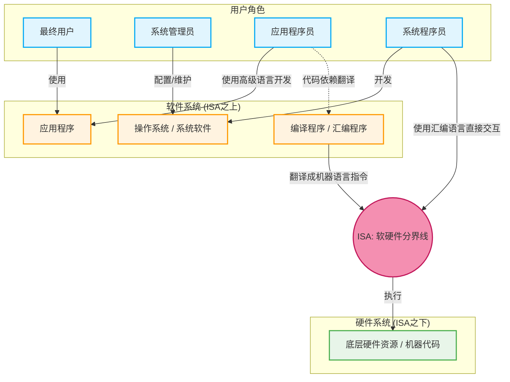

# 1.2.5 计算机系统的不同用户

计算机系统的用户根据其交互层级和任务目标可分为四种角色。ISA（指令集体系结构）作为软硬件的分界线，在不同角色的工作视野中具有截然不同的存在感。

## 一、 计算机系统的四类用户角色

在日常使用和开发中，同一个人在做不同事情时，其扮演的角色也会发生转换（例如：写代码时是程序员，装手机软件时是管理员）。

| 用户角色       | 核心职责与交互对象                       | 使用的编程语言                      | 典型日常场景                             |
| :------------- | :--------------------------------------- | :---------------------------------- | :--------------------------------------- |
| **最终用户**   | 使用应用程序完成特定任务。               | 无                                  | 玩游戏、做PPT、写文档、刷手机。          |
| **系统管理员** | 负责配置、维护和升级操作系统。           | 无                                  | 安装软件、配置用户账号、系统备份与升级。 |
| **应用程序员** | 开发面向最终用户的应用软件。             | **仅高级语言** (如 C++, Python, C#) | 开发微信应用、交友软件、手机游戏等。     |
| **系统程序员** | 开发底层系统软件 (如 OS、编译器、DBMS)。 | **高级语言 + 汇编语言**             | 开发 Linux 内核模块、编写硬件驱动程序。  |

👇 **不同用户与计算机系统的交互层次结构图**

---

## 二、 核心概念：ISA 与“透明性”

### 1. 软硬件的分界线：ISA (指令集体系结构)

- **界限定义**：ISA 之上属于软件部分，ISA 之下属于硬件部分。
- **不同 ISA 的差异**：不同的底层架构（如 x86、ARM）拥有完全不同的 ISA，它们规定的汇编语言格式、功能、可访问的 CPU 寄存器等均不相同（即 x86 汇编与 ARM 汇编是两套独立的东西）。

### 2. 谁需要关注 ISA 层？

- **系统程序员（必须关心）**：在开发系统软件（如操作系统内核）时，为了与硬件交互，难免需要编写对应的汇编语言指令。因此必须清楚 ISA 层的特性和规定（如哪些 CPU 寄存器可被访问）。
- **应用程序员（无需关心）**：只使用高级语言编写代码（如写一句 `hello world`），由底层的编译程序和汇编程序去负责完成转换。因此无需关心代码最终运行在何种 ISA 架构之上。

### 3. 计算机世界中的“透明” (Transparency)

- **概念辨析**：在计算机专业术语中，“透明”指的是**“看不见它，感受不到它的存在”**（就像日常生活中的空气一样，虽然存在但感知不到）。
- **典型场景应用**：对于**高级语言应用程序员**来说，ISA 层以及更下层的硬件结构特性（例如：是单核还是双核 CPU、主存容量多大、底层是 x86 还是 ARM 架构）都是**透明**的。上层用户只管调用高级接口编程，无需也无法感知底层硬件的具体实现细节。
