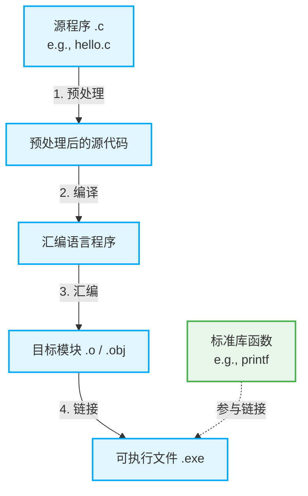
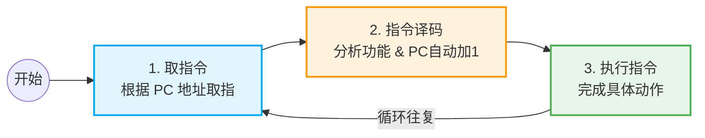

# 1.2.6 计算机系统的基本工作原理

## 一、 从源程序到可执行文件的转化过程（重点考点）

我们用高级语言编写的代码（源程序）需要经过四个关键步骤，才能转变为计算机可以识别运行的二进制可执行文件（如 `.exe`）。

👇 **程序编译转换流程图**

### 核心处理环节说明

| 处理环节      | 工具名称     | 核心作用描述                                                                                                         |
| :------------ | :----------- | :------------------------------------------------------------------------------------------------------------------- |
| **1. 预处理** | **预处理器** | 处理代码中以 `#` 开头的命令（如宏定义 `#define PI 3.14`）。将代码中的宏常量恢复替换为具体的数值，为后续翻译做准备。  |
| **2. 编 译**  | **编译器**   | 将预处理后的高级语言源程序翻译成与之等价的**汇编语言程序**。                                                         |
| **3. 汇 编**  | **汇编器**   | 将汇编语言程序翻译成由 `0` 和 `1` 组成的**机器语言指令**，生成的文件称为**目标模块**（通常以 `.o` 或 `.obj` 结尾）。 |
| **4. 链 接**  | **链接器**   | 将多个目标模块以及调用的**标准库函数**（如 `printf` 库）组装拼接在一起，生成最终统一的**可执行文件**。               |

---

## 二、 程序的加载与基本结构

1.  **存储与加载**：可执行文件平时存放在外存（硬盘，属 I/O 设备）中。需要运行时，必须先从外存调入**主存（内存）**，随后 CPU 才能读取运行。
2.  **交互方式**：运行期间可通过输入设备（鼠标/键盘）交互，通过输出设备（显示器）查看结果。
3.  **程序的基本结构**：一段装入内存的程序，本质上是由一系列的**指令**和一系列的**数据**组成的。
    - _示例_：计算 `y = a * b + c`，变量 `a, b, c, y` 存放在内存的**数据区**（如地址 5, 6, 7, 8），而执行取数、乘法、加法的代码以二进制形式存放在内存的**指令区**（如地址 0-4）。

---

## 三、 CPU 指令执行的完整生命周期

CPU 执行指令的核心依赖于一个极其重要的寄存器：**PC（程序计数器，Program Counter）**。

- **PC 的作用**：始终指向**下一条应该执行的指令地址**。程序刚开始时，通常指向程序的第一条指令（如主存地址 `0`）。

CPU 的工作过程就是不断重复以下三个步骤：

1.  **取指令**：根据 **PC** 所指的地址，从主存中取出即将执行的指令。
2.  **指令译码**：分析这条指令的操作码（要做什么运算，如“取数”）和地址码（运算对象在哪，如“内存地址5”）。**此时，PC 的值会自动加 1，指向下一条指令。**
3.  **执行指令**：CPU 根据译码结果，执行指令要求的动作（如把变量 `a` 从内存取出，放入累加寄存器 ACC 中），并保存运行结果。

---

## 四、 顺序执行与跳转执行

- **顺序执行**：正常情况下，代码逻辑是一句接一句的，CPU 也是按地址顺序一条条往下执行（PC 每次加 1）。
- **跳转执行**：当代码遇到条件分支（如 `if (a > b)`）或循环时，指令的执行逻辑会发生跳转。
  - _原理_：此时执行的是“跳转指令”，如果满足跳转条件，CPU 会直接修改 PC 的值，使得下一条指令不再是紧挨着的下一句，而是跳到了内存的其他地址。

---

## 五、 通俗类比：指挥室友干活模型

为了更好地理解上述枯燥的执行过程，可以将计算机组件类比为“指挥室友干活”的场景：

| 计算机术语           | 生活场景类比       | 对应功能解析                                                                                |
| :------------------- | :----------------- | :------------------------------------------------------------------------------------------ |
| **CPU (处理器)**     | **干活的室友**     | 专门负责按照指令完成所有的动作与计算。                                                      |
| **主存 (内存)**      | **揣兜里的信签纸** | 上半部分写着 5 条指令，下半部分写着原始数据。室友把纸放进裤兜，相当于程序被加载到主存中。   |
| **PC (程序计数器)**  | **室友的小手指**   | 手指永远指着接下来要读的那一行字。读完一行，手指自动下移一行（PC+1）。                      |
| **ACC (累加寄存器)** | **室友的小脑瓜**   | 从信签纸（内存）上取出的数据和计算得到的结果，暂存在脑子里。                                |
| **指令格式**         | **主谓宾结构句式** | 主语=室友(省略); 谓语=操作码(取数/相加); 宾语=地址码(信签纸第5行)。                         |
| **跳转指令**         | **条件判断语句**   | 第2行写着：“如果结果大于1000，请直接去看第4行”。这就引发了小手指（PC）的跳转，跳过了第3行。 |
| **停机指令 (Halt)**  | **“去睡觉”**       | 执行完这条指令，整个程序/干活流程结束。                                                     |

> **复习提示**：
> 对于初学者，面对复杂的二进制机器码无需感到头疼。本节重点在于宏观理解。应试层面，请务必牢记**“预处理 -> 编译 -> 汇编 -> 链接”**四大环节的作用，这在选择题中属于高频考点。
