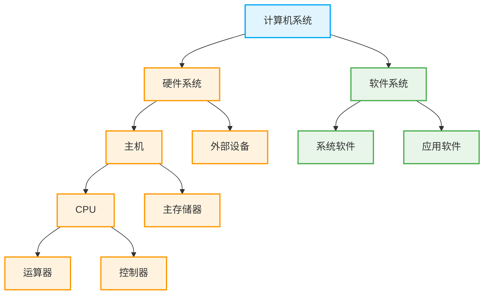

# 计算机系统基础与指令集体系结构 (ISA)

## 一、 计算机系统的基本组成

计算机系统在宏观上有着清晰的层级与包含关系：

- **主机** = CPU（运算器 + 控制器） + 主存储器
- **硬件系统** = 主机 + 外部设备
- **软件系统** = 系统软件 + 应用软件

👇 **计算机系统组成结构图**

---

## 二、 冯·诺依曼计算机特点与工作机制

- **两大核心特点**：**存储程序** + **程序控制**。
  - **程序控制**：是由程序的功能，通过中央处理器（CPU）执行指令来实现。
- **控制流计算机**：冯·诺依曼架构属于控制流计算机，它是通过**执行指令**来驱动程序运行的，而不是通过处理相关数据来驱动程序。
- **指令与数据的区分**：计算机是通过**控制器**来区分指令和数据的。
  - _原理_：因为是由控制器发出信号，让 CPU 去内存中取指令和数据。取出来的数据到底是被作为指令处理，还是作为运算数据处理，这完全是由控制器所处的执行周期和发出的控制信号决定的。

---

## 三、 编程语言的翻译与硬件关联

- **编译程序（编译器）**：将高级语言程序翻译成汇编语言，或者机器语言程序。
  - _注意_：编译器具备直接将高级语言翻译成机器语言程序的能力。
- **汇编与硬件架构的依赖关系**：把高级语言翻译成汇编语言时，必须考虑**机器结构**（例如 x86 架构）。
  - _原因_：在翻译成汇编语言的过程中，会使用到 CPU 内部的寄存器。所谓的“机器结构”，就决定了 CPU 内部寄存器是如何组织的、通用寄存器是如何编号的。
- **指令的映射关系**：汇编指令和机器指令是**一一对应**的。任何一条汇编指令都能转换成唯一的机器指令，反之任何机器指令也能找到对应且功能完全相同的汇编指令。

---

## 四、 指令集体系结构 (ISA) 与指令细节

### 1. 什么是 ISA (Instruction Set Architecture)？

- **抽象界限**：ISA **不涉及硬件实现细节**，而是完整定义了软件可直接使用的硬件功能。
- **功能定义**：它不仅定义了指令的具体功能，还定义了各种各样的指令规范协议。
- **软件可见性**：因此，ISA 构成了软件所能感知到的计算机功能视图，也被称为计算机的**软件可见部分**。
- **指令归属**：ISA 中的“机器指令”，就是在这个 ISA 标准协议下所明文规定的机器指令。

### 2. 指令与寻址方式

- **寻址方式**：一条指令包含不同的寻址方式（也叫做操作数的寻址方式）。
- **数据获取**：很多指令在处理数据时，其数据并不是在指令内部直接给出的（非立即数），而是在指令执行的过程中，通过寻址方式**额外从主存储器（内存）中去取到**的。
