# 1.2.7 计算机的性能指标 (408高频考点)

> 💡 **学习提示**：本节内容是统考的高频考点，不仅会在选择题中出现，也常作为大题的某一小问进行计算考查。请务必高度集中注意力！

## 一、 评价计算机的整体性能指标

### 1. 吞吐量 (Throughput)
*   **定义**：指计算机在**单位时间内所能完成的工作量**。
*   **示例**：以 1 分钟为单位时间，计算机 M1 一分钟能执行完 5 道程序，而 M2 能执行 10 道程序。则 M2 多完成了一倍的工作，M2 的吞吐量是 M1 的两倍。

### 2. 响应时间 (Response Time)
*   **定义**：从**作业 (Job) 提交**到**作业完成**所用的总时间。
*   **组成**：响应时间可严格拆分为**用户 CPU 时间**和**其他时间（等待时间）**。

👇 **响应时间构成拆解示例 (总计 10秒)**

```mermaid
gantt
    title 某程序在系统中的生命周期
    dateFormat  X
    axisFormat %s
    
    section 宏观响应
    总响应时间 (10秒) : 0, 10
    
    section 微观执行状态
    等待 I/O 或被其他程序占用 : wait1, 0, 5
    用户 CPU 时间 (真正在CPU运行) : active1, 5, 7
    等待 I/O 或被其他程序占用 : wait2, 7, 9
    用户 CPU 时间 (真正在CPU运行) : active2, 9, 10
```

*   **案例解析**：如上图，0秒提交，10秒完成，总**响应时间为 10 秒**。在并发环境下，程序并非一直占用 CPU。真正在 CPU 上运行的时间为第 5-7 秒（2秒）和第 9-10 秒（1秒）。因此：
    *   **用户 CPU 时间**（即 CPU 执行时间） = 2 + 1 = **3 秒**。
    *   **其他时间** = **7 秒**。

---

## 二、 评价 CPU 性能的核心指标

### 1. 时钟周期与主频
CPU 需要发出数字脉冲信号（节拍）来指挥所有部件统一步调工作（类似于做广播体操的节拍指令）。
*   **时钟周期**：CPU 节奏信号的一个周期的时间长度。由于极快，单位通常为微秒 (μs)、纳秒 (ns)。
*   **主频 (CPU 时钟频率)**：每秒钟会发生多少次脉冲信号。单位是赫兹 (Hz)。买电脑时常说的 "2.9 GHz" 指的就是主频。
*   **二者关系**：互为倒数。**主频 = 1 / 时钟周期**。

### 2. CPI (Cycles Per Instruction)
*   **定义**：执行**每一条指令平均需要消耗的时钟周期数**。
*   **说明**：不同类型的指令复杂度不同，所需的时钟周期也不同（如乘法 CPI 通常大于加法 CPI）。
*   **平均 CPI 计算**：根据各类指令在程序中出现的概率求加权平均值。
    *   *示例*：某程序中加法 (CPI=2) 占 50%，减法 (CPI=4) 占 20%，乘除法各占 15%。
    *   *计算*：平均 CPI = 2 × 50% + 4 × 20% + 8 × 15% + 16 × 15%。

### 3. CPU 执行时间 (用户 CPU 时间)
*   **定义**：一段程序真正在 CPU 上运行所消耗的时间（不包含等待 I/O 的时间）。
*   **核心公式**：
    *   **CPU 执行时间 = 指令总条数 × 平均 CPI × 时钟周期**
    *   **CPU 执行时间 = (指令总条数 × 平均 CPI) / 主频**

> ⚠️ **重要结论：CPU 性能三要素的相互制约**
> 单纯比较“主频”无法决定 CPU 的绝对性能，必须综合考虑 **指令条数、CPI、主频**。
> *   **反例 1**：CPU A 主频 2GHz (CPI=10)，CPU B 主频 1GHz (CPI=1)。B 虽然主频低，但单条指令效率极高，综合性能 B > A。
> *   **反例 2**：A 和 B 主频与 CPI 均相同。但 A 不支持乘法指令（需用多次加法模拟），B 直接支持乘法指令。遇到乘法任务时，B 需执行的指令条数更少，速度远快于 A。

### 4. IPS 与 FLOPS
*   **IPS (Instructions Per Second)**：每秒钟可以执行多少条指令。
    *   **核心公式**：**IPS = 主频 / 平均 CPI**
*   **FLOPS (Floating-point Operations Per Second)**：每秒钟可以执行多少次**浮点数**运算。常用于评价显卡或科研超级计算机的性能。

---

## 三、 常用大数量单位速查

在计算主频、IPS 和 FLOPS 时，经常会结合数量单位进行简写（呈 $10^3$ 递增关系）：

| 单位名称 | 符号 | 代表数值 | 应用示例 |
| :--- | :--- | :--- | :--- |
| **Kilo** (千) | **K** | $10^3$ | 1 KIPS |
| **Mega** (兆) | **M** | $10^6$ | 1 MIPS (百万条指令/秒) |
| **Giga** (吉) | **G** | $10^9$ | 2.9 GHz, 1 GIPS |
| **Tera** (太) | **T** | $10^{12}$ | 1 TFLOPS |
| **Peta** (拍) | **P** | $10^{15}$ | 神威·太湖之光：93 PFLOPS (9.3亿亿次) |
| **Exa** (艾) | **E** | $10^{18}$ | - |
| **Zetta** (泽) | **Z** | $10^{21}$ | - |

---

## 四、 性能评测与基准程序 (Benchmark)

*   **基准程序**：是一组专门用于性能评测的典型程序。
*   **通俗理解**：即日常电子产品评测中的**“跑分软件”**。软件内部包含了多段各有侧重的程序（如专门测 3D 渲染、测逻辑运算），运行后综合得出一个评分，以客观反映计算机系统的综合能力。

---

## 五、 真题与经典例题解析

### 例题 1：基础执行时间计算
> **题目**：假设 CPU 主频是 2.9 GHz，某程序包含 100 条指令，平均 CPI = 3。求该程序的 CPU 执行时间？
*   **解析**：
    *   总共需要的时钟周期数 = 100 条 × 3 = 300 个时钟周期。
    *   执行时间 = 300 / (2.9 × 10^9) ≈ **103 纳秒 (ns)**。

### 真题 2：【2023年408统考 第12题】
> **题目**：计算机 M 主频为 1.5 GHz，执行程序 P 的指令条数为 5 × 10^5，平均 CPI = 1.2。问指令执行速度 (IPS) 和 用户 CPU 时间分别是多少？
*   **解析**：
    *   **指令执行速度 (IPS)** = 主频 / CPI = (1.5 × 10^9) / 1.2 = **1.25 GIPS**。
    *   **用户 CPU 时间** = (指令总条数 × CPI) / 主频 = (5 × 10^5 × 1.2) / (1.5 × 10^9) = (6 × 10^5) / (1.5 × 10^9) = 4 × 10^-4 秒 = **0.4 毫秒 (ms)**。

### 真题 3：【2013年408统考 第12题】
> **题目**：某计算机主频 1.2 GHz，执行某基准程序（已知算出加权平均 CPI = 3）。求 MIPS 指标？
*   **解析**：
    *   IPS = 主频 / CPI = 1.2 GHz / 3 = 0.4 GIPS。
    *   单位换算：1 G = 1000 M，因此 0.4 GIPS = **400 MIPS**。
