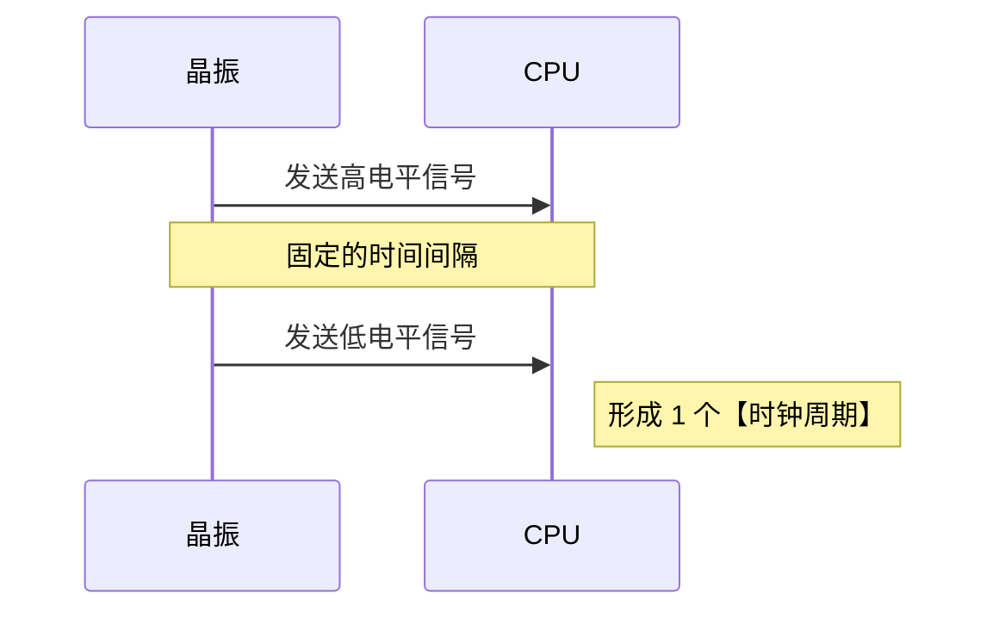
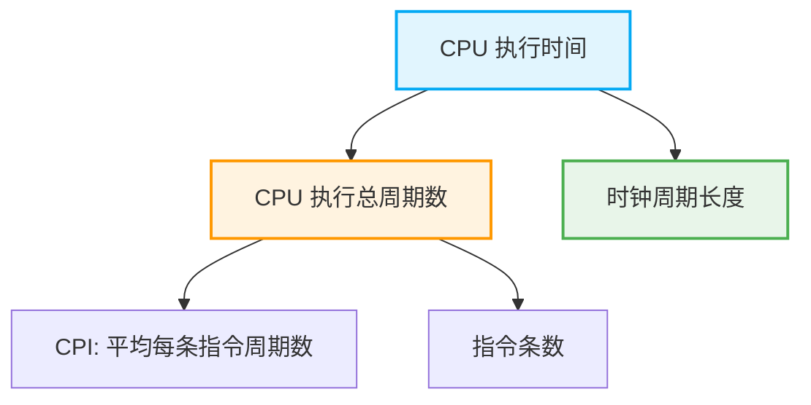

# CPU 工作原理与性能核心指标

## 一、 CPU 的本质与时钟系统

- **CPU 的本质**：本质上是由各种电子元件集合而成的芯片。
- **晶振与时钟信号**：
  - CPU 外接**晶振**（计时系统），负责向 CPU 发出高低电平信号。
  - 高低电平信号产生的时间间隔是固定的（例如：发一个高电平再发一个低电平，时间间隔确定）。
  - CPU 收到信号后即可判断时间流逝，从而在内部形成**时钟周期**。
- **时钟周期**：计算机内部**最小的时间单位**。决定了 CPU “什么时候该干什么”以及“干一个动作需要多久”。
- **主频**：指一秒钟内计算机内部包含多少个时钟周期。
  - _推论_：只要处理器速度更快，就代表时钟周期长度降下来了，主频提高了。

👇 **CPU 时钟系统工作机制**

---

## 二、 核心性能计算公式

### 1. CPU 执行时间

计算机执行某段程序时，考量的是执行每条指令需要多少个时钟周期，而不是具体的时间。**时钟频率只影响 CPU 的执行时间，与 CPI 无关**（CPI 是用时钟周期数量来衡量的，不是绝对时间）。

> **CPU 执行时间** = CPU 执行周期数 × 时钟周期长度
> **CPU 执行时间** = CPI × 指令条数(机器指令) × 时钟周期长度

### 2. MIPS (每秒百万条指令)

> **MIPS** = 主频 ÷ (CPI × 10^6)
> **MIPS** = 1 ÷ (时钟周期长度 × CPI × 10^6)

---

## 三、 CPI (Cycles Per Instruction) 深度解析

CPI 指的是**每条机器指令平均需要执行多少个时钟周期**。

- **决定因素**：取决于**系统结构**、**计算机组织**和**指令集**。
  - _示例_：硬件中是否配备专门实现乘法的部件，会直接影响指令的执行效率。
- **翻译差异**：不同计算机翻译出的机器指令是不同的，指令不同自然会影响 CPI。
- **优化编译的影响**：优化编译生成的代码，可能会**减少生成的指令条数**，或者**生成不同的指令**，从而达到降低 CPI 的目的。

👇 **CPU 执行时间核心要素拆解**

---

## 四、 机器字长与数据通路

### 1. 数据通路 (Data Path)

- **定义**：CPU 内部数据流经的路径以及路径上的部件。主要是 CPU 内部进行数据运算、存储和传送的部件。
- **匹配原则**：这些部件的带宽（宽度）基本上要保持一致，才能相互匹配。
- **优化方向**：优化数据通路可以提升效率（例如：从主存中读取的数据如果能直接送到目的寄存器，就能减少中间环节）。

### 2. 机器字长 (Word Length)

- **核心定义**：字长等于 **CPU 内部总线的宽度** = **运算器的位数** = **通用寄存器的宽度**。
- **性能影响**：
  - 字长越长，通用寄存器位数越多。
  - 整数运算或相关运算的**精度越高**（例如：机器字长 8 位，运算结果只能保留 8 位二进制数）。
  - 表示的数据**范围越大**。
  - 整体计算机**性能越好**（_做题技巧：凡是评价计算机性能且与字长沾边的选项，通常都选_）。

---

## 五、 其他计算机性能评价指标

| 指标名称                        | 核心含义与特征                                                                                     |
| :------------------------------ | :------------------------------------------------------------------------------------------------- |
| **MDLOPS** _(注:常写为 MFLOPS)_ | **不是指令**，是一种评价计算机系统的性能指标。代表每秒钟计算机能够执行**几百万次的浮点数运算**。   |
| **科学计算**                    | 业务逻辑极度依赖且包含**大量的浮点数运算**。                                                       |
| **基准程序 (Benchmark)**        | 局限性：由于基准程序可能只针对某一小段特定代码进行优化，因此**无法得到对计算机性能的全面性评价**。 |
