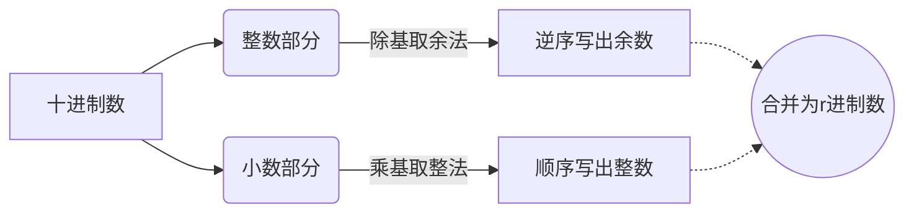

# 数据的表示与运算：进位计数制

> **导语**
> 本节正式进入第二章《数据的表示和运算》。第一章提到计算机五大部件，主存用于存数据，运算器用于算数据。那么，**数据在计算机中究竟如何用二进制表示？运算器又是如何实现这些算术逻辑运算的？**这就是本章的两大核心。
> 本小节我们将从最基础的“进位计数制”开始，彻底搞懂二进制、八进制、十进制、十六进制之间的相互转换，以及真值与机器数的概念。

---

## 一、 进位计数制的基本概念

从远古人类画竖线记苹果数量，到罗马数字（符号代表权重：I=1, V=5, X=10，使用加法），再到古印度人发明、阿拉伯人传播的**阿拉伯数字系统**，人类的技术方式不断演进。

十进制是最符合人类习惯的技术方式，因为人有十根手指（逢十进一）。如果海绵宝宝来数数，他可能更习惯八进制（逢八进一）。

**核心概念：**

1.  **基数 ($r$)**：每个数码位可能用到的不同符号的个数。例如十进制有 0~9 共 10 个符号，基数就是 10。
2.  **位权 ($r^n$)**：数码位所处位置确定的权重。
    - 例如十进制数 `975.3`：
      - `5` 在个位，位权是 $10^0$
      - `7` 在十位，位权是 $10^1$
      - `9` 在百位，位权是 $10^2$
      - `3` 在小数第一位，位权是 $10^{-1}$

### 计算机常用进制一览表

| 进制                       | 基数 ($r$) | 使用的符号              | 常用后缀/前缀表示法 |
| :------------------------- | :--------- | :---------------------- | :------------------ |
| **二进制 (Binary)**        | 2          | `0, 1`                  | `1010B`             |
| **八进制 (Octal)**         | 8          | `0~7`                   | `(75.3)_8`          |
| **十进制 (Decimal)**       | 10         | `0~9`                   | `1024D`             |
| **十六进制 (Hexadecimal)** | 16         | `0~9, A, B, C, D, E, F` | `1A8H` 或 `0x1A8`   |

> _注：16进制中，A=10, B=11, C=12, D=13, E=14, F=15。_

---

## 二、 任意进制转十进制

**转换规则**：将每个数码位的值乘以它所对应位置的**位权**，然后相乘相加。

**1. 二进制转十进制**
$101.1_2 = 1 	imes 2^2 + 0 	imes 2^1 + 1 	imes 2^0 + 1 	imes 2^{-1} = 4 + 0 + 1 + 0.5 = 5.5_{10}$

**2. 八进制转十进制**
$5.4_8 = 5 	imes 8^0 + 4 	imes 8^{-1} = 5 + 0.5 = 5.5_{10}$

**3. 十六进制转十进制**
$5.8_{16} = 5 	imes 16^0 + 8 	imes 16^{-1} = 5 + 0.5 = 5.5_{10}$

> 💡 **做题技巧（二进制转十进制快速法）：**
> 建议熟记二进制各个位的权值，做题时直接把二进制数“对号入座”相加即可，无需每次都算 $2^n$：
>
> - **整数位权**：`... 128, 64, 32, 16, 8, 4, 2, 1`
> - **小数位权**：`0.5, 0.25, 0.125 ...`
>
> 例如 $10010011_2$ 对应 `128 + 16 + 2 + 1 = 147`。

**思考：为什么计算机使用二进制？**

1.  **物理实现简单**：两个稳定状态的物理器件容易制造（如高/低电平、电荷正/负）。
2.  **对应逻辑运算**：0 和 1 完美对应逻辑值的“假”和“真”，方便用逻辑门电路实现算术运算。

---

## 三、 二、八、十六进制之间的相互转换

八进制基数 $8 = 2^3$，十六进制基数 $16 = 2^4$。因此它们与二进制之间存在完美的位数组合对应关系。

### 1. 二进制 ↔ 八进制 (3位一组)

- **规则**：每 3 个二进制位对应 1 个八进制位。
- **补位原则**：以小数点为界，**整数部分向高位（左侧）补 0**，**小数部分向低位（右侧）补 0**。
- **示例**：将 $11101.1_2$ 转八进制
  - 整数部分：`011` -> `3`, `101` -> `5`
  - 小数部分：`100` -> `4` (注意右侧补两个0)
  - 结果：$35.4_8$

### 2. 二进制 ↔ 十六进制 (4位一组)

- **规则**：每 4 个二进制位对应 1 个十六进制位。补位原则同上。
- **示例**：将 $11101000.1_2$ 转十六进制
  - 整数部分：`1110` -> `E(14)`, `1000` -> `8`
  - 小数部分：`1000` -> `8`
  - 结果：$E8.8_{16}$

> **如果要将十六进制转八进制怎么办？**
> 最佳路径：**十六进制 ➔ 二进制 ➔ 八进制**。以二进制作为中间桥梁进行转换最不容易出错。

---

## 四、 十进制转其他进制

将十进制数（如 `75.3`）转换为 $r$ 进制数，必须**将整数部分和小数部分分开处理**。



### 1. 整数部分：除基取余法

- **方法**：用整数不断除以基数 $r$，取其余数。直到商为 0 为止。
- **排位**：**先得到的余数是低位（LSB），后得到的余数是高位（MSB）。**（从下往上写）

**示例**：将 `75` 转为二进制 ($r=2$)

```text
2 |__ 75
2 |__ 37  ...... 余 1 (最低位)
2 |__ 18  ...... 余 1
2 |__  9  ...... 余 0
2 |__  4  ...... 余 1
2 |__  2  ...... 余 0
2 |__  1  ...... 余 0
       0  ...... 余 1 (最高位)
-> 结果为：1001011
```

### 2. 小数部分：乘基取整法

- **方法**：用小数不断乘以基数 $r$，取其整数部分。每次取走整数后，用剩下的小数继续乘。
- **排位**：**先得到的整数是高位（紧靠小数点），后得到的整数是低位。**（从上往下写）

**示例**：将 `0.3` 转为二进制 ($r=2$)

- $0.3 	imes 2 = 0.6$ -> 取整数 **0** (最高位)
- $0.6 	imes 2 = 1.2$ -> 取整数 **1**
- $0.2 	imes 2 = 0.4$ -> 取整数 **0**
- $0.4 	imes 2 = 0.8$ -> 取整数 **0**
- $0.8 	imes 2 = 1.6$ -> 取整数 **1**
- $0.6 	imes 2 = 1.2$ -> 取整数 **1** （发现开始循环）

⚠️ **重要考点预警**：

- **十进制的整数**一定能用二进制**精确表示**。
- **十进制的小数**（如 0.3）**可能无法用二进制精确表示**，会产生无限循环。只有像 0.5、0.25、0.75 这种可以用 $2^{-n}$ 组合出来的小数，才能精确表示。

### 3. 高手进阶：拼凑法 (熟练者推荐)

如果对各个位的位权足够熟悉，可以直接用加法拼凑。

- **例 1**：$260.75_{10}$
  - 整数 $260 = 256 + 4$ -> `100000100`
  - 小数 $0.75 = 0.5 + 0.25$ -> `.11`
  - 合计：`100000100.11_2`

---

## 五、 真值与机器数

十进制数转换成二进制后虽然方便存储，但怎么表示数据的**正负号（+/-）**呢？
通常的做法是增加一个**符号位**（用 0 表示正，用 1 表示负）。

- **真值**：符合人类阅读习惯的、带有实际正负号的数字（如 $+15$, $-10$）。
- **机器数**：数字实际存入计算机内部的形式，正负号被“数字化”为了 0 或 1，连同数值一起构成的二进制串。

> _(后续小节中将会深入学习如何用原码、反码、补码、移码等方式在计算机中表示机器数。)_

---

## 六、 拓展趣闻：中国古代的“二进制”

你知道中国古代其实就已经有二进制系统的雏形了吗？
周易八卦系统中的：**“太极生两仪，两仪生四象，四象生八卦”**

- **两仪（阴、阳）**：完美对应了二进制的 `0` 和 `1`。
- **四象**：是由两个二进制位组合而成的四种状态（`00, 01, 10, 11`）。
- **八卦**：是由三个二进制位组合而成的八种状态（`000` 到 `111`）。

这可以说是世界上最古老的基于二进制思想的系统，与现代计算机的底层逻辑有着异曲同工之妙！
