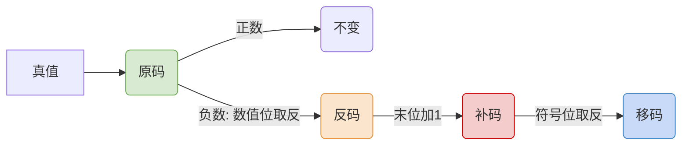

# 数据的表示与运算：定点数的表示

> **导语**
> 本节我们将学习数据在计算机中的两种主要表示方式之一：**定点数**。与之对应的是浮点数（小数点位置会浮动，类似科学计数法）。定点数则是小数点位置固定不变的表示方法。
> 这一小节是计算机底层数据表示的**核心基础，也是考试的重中之重**。我们将深入探讨无符号数、有符号数的原码、反码、补码和移码，以及它们之间的相互转换和表示范围。

---

## 一、 无符号数

所谓无符号数，就是指整个机器字长的**全部二进制位都用来表示数值**，没有正负号之分（相当于表示绝对值）。

### 1. 表示范围推导

假设机器字长为 $n$ 位：

- **最小值**：所有位均为 0，即 `0`。
- **最大值**：所有位均为 1。
  - _思路 1 (等比数列求和)_：$2^{n-1} + 2^{n-2} + ... + 2^0 = 2^n - 1$
  - _思路 2 (进位法)_：给 $n$ 个 1 加上 1，会产生向第 $n+1$ 位的进位，结果变为 $1$ 后面跟着 $n$ 个 $0$ (即 $2^n$)。因此原本的 $n$ 个 1 的值就是 **$2^n - 1$**。

**结论**：$n$ 位无符号数的表示范围是 **$0 \sim 2^n - 1$**。
_(例如 8 位无符号数范围是 0~255)_。

> **注意**：在计算机中，我们通常只讨论**无符号整数**，很少讨论无符号小数（例如 C 语言中 `unsigned` 只能修饰整型，修饰 `float` 会报错）。

---

## 二、 有符号数的定点表示（原、反、补、移）

有符号数既有符号位，也有数值位（尾数）。

- **定点整数**：小数点固定隐含在**最低位之后**。
- **定点小数**：小数点固定隐含在**最高位（符号位）之后**。

最高位为**符号位**：通常 `0` 表示正（+），`1` 表示负（-）。

---

### 1. 原码 (Sign-Magnitude)

用尾数直接表示真值的绝对值，最高位表示符号。

- **定点整数示例 (8位)**：
  - 真值 $+19$：`0,0010011`
  - 真值 $-19$：`1,0010011`
- **定点小数示例**：
  - 真值 $+0.75$：`0.1100000` (小数点在符号位后)
  - 真值 $-0.75$：`1.1100000`

**【原码的表示范围 (含符号位共 n+1 位)】**

- **定点整数**：$-(2^n - 1) \sim 2^n - 1$
- **定点小数**：$-(1 - 2^{-n}) \sim 1 - 2^{-n}$
- **⚠️ 真值 0 的表示**：有**正 0** (`0000...0`) 和 **负 0** (`1000...0`) 两种状态。

---

### 2. 反码 (One's Complement)

反码主要作为原码到补码转换的“中间状态”。

- **正数**：反码与原码相同。
- **负数**：符号位保持不变，**数值位全部取反**（0变1，1变0）。
- **示例 (8位)**：
  - $+19$ 的反码：`0,0010011` (同原码)
  - $-19$ 的原码：`1,0010011` ➔ 反码：`1,1101100`

**【反码的表示范围】**

- 与原码完全一致。同样存在**正 0** (全0) 和 **负 0** (全1) 两种状态。

---

### 3. 补码 (Two's Complement) - 🌟 核心重点

计算机硬件实际运算中普遍使用补码，它能将减法转化为加法。

- **正数**：补码与原码相同。
- **负数**：**在反码的末位加 1**（即：原码数值位取反，末位加1）。
- **示例 (8位整数)**：
  - $-19$ 原码：`1,0010011`
  - $-19$ 反码：`1,1101100`
  - $-19$ 补码：`1,1101101`

**【补码的特殊性与表示范围】**

1.  **真值 0 只有一种表示**：
    - `+0` 的补码是 `0000...0`。
    - `-0` 经过“取反加1”后，最高位进位被丢弃，结果依然是 `0000...0`。
2.  **多出一个负数表示**：
    - 因为 0 只有一种状态，省出来的一个二进制状态 `1000...0` (符号位为1，数值全0)。
    - 对于定点整数，规定 `1000...0` 表示 **$-2^n$**。
    - 对于定点小数，规定 `1.000...0` 表示 **$-1$**。
3.  **表示范围 (含符号位共 n+1 位)**：
    - **定点整数**：**$-2^n \sim 2^n - 1$** (比原码多表示一个最小负数)
    - **定点小数**：**$-1 \sim 1 - 2^{-n}$**

> 💡 **补码转原码的技巧**：
> 已知负数的补码求原码，其操作步骤与“原转补”完全一样：**符号位不变，数值位取反，然后在末位加 1**。

---

### 4. 移码 (Excess/Bias Representation)

移码主要用于**定点整数**的大小比较（在后续浮点数的阶码中会大量使用）。

- **转换方法**：在**补码**的基础上，将**符号位取反**即可。
- **示例 (8位)**：
  - $+19$ 补码：`0,0010011` ➔ 移码：`1,0010011`
  - $-19$ 补码：`1,1101101` ➔ 移码：`0,1101101`

**【移码的特性】**

1.  **只能用于表示整数**，不能表示小数。
2.  **保持单调递增**：将移码看作无符号数时，真值越大，对应的移码无符号值也越大。这极大方便了计算机硬件从最高位开始对比大小（谁先出现 1 谁就更大）。
3.  真值 0 只有一种表示；表示范围与补码的整数范围完全一致。

---

## 三、 各种码的总结与对比表

假设机器字长为 $n+1$ 位（1 位符号，n 位数值）：

| 码制     | 正数规则              | 负数规则 (基于原码)      | 0 的表示     | 整数表示范围          | 小数表示范围                |
| :------- | :-------------------- | :----------------------- | :----------- | :-------------------- | :-------------------------- |
| **原码** | 符号为0，尾数表绝对值 | 符号为1，尾数表绝对值    | 2种 (+0, -0) | $-(2^n-1) \sim 2^n-1$ | $-(1-2^{-n}) \sim 1-2^{-n}$ |
| **反码** | 同原码                | 符号位不变，数值位全取反 | 2种 (+0, -0) | $-(2^n-1) \sim 2^n-1$ | $-(1-2^{-n}) \sim 1-2^{-n}$ |
| **补码** | 同原码                | 符号位不变，数值位取反+1 | **1种**      | **$-2^n \sim 2^n-1$** | **$-1 \sim 1-2^{-n}$**      |
| **移码** | 补码符号位取反        | 补码符号位取反           | **1种**      | **$-2^n \sim 2^n-1$** | _(只能表示整数)_            |

---

## 四、 实战演练与终极秒杀技巧

### 1. 真值转机器数演练 (8位)

- **$x = +50$**：二进制为 $32+16+2 = 110010$。补足 8 位为 `0,0110010`。正数原/反/补相同，移码取反符号位即 `1,0110010`。
- **$x = -100$**：二进制大小为 $64+32+4 = 1100100$。
  - 原码：`1,1100100`
  - 反码：`1,0011011` (数值位取反)
  - 补码：`1,0011100` (末位加1)
  - 移码：`0,0011100` (符号位取反)

### 2. 终极秒杀技巧：已知 $[x]_补$，求 $[-x]_补$

在做题时，如果已知一个数 $x$ 的补码，想要快速求出其相反数 $-x$ 的补码，不需要先转回原码再转回去，只需使用以下秒杀技巧：

**技巧：连同符号位在内，全部位取反，然后末位加 1。**

- **示例**：已知 $[+13]_补 = 0,0001101$，求 $[-13]_补$
  1. 全部取反（连同符号位）：`1,1110010`
  2. 末位加 1：`1,1110011` (即得 $[-13]_补$)
