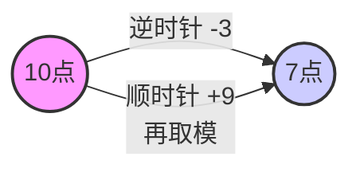

# 数据的表示与运算：各种码的作用与原理

> **导语**
> 上一小节我们学习了原码、反码、补码和移码的表示方法及相互转换。本小节我们将深入探讨：**为什么计算机要发明这么多种“码”？它们各自有什么缺陷和不可替代的作用？**
> 重点理解计算机是如何通过“模运算”和“补码”的魔法，将复杂的减法运算转化为简单的加法运算的。

---

## 一、 原码运算的缺陷（为什么需要减法器？）

假设机器字长为 8 比特，我们尝试对两个用**原码**表示的二进制数进行加法运算：

- 上方的数：`0 0001110` (原码：**正 14**)
- 下方的数：`1 0001110` (原码：**负 14**)

如果直接按位相加：

```text
  0 0001110  (+14)
+ 1 0001110  (-14)
-----------------
  1 0011100  (原码结果：-28，错误！)
```

正 14 加上负 14 本应该等于 0，但直接按位相加的结果却是 `-28`。

**【原码的缺陷】**

1.  对原码进行加减运算时，**符号位不能直接参与运算**。
2.  当符号不同（即一正一负相加）时，计算机硬件必须判断符号，并将运算改造为“大绝对值减去小绝对值”，最后再赋予正确的符号。
3.  这意味着，算术逻辑单元 (ALU) 中不仅需要有加法器，**还必须专门设计一个减法器**。设计减法器的硬件电路成本高，且增加了整体电路的复杂度。

💡 **思考**：既然减法器这么麻烦，能不能**用加法来代替减法**呢？

---

## 二、 模运算与补数（时钟的启示）

为了理解“用加法代替减法”，我们来看一个大家都很熟悉的**十进制时钟**的例子。

假设现在时钟指向 **10点**，我们想把它调到 **7点**，有两种方法：

1.  **逆时针拨 3 格 (减法)**：$10 - 3 = 7$
2.  **顺时针拨 9 格 (加法)**：$10 + 9 = 19$，但在 12 小时制的表盘上，19 点其实就是 $19 \pmod{12} = 7$ 点。



### 1. 模运算与等价类

在这个例子中，时钟的表盘只有 12 个刻度，这就相当于一个**模数为 12 的系统**。
在“模 12”的条件下：一个“减 3”的操作，被完美等价地替换成了“加 9”的操作。

我们称 **-3** 和 **9** 在模 12 的条件下是**等价**的。

- 根据数论中求余数的定义：$x \pmod{m} = r$，其中 $r$ 必须满足 $0 \le r < m$，且 $x = q 	imes m + r$ ($q$为整数)。
- $-3 = (-1) 	imes 12 + 9$，所以 $-3 \pmod{12} = 9$。
- 同理，$-15, -3, 9, 21, 33$ 这些数，在模 12 的意义下余数都是 9，它们属于同一个**等价类**，在运算时可以相互替换。

### 2. 补数

在模 12 系统中，$-3$ 的等价正数是 $9$。注意观察它们的绝对值：**$|-3| + |9| = 12$ (即模数)**。
满足这种关系的两个数，互称为**补数**。

**结论：**

- 只要找到一个负数对应的“补数”（正数），我们就可以**用加上这个补数，来等效地代替减去那个负数**。
- 负数的补数计算公式：**补数 = 模 - 负数的绝对值**。

---

## 三、 补码的真正作用与原理

现在回到计算机世界。假设机器字长为 8 比特。
8 个比特最多只能表示 $2^8 = 256$ 种状态。如果运算结果超出了 8 位，**最高位的进位会被硬件自动抛弃**。
👉 _这个“硬件自动抛弃溢出位”的天然特性，实际上就等同于计算机硬件自动帮我们完成了 **“模 $2^8$”** 的运算！_

### 1. 补码的数学本质

在模 $2^8$ 的计算机中，我们要计算 $14 - 14$。
也就是要把减去 14，替换成加上“$-14$ 的补数”。

- $-14$ 的补数 = 模 - $|-14|$ = $2^8 - 14$ = `100000000` - `00001110` = `11110010`

大家会发现，算出来的这个补数 `11110010`，**正好就是 $-14$ 的补码！**

```text
计算 14 + (-14的补码)：
  0 0001110  (+14)
+ 1 1110010  (-14的补码)
-----------------
1 0 0000000
↑
这个最高位的 1 超出了 8 位字长，被硬件直接丢弃（即模运算）。
最终留在寄存器里的结果就是 `00000000`，等于 0！计算正确！
```

### 2. 为什么“取反加1”等于“模减绝对值”？

为什么上一节我们学到的算法“符号位不变，数值位取反加1”就能算出这个补数呢？

以 $-14$ 为例，其绝对值为 `00001110`：

1.  **取反**：绝对值全部取反得到 `11110001`。
2.  注意：原绝对值 + 取反后的值 = `11111111` ($2^8 - 1$)。
3.  **加 1**：我们在取反后的值上再加 1，那么两者的和就变成了 `100000000` ($2^8$，即模)。
4.  因此，**全部取反加 1** 这个操作，在数学逻辑上完美等价于 **用模减去绝对值**。

### 3. 补码的核心作用总结

- **统一加减法**：将减法操作转化为等价的加法操作。
- **符号位参与运算**：连同符号位一起直接进行加法运算，不需要单独判断符号。
- **降低硬件成本**：ALU (算术逻辑单元) 中只需要设计加法器电路，**彻底消灭了减法器**，大大降低了硬件设计成本和复杂度。

> **挖坑提示**：补码运算虽然好用，但运算时最高位产生的进位被丢弃，有可能会导致**溢出**（如 -100 加上 -100）。如何判断溢出？我们将在后续小节详细探讨。

---

## 四、 移码的作用

上一小节提过，移码是在补码的基础上将符号位取反。由于移码只能表示整数，我们来看看将一组真值转化为移码后的效果：

|  真值  | 移码表示 (8位) | 视为无符号数的大小比较 |
| :----: | :------------: | :--------------------- |
| $-128$ |   `00000000`   | 最小                   |
|  $-1$  |   `01111111`   | $\dots$                |
|  $0$   |   `10000000`   | $\dots$                |
|  $+1$  |   `10000001`   | $\dots$                |
| $+127$ |   `11111111`   | 最大                   |

**【移码的核心作用】**

- **方便比大小**：移码的二进制编码（当作无符号数来看时）随着真值的增大而单调递增。
- 计算机硬件在比较两个移码大小时，**只需要从最高位开始向后逐位对比，谁先出现 `1`，谁代表的真值就更大**。这种硬件逻辑实现起来极其简单、迅速。

---

## 五、 本节总结

| 码制     | 核心作用 / 缺陷                                                                                                                  |
| :------- | :------------------------------------------------------------------------------------------------------------------------------- |
| **原码** | **缺陷**：运算麻烦，符号位不能直接参与运算，硬件中必须专门集成成本高昂的减法器电路。                                             |
| **反码** | **作用**：没有实际的计算作用，仅仅作为原码求补码过程中的“中间过渡状态”。                                                         |
| **补码** | 🌟 **核心作用**：利用模运算原理，**将减法转化为等价的加法**，让符号位直接参与运算。使得 CPU 中只需保留加法器，大幅降低硬件成本。 |
| **移码** | **作用**：将数值单调映射，极大地**方便了计算机硬件电路快速比较两个数的大小**（常用于浮点数的阶码比较）。                         |
